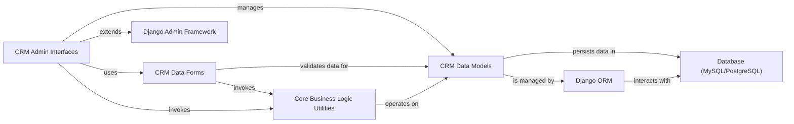

## Details

The `Core CRM Data Management` subsystem is the backbone of the CRM application, responsible for defining, storing, and managing all essential customer and sales-related data. It adheres to the Model-View-Template (MVT) and Database-Centric Architecture patterns, leveraging Django's capabilities to ensure data integrity and provide a single source of truth.

### CRM Data Models
These are the foundational Django models that define the structure, relationships, and integrity constraints for all core CRM entities such as Companies, Contacts, Leads, Deals, Requests, Payments, Shipments, Products, and Tags. They serve as the "single source of truth" for all customer and sales-related information, encapsulating the database schema and basic data validation.

**Related Classes/Methods**:

- <a href="https://github.com/DjangoCRM/django-crm/crm/models/company.py#L1-L1" target="_blank" rel="noopener noreferrer">`crm/models/company` (1:1)</a>
- <a href="https://github.com/DjangoCRM/django-crm/crm/models/contact.py#L1-L1" target="_blank" rel="noopener noreferrer">`crm/models/contact` (1:1)</a>
- <a href="https://github.com/DjangoCRM/django-crm/crm/models/deal.py#L1-L1" target="_blank" rel="noopener noreferrer">`crm/models/deal` (1:1)</a>
- <a href="https://github.com/DjangoCRM/django-crm/crm/models/lead.py#L1-L1" target="_blank" rel="noopener noreferrer">`crm/models/lead` (1:1)</a>
- <a href="https://github.com/DjangoCRM/django-crm/crm/models/payment.py#L1-L1" target="_blank" rel="noopener noreferrer">`crm/models/payment` (1:1)</a>
- <a href="https://github.com/DjangoCRM/django-crm/crm/models/request.py#L1-L1" target="_blank" rel="noopener noreferrer">`crm/models/request` (1:1)</a>
- <a href="https://github.com/DjangoCRM/django-crm/crm/models/output.py#L1-L1" target="_blank" rel="noopener noreferrer">`crm/models/output` (1:1)</a>
- <a href="https://github.com/DjangoCRM/django-crm/crm/models/others.py#L1-L1" target="_blank" rel="noopener noreferrer">`crm/models/others` (1:1)</a>
- <a href="https://github.com/DjangoCRM/django-crm/crm/models/country.py#L1-L1" target="_blank" rel="noopener noreferrer">`crm/models/country` (1:1)</a>
- <a href="https://github.com/DjangoCRM/django-crm/crm/models/product.py#L1-L1" target="_blank" rel="noopener noreferrer">`crm/models/product` (1:1)</a>
- <a href="https://github.com/DjangoCRM/django-crm/crm/models/crmemail.py#L1-L1" target="_blank" rel="noopener noreferrer">`crm/models/crmemail` (1:1)</a>
- <a href="https://github.com/DjangoCRM/django-crm/crm/models/base_contact.py#L1-L1" target="_blank" rel="noopener noreferrer">`crm/models/base_contact` (1:1)</a>
- `crm/models/base_model` (1:1)
- `crm/models/base_payment` (1:1)
- <a href="https://github.com/DjangoCRM/django-crm/crm/models/tag.py#L1-L1" target="_blank" rel="noopener noreferrer">`crm/models/tag` (1:1)</a>

### CRM Data Forms
This component provides Django Forms for data input, validation, and manipulation of CRM entities. These forms are crucial for user interaction, ensuring that data conforms to business rules and is properly validated before being saved to the database, thereby maintaining data quality and integrity. They bridge the user interface with the underlying data models.

**Related Classes/Methods**:

- <a href="https://github.com/DjangoCRM/django-crm/crm/forms/admin_forms.py#L1-L1" target="_blank" rel="noopener noreferrer">`crm/forms/admin_forms` (1:1)</a>
- <a href="https://github.com/DjangoCRM/django-crm/crm/forms/contact_form.py#L1-L1" target="_blank" rel="noopener noreferrer">`crm/forms/contact_form` (1:1)</a>
- <a href="https://github.com/DjangoCRM/django-crm/crm/forms/add_files_form.py#L1-L1" target="_blank" rel="noopener noreferrer">`crm/forms/add_files_form` (1:1)</a>

### CRM Admin Interfaces
This component comprises the customized Django Admin interfaces for managing core CRM entities. It provides administrative views, filters, and actions, enabling internal users to perform CRUD (Create, Read, Update, Delete) operations efficiently. `CrmModelAdmin` and `CrmStackedInline` serve as base classes for consistent administrative behavior across various models.

**Related Classes/Methods**:

- <a href="https://github.com/DjangoCRM/django-crm/crm/admin.py#L1-L1" target="_blank" rel="noopener noreferrer">`crm/admin` (1:1)</a>
- `crm/site` (1:1)

### Core Business Logic Utilities
This component encapsulates reusable business logic and helper functions that directly manipulate or process core CRM data. These utilities ensure that complex operations, data transformations, and specific business rules (e.g., custom filters, email creation, object creation) are applied consistently across the application, supporting both automated processes and manual interactions.

**Related Classes/Methods**:

- <a href="https://github.com/DjangoCRM/django-crm/crm/utils/admfilters.py#L1-L1" target="_blank" rel="noopener noreferrer">`crm/utils/admfilters` (1:1)</a>
- <a href="https://github.com/DjangoCRM/django-crm/crm/utils/change_massconts.py#L1-L1" target="_blank" rel="noopener noreferrer">`crm/utils/change_massconts` (1:1)</a>
- <a href="https://github.com/DjangoCRM/django-crm/crm/utils/check_city.py#L1-L1" target="_blank" rel="noopener noreferrer">`crm/utils/check_city` (1:1)</a>
- <a href="https://github.com/DjangoCRM/django-crm/crm/utils/counterparty_name.py#L1-L1" target="_blank" rel="noopener noreferrer">`crm/utils/counterparty_name` (1:1)</a>
- <a href="https://github.com/DjangoCRM/django-crm/crm/utils/create_email_request.py#L1-L1" target="_blank" rel="noopener noreferrer">`crm/utils/create_email_request` (1:1)</a>
- <a href="https://github.com/DjangoCRM/django-crm/crm/utils/create_form_request.py#L1-L1" target="_blank" rel="noopener noreferrer">`crm/utils/create_form_request` (1:1)</a>
- <a href="https://github.com/DjangoCRM/django-crm/crm/utils/create_objects.py#L1-L1" target="_blank" rel="noopener noreferrer">`crm/utils/create_objects` (1:1)</a>
- <a href="https://github.com/DjangoCRM/django-crm/crm/utils/helpers.py#L1-L1" target="_blank" rel="noopener noreferrer">`crm/utils/helpers` (1:1)</a>
- <a href="https://github.com/DjangoCRM/django-crm/crm/utils/make_massmail_form.py#L1-L1" target="_blank" rel="noopener noreferrer">`crm/utils/make_massmail_form` (1:1)</a>
- <a href="https://github.com/DjangoCRM/django-crm/crm/utils/rates_loader.py#L1-L1" target="_blank" rel="noopener noreferrer">`crm/utils/rates_loader` (1:1)</a>
- <a href="https://github.com/DjangoCRM/django-crm/crm/utils/send_email.py#L1-L1" target="_blank" rel="noopener noreferrer">`crm/utils/send_email` (1:1)</a>
- <a href="https://github.com/DjangoCRM/django-crm/crm/utils/ticketproc.py#L1-L1" target="_blank" rel="noopener noreferrer">`crm/utils/ticketproc` (1:1)</a>
- <a href="https://github.com/DjangoCRM/django-crm/crm/utils/clarify_permission.py#L1-L1" target="_blank" rel="noopener noreferrer">`crm/utils/clarify_permission` (1:1)</a>
- <a href="https://github.com/DjangoCRM/django-crm/crm/utils/import_emails.py#L1-L1" target="_blank" rel="noopener noreferrer">`crm/utils/import_emails` (1:1)</a>
- <a href="https://github.com/DjangoCRM/django-crm/crm/utils/manage_imaps.py#L1-L1" target="_blank" rel="noopener noreferrer">`crm/utils/manage_imaps` (1:1)</a>

### Django ORM
Django's built-in Object-Relational Mapper (ORM) provides an abstraction layer over the database. It allows Python code to interact with the database using Python objects (models) instead of raw SQL, simplifying database operations and ensuring database portability.

**Related Classes/Methods**: _None_

### Database (MySQL/PostgreSQL)
The underlying relational database system (MySQL or PostgreSQL) is responsible for the persistent storage of all CRM data. It ensures data durability, consistency, and provides transactional integrity.

**Related Classes/Methods**: _None_

### Django Admin Framework
The core Django Admin framework provides the extensible foundation upon which the `CRM Admin Interfaces` are built. It offers a powerful, automatically generated administrative interface for managing application data.

**Related Classes/Methods**: _None_

### [FAQ](https://github.com/CodeBoarding/GeneratedOnBoardings/tree/main?tab=readme-ov-file#faq)