```mermaid
graph LR
    crm_models_crmemail_CrmEmail["crm.models.crmemail.CrmEmail"]
    crm_utils_crm_imap["crm.utils.crm_imap"]
    crm_utils_import_emails["crm.utils.import_emails"]
    crm_utils_send_email["crm.utils.send_email"]
    crm_utils_create_email_request["crm.utils.create_email_request"]
    crm_utils_oauth2["crm.utils.oauth2"]
    crm_utils_manage_imaps["crm.utils.manage_imaps"]
    crm_site_crmemailadmin_CrmEmailAdmin["crm.site.crmemailadmin.CrmEmailAdmin"]
    crm_views_create_email["crm.views.create_email"]
    crm_views_reply_email["crm.views.reply_email"]
    crm_utils_import_emails -- "stores" --> crm_models_crmemail_CrmEmail
    crm_utils_send_email -- "stores" --> crm_models_crmemail_CrmEmail
    crm_site_crmemailadmin_CrmEmailAdmin -- "manages" --> crm_models_crmemail_CrmEmail
    crm_views_create_email -- "accesses" --> crm_models_crmemail_CrmEmail
    crm_views_reply_email -- "accesses" --> crm_models_crmemail_CrmEmail
    crm_utils_import_emails -- "utilizes" --> crm_utils_crm_imap
    crm_utils_manage_imaps -- "utilizes" --> crm_utils_crm_imap
    crm_utils_crm_imap -- "uses for authentication" --> crm_utils_oauth2
    crm_utils_import_emails -- "creates records of" --> crm_models_crmemail_CrmEmail
    crm_utils_send_email -- "sends data of" --> crm_models_crmemail_CrmEmail
    crm_utils_create_email_request -- "calls" --> crm_utils_send_email
    crm_views_create_email -- "calls" --> crm_utils_send_email
    crm_views_reply_email -- "calls" --> crm_utils_send_email
    crm_utils_create_email_request -- "prepares data for" --> crm_utils_send_email
    crm_utils_create_email_request -- "creates instances of" --> crm_models_crmemail_CrmEmail
    crm_utils_oauth2 -- "provides authentication for" --> crm_utils_crm_imap
    crm_utils_oauth2 -- "provides authentication for" --> crm_utils_manage_imaps
    crm_utils_manage_imaps -- "uses" --> crm_utils_oauth2
    crm_views_create_email -- "calls" --> crm_utils_create_email_request
    crm_views_reply_email -- "calls" --> crm_utils_create_email_request
```

## Details

The `Email & Communication Management` subsystem is a critical part of the CRM, enabling users to send, receive, and manage email interactions directly within the system. It adheres to the Monolithic Web Application and MVT patterns, with clear separation of concerns between data models, utility functions, and user interfaces.

### crm.models.crmemail.CrmEmail
This is the core Django model that defines the structure and persistence for all email-related data within the CRM. It stores essential information such as sender, recipients, subject, body, attachments, and timestamps, and establishes relationships with other CRM entities (e.g., `Request` objects). It is fundamental because it serves as the central repository for all email communications, enabling historical tracking and integration with other CRM functionalities.

**Related Classes/Methods**:

- <a href="https://github.com/DjangoCRM/django-crm/crm/models/crmemail.py#L8-L92" target="_blank" rel="noopener noreferrer">`crm.models.crmemail.CrmEmail` (8:92)</a>

### crm.utils.crm_imap
This utility module provides the low-level interface for interacting with IMAP servers. It handles establishing connections, authenticating (potentially using OAuth2), fetching email messages, and parsing their content. It is fundamental as it abstracts the complexities of IMAP protocol, allowing other components to easily retrieve emails from external accounts.

**Related Classes/Methods**:

- <a href="https://github.com/DjangoCRM/django-crm/crm/utils/crm_imap.py#L1-L1" target="_blank" rel="noopener noreferrer">`crm.utils.crm_imap` (1:1)</a>

### crm.utils.import_emails
This component orchestrates the process of importing emails from external IMAP accounts into the CRM. It leverages `crm.utils.crm_imap` to retrieve raw email data and then processes this data to create or update `CrmEmail` records in the database. It is fundamental for populating the CRM with inbound email communications, ensuring a comprehensive view of customer interactions.

**Related Classes/Methods**:

- <a href="https://github.com/DjangoCRM/django-crm/crm/utils/import_emails.py#L1-L1" target="_blank" rel="noopener noreferrer">`crm.utils.import_emails` (1:1)</a>

### crm.utils.send_email
This utility function is responsible for the actual dispatch of emails from the CRM system to external recipients. It takes prepared email content and recipient information, handles the underlying email sending mechanism (e.g., via Django's email backend), and potentially logs the sent email. It is fundamental for all outbound email communication initiated from within the CRM.

**Related Classes/Methods**:

- <a href="https://github.com/DjangoCRM/django-crm/crm/utils/send_email.py#L24-L77" target="_blank" rel="noopener noreferrer">`crm.utils.send_email` (24:77)</a>

### crm.utils.create_email_request
This utility function prepares and structures the necessary data for sending new emails or creating email-related requests within the CRM. It often involves populating email templates, associating the email with relevant CRM objects (like contacts or deals), and validating the input before passing it to the sending mechanism. It is fundamental for standardizing and validating email creation workflows.

**Related Classes/Methods**:

- <a href="https://github.com/DjangoCRM/django-crm/crm/utils/create_email_request.py#L39-L94" target="_blank" rel="noopener noreferrer">`crm.utils.create_email_request` (39:94)</a>

### crm.utils.oauth2
This module manages the OAuth2 authentication flows required for secure integration with various email service providers (e.g., Gmail, Outlook). It handles the acquisition, refresh, and secure storage of access tokens, ensuring that the CRM can securely access and manage user email accounts without storing credentials directly. It is fundamental for modern, secure, and compliant integration with external email services.

**Related Classes/Methods**:

- <a href="https://github.com/DjangoCRM/django-crm/crm/utils/oauth2.py#L1-L1" target="_blank" rel="noopener noreferrer">`crm.utils.oauth2` (1:1)</a>

### crm.utils.manage_imaps
This utility provides higher-level functionalities for managing IMAP accounts configured within the CRM. This includes operations such as adding new accounts, editing existing configurations, testing connection parameters, and potentially scheduling automated email import tasks. It is fundamental for administrators to configure and maintain the email integration settings.

**Related Classes/Methods**:

- <a href="https://github.com/DjangoCRM/django-crm/crm/utils/manage_imaps.py#L1-L1" target="_blank" rel="noopener noreferrer">`crm.utils.manage_imaps` (1:1)</a>

### crm.site.crmemailadmin.CrmEmailAdmin
This is a Django ModelAdmin class that customizes and extends the administrative interface for the `CrmEmail` model within the Django Admin site. It defines how `CrmEmail` records are displayed, filtered, searched, and managed by CRM administrators. It is fundamental for administrative oversight, debugging, and manual management of email records.

**Related Classes/Methods**:

- <a href="https://github.com/DjangoCRM/django-crm/crm/site/crmemailadmin.py#L66-L426" target="_blank" rel="noopener noreferrer">`crm.site.crmemailadmin.CrmEmailAdmin` (66:426)</a>

### crm.views.create_email
This Django web view is responsible for rendering the user interface (template) for composing new emails and handling the associated backend logic. It processes user input from the email composition form, utilizes `crm.utils.create_email_request` to prepare the email data, and then calls `crm.utils.send_email` to dispatch it. It is fundamental as it provides the primary user-facing entry point for initiating outbound email communications.

**Related Classes/Methods**:

- <a href="https://github.com/DjangoCRM/django-crm/crm/views/create_email.py#L20-L106" target="_blank" rel="noopener noreferrer">`crm.views.create_email` (20:106)</a>

### crm.views.reply_email
This Django web view provides the user interface and backend logic for replying to existing emails within the CRM. It fetches the original email content, pre-populates the reply form, and then uses `crm.utils.create_email_request` and `crm.utils.send_email` to send the reply. It is fundamental for enabling seamless continuation of email conversations directly from CRM records.

**Related Classes/Methods**:

- <a href="https://github.com/DjangoCRM/django-crm/crm/views/reply_email.py#L16-L64" target="_blank" rel="noopener noreferrer">`crm.views.reply_email` (16:64)</a>

### [FAQ](https://github.com/CodeBoarding/GeneratedOnBoardings/tree/main?tab=readme-ov-file#faq)