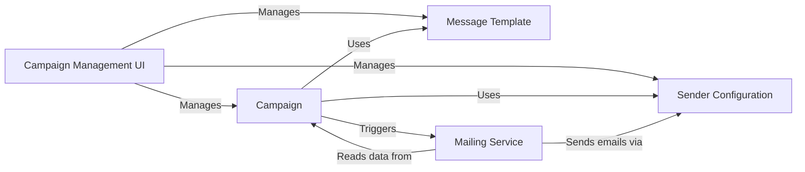

## Details

The component selection isolates the core responsibilities of the mass mailing subsystem into logical units.
1.  **Campaign** is the central entity, representing the "what" and "who" of a mass mailing.
2.  **Message Template** and **Sender Configuration** are the reusable building blocks that define the content and delivery mechanism.
3.  The **Mailing Service** is the active component, encapsulating the business logic of *how* to execute the campaign.
4.  The **Campaign Management UI** provides the necessary user interface for system administration.

This structure separates data models (Campaign, Template, Configuration) from the service logic (Mailing Service) and user interface (Management UI), adhering to the modularity of the Django app pattern.

### Campaign
Represents a specific mass mailing operation, linking the audience, message, and sender.

**Related Classes/Methods**:

- <a href="https://github.com/DjangoCRM/django-crm/blob/main/massmail/models/mailing_out.py#L8-L110" target="_blank" rel="noopener noreferrer">`massmail.models.MailingOut` (8:110)</a>

### Message Template
A reusable email template with a subject and body.

**Related Classes/Methods**:

- `massmail.models.EmlMessage`

### Sender Configuration
Defines the sending server (SMTP) and the email signature to be used.

**Related Classes/Methods**:

- <a href="https://github.com/DjangoCRM/django-crm/blob/main/massmail/models/email_account.py#L12-L130" target="_blank" rel="noopener noreferrer">`massmail.models.EmailAccount` (12:130)</a>
- <a href="https://github.com/DjangoCRM/django-crm/blob/main/massmail/models/signature.py#L10-L34" target="_blank" rel="noopener noreferrer">`massmail.models.Signature` (10:34)</a>

### Mailing Service
Orchestrates the sending process: renders templates for each recipient and dispatches emails.

**Related Classes/Methods**:

- `massmail.services.SendMassmail`

### Campaign Management UI
Django Admin interface for creating and managing campaigns, templates, and sender configurations.

**Related Classes/Methods**:

- <a href="https://github.com/DjangoCRM/django-crm/blob/main/massmail/admin.py" target="_blank" rel="noopener noreferrer">`massmail.admin`</a>

### [FAQ](https://github.com/CodeBoarding/GeneratedOnBoardings/tree/main?tab=readme-ov-file#faq)