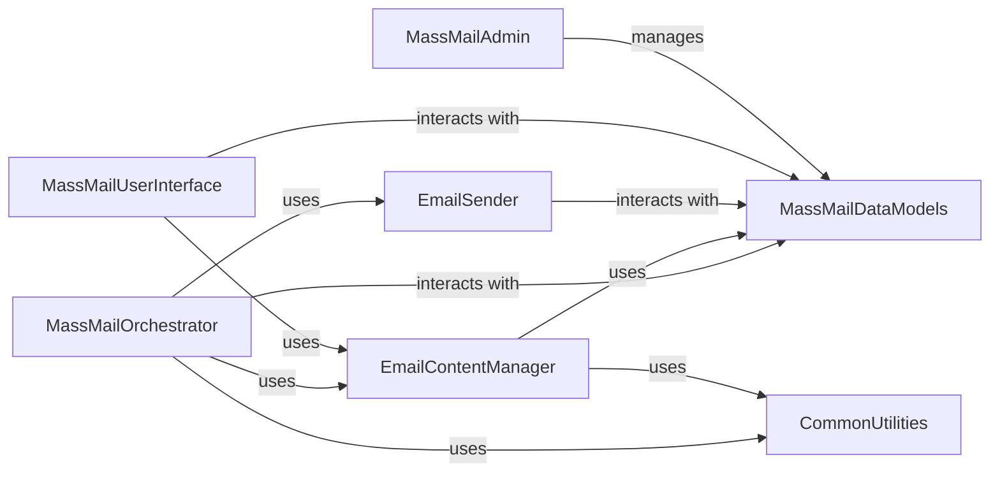

## Details

The Mass Mailing System is a core component of the CRM, enabling comprehensive email campaign management. Its architecture follows the Model-View-Template (MVT) pattern, typical for Django applications, and integrates seamlessly with the broader CRM system.

### MassMailDataModels
This component is the backbone of the Mass Mailing System, defining and managing all persistent data related to email campaigns. It encapsulates the database schema for entities such as EmailAccount, MailingOut, EmlMessage, MassContact, and Signature. It provides the interface for all data storage and retrieval operations, ensuring data integrity and consistency across the system.

**Related Classes/Methods**:

- <a href="https://github.com/DjangoCRM/django-crm/massmail/models/email_account.py#L1-L1" target="_blank" rel="noopener noreferrer">`massmail/models/email_account.py` (1:1)</a>
- <a href="https://github.com/DjangoCRM/django-crm/massmail/models/mailing_out.py#L1-L1" target="_blank" rel="noopener noreferrer">`massmail/models/mailing_out.py` (1:1)</a>
- <a href="https://github.com/DjangoCRM/django-crm/massmail/models/email_message.py#L1-L1" target="_blank" rel="noopener noreferrer">`massmail/models/email_message.py` (1:1)</a>
- <a href="https://github.com/DjangoCRM/django-crm/massmail/models/mass_contact.py#L1-L1" target="_blank" rel="noopener noreferrer">`massmail/models/mass_contact.py` (1:1)</a>
- <a href="https://github.com/DjangoCRM/django-crm/massmail/models/signature.py#L1-L1" target="_blank" rel="noopener noreferrer">`massmail/models/signature.py` (1:1)</a>
- <a href="https://github.com/DjangoCRM/django-crm/massmail/models/baseeml.py#L1-L1" target="_blank" rel="noopener noreferrer">`massmail/models/baseeml.py` (1:1)</a>
- <a href="https://github.com/DjangoCRM/django-crm/massmail/models/eml_accounts_queue.py#L1-L1" target="_blank" rel="noopener noreferrer">`massmail/models/eml_accounts_queue.py` (1:1)</a>

### MassMailOrchestrator
This component acts as the central control unit for mass email campaigns. It is responsible for initiating, scheduling, and overseeing the entire email sending process. It coordinates with MassMailDataModels to retrieve campaign details and recipient lists, utilizes EmailContentManager to prepare email content, and dispatches emails through the EmailSender. It also handles campaign status updates and reporting.

**Related Classes/Methods**:

- <a href="https://github.com/DjangoCRM/django-crm/massmail/utils/sendmassmail.py#L1-L1" target="_blank" rel="noopener noreferrer">`massmail/utils/sendmassmail.py` (1:1)</a>
- <a href="https://github.com/DjangoCRM/django-crm/massmail/apps.py#L1-L1" target="_blank" rel="noopener noreferrer">`massmail/apps.py` (1:1)</a>

### EmailContentManager
This component is dedicated to the creation, formatting, and templating of email messages. It handles dynamic content generation, personalization, and the rendering of email templates. It interacts with MassMailDataModels to fetch data required for populating templates and ensures that emails are correctly formatted before dispatch.

**Related Classes/Methods**:

- <a href="https://github.com/DjangoCRM/django-crm/massmail/utils/email_creators.py#L1-L1" target="_blank" rel="noopener noreferrer">`massmail/utils/email_creators.py` (1:1)</a>
- <a href="https://github.com/DjangoCRM/django-crm/massmail/templatetags/mailbuilder.py#L1-L1" target="_blank" rel="noopener noreferrer">`massmail/templatetags/mailbuilder.py` (1:1)</a>

### EmailSender
This component provides the concrete implementation for sending emails to external mail servers. It abstracts away the complexities of various email protocols (e.g., SMTP) and authentication mechanisms (e.g., OAuth2). It acts as a pluggable backend, allowing the system to integrate with different email service providers.

**Related Classes/Methods**:

- <a href="https://github.com/DjangoCRM/django-crm/massmail/backends/smtp.py#L1-L1" target="_blank" rel="noopener noreferrer">`massmail/backends/smtp.py` (1:1)</a>

### MassMailUserInterface
This component manages all user-facing interactions within the massmail module. It includes views for creating and managing campaigns, handling file uploads for attachments, and displaying various campaign-related information. It interacts with MassMailDataModels to retrieve and store user input and with EmailContentManager for email previews.

**Related Classes/Methods**:

- <a href="https://github.com/DjangoCRM/django-crm/massmail/views/copy_message.py#L1-L1" target="_blank" rel="noopener noreferrer">`massmail/views/copy_message.py` (1:1)</a>
- <a href="https://github.com/DjangoCRM/django-crm/massmail/views/file_upload.py#L1-L1" target="_blank" rel="noopener noreferrer">`massmail/views/file_upload.py` (1:1)</a>
- <a href="https://github.com/DjangoCRM/django-crm/massmail/views/get_oauth2_tokens.py#L1-L1" target="_blank" rel="noopener noreferrer">`massmail/views/get_oauth2_tokens.py` (1:1)</a>
- <a href="https://github.com/DjangoCRM/django-crm/massmail/views/message_previews.py#L1-L1" target="_blank" rel="noopener noreferrer">`massmail/views/message_previews.py` (1:1)</a>
- <a href="https://github.com/DjangoCRM/django-crm/massmail/views/recipient_ids.py#L1-L1" target="_blank" rel="noopener noreferrer">`massmail/views/recipient_ids.py` (1:1)</a>
- <a href="https://github.com/DjangoCRM/django-crm/massmail/views/select_recipient_type.py#L1-L1" target="_blank" rel="noopener noreferrer">`massmail/views/select_recipient_type.py` (1:1)</a>
- <a href="https://github.com/DjangoCRM/django-crm/massmail/views/send_failed_recipients.py#L1-L1" target="_blank" rel="noopener noreferrer">`massmail/views/send_failed_recipients.py` (1:1)</a>
- <a href="https://github.com/DjangoCRM/django-crm/massmail/views/send_tests.py#L1-L1" target="_blank" rel="noopener noreferrer">`massmail/views/send_tests.py` (1:1)</a>
- <a href="https://github.com/DjangoCRM/django-crm/massmail/views/show_uploaded_images.py#L1-L1" target="_blank" rel="noopener noreferrer">`massmail/views/show_uploaded_images.py` (1:1)</a>
- <a href="https://github.com/DjangoCRM/django-crm/massmail/views/signature_previews.py#L1-L1" target="_blank" rel="noopener noreferrer">`massmail/views/signature_previews.py` (1:1)</a>
- <a href="https://github.com/DjangoCRM/django-crm/massmail/views/unsubscribes.py#L1-L1" target="_blank" rel="noopener noreferrer">`massmail/views/unsubscribes.py` (1:1)</a>
- <a href="https://github.com/DjangoCRM/django-crm/massmail/forms/radio_select_form.py#L1-L1" target="_blank" rel="noopener noreferrer">`massmail/forms/radio_select_form.py` (1:1)</a>
- <a href="https://github.com/DjangoCRM/django-crm/massmail/urls.py#L1-L1" target="_blank" rel="noopener noreferrer">`massmail/urls.py` (1:1)</a>

### MassMailAdmin
This component provides the administrative interface for managing massmail configurations, email accounts, and campaigns through Django's built-in admin site. It allows administrators to oversee and control the mass mailing functionality, including custom actions and filters for efficient management.

**Related Classes/Methods**:

- <a href="https://github.com/DjangoCRM/django-crm/massmail/admin.py#L1-L1" target="_blank" rel="noopener noreferrer">`massmail/admin.py` (1:1)</a>
- <a href="https://github.com/DjangoCRM/django-crm/massmail/site/emailaccountadmin.py#L1-L1" target="_blank" rel="noopener noreferrer">`massmail/site/emailaccountadmin.py` (1:1)</a>
- <a href="https://github.com/DjangoCRM/django-crm/massmail/site/emlmessageadmin.py#L1-L1" target="_blank" rel="noopener noreferrer">`massmail/site/emlmessageadmin.py` (1:1)</a>
- <a href="https://github.com/DjangoCRM/django-crm/massmail/site/mailingoutadmin.py#L1-L1" target="_blank" rel="noopener noreferrer">`massmail/site/mailingoutadmin.py` (1:1)</a>
- <a href="https://github.com/DjangoCRM/django-crm/massmail/site/signatureadmin.py#L1-L1" target="_blank" rel="noopener noreferrer">`massmail/site/signatureadmin.py` (1:1)</a>
- <a href="https://github.com/DjangoCRM/django-crm/massmail/admin_actions.py#L1-L1" target="_blank" rel="noopener noreferrer">`massmail/admin_actions.py` (1:1)</a>
- <a href="https://github.com/DjangoCRM/django-crm/massmail/utils/adminfilters.py#L1-L1" target="_blank" rel="noopener noreferrer">`massmail/utils/adminfilters.py` (1:1)</a>

### CommonUtilities
This component provides a collection of general helper functions and utilities that are used across the entire CRM system, including by the massmail subsystem. This includes functionalities like date/time manipulation, internationalization (translation), and other common tasks that are not specific to mass mailing but are essential for its operation.

**Related Classes/Methods**:

- <a href="https://github.com/DjangoCRM/django-crm/common/utils/helpers.py#L1-L1" target="_blank" rel="noopener noreferrer">`common/utils/helpers.py` (1:1)</a>

### [FAQ](https://github.com/CodeBoarding/GeneratedOnBoardings/tree/main?tab=readme-ov-file#faq)