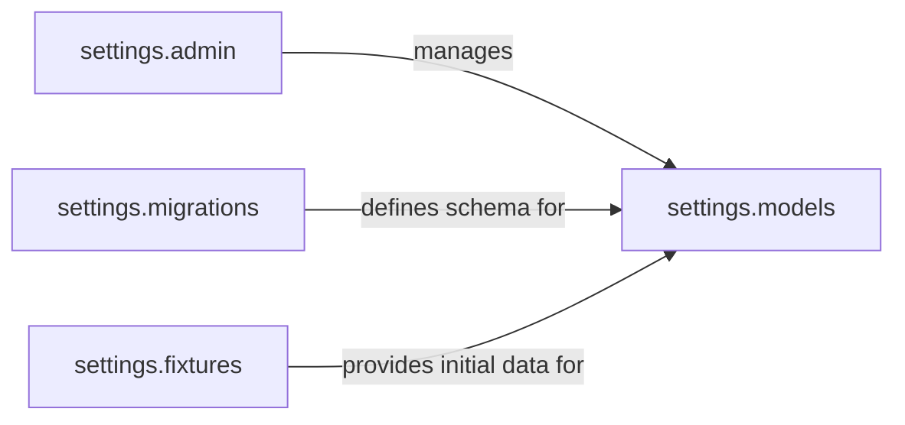

## Details

The `settings` package, as a core component of the CRM system, is responsible for managing application-wide configurations. My analysis focuses on the key modules within this package that directly contribute to this functionality, aligning with the project's "centralize project settings" architectural bias.

### settings.models
This component defines the database schemas for all system-wide settings. It's fundamental because it provides the persistent storage and structure for critical configuration data like mass mail limits, reminder frequencies, and spam filtering rules. Without these models, the system would lack a structured way to store and retrieve its operational parameters.

**Related Classes/Methods**:

- <a href="https://github.com/DjangoCRM/django-crm/settings/models.py#L1-L1" target="_blank" rel="noopener noreferrer">`settings.models` (1:1)</a>

### settings.admin
This component integrates with Django's administrative interface, providing a user-friendly web-based tool for administrators to manage (create, read, update, delete) the settings defined in `settings.models`. It's crucial for enabling dynamic configuration changes without requiring direct database interaction.

**Related Classes/Methods**:

- <a href="https://github.com/DjangoCRM/django-crm/settings/admin.py#L1-L1" target="_blank" rel="noopener noreferrer">`settings.admin` (1:1)</a>

### settings.migrations
This component contains the database migration files that manage changes to the `settings.models` over time. It ensures that the database schema remains consistent with the application's evolving configuration requirements.

**Related Classes/Methods**:

- <a href="https://github.com/DjangoCRM/django-crm/crm/settings.py#L1-L1" target="_blank" rel="noopener noreferrer">`settings.migrations` (1:1)</a>

### settings.fixtures
This component holds initial data (e.g., `massmailsettings.json`, `reminders.json`) that can be loaded into the database, providing default configurations for the system. This is important for setting up new environments or resetting configurations to a known state.

**Related Classes/Methods**:

- <a href="https://github.com/DjangoCRM/django-crm/crm/settings.py#L1-L1" target="_blank" rel="noopener noreferrer">`settings.fixtures` (1:1)</a>

### [FAQ](https://github.com/CodeBoarding/GeneratedOnBoardings/tree/main?tab=readme-ov-file#faq)