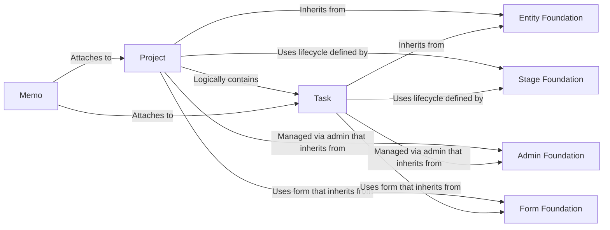

## Details

One paragraph explaining the functionality which is represented by this graph. What the main flow is and what is its purpose.

### Project
Represents a high-level work initiative or container for tasks. It includes the data model, its lifecycle stages, and the corresponding admin interface and form for management.

**Related Classes/Methods**:

- `tasks.models.project`
- `tasks.models.projectstage`
- `tasks.admin`
- `tasks.forms`

### Task
Represents an individual, actionable work item. It is the fundamental unit of work, complete with its own data model, lifecycle stages, admin interface, and form.

**Related Classes/Methods**:

- `tasks.models.task`
- `tasks.models.taskstage`
- `tasks.admin`
- `tasks.forms`

### Memo
A supporting component for adding notes and comments. It is designed to be attached to other primary entities like Projects and Tasks to provide context or log updates.

**Related Classes/Methods**:

- `tasks.models.memo`
- `tasks.admin`
- `tasks.forms`

### Entity Foundation
An abstract base model (`TaskBase`) that provides common fields and functionality (e.g., `name`, `description`, `status`) to the `Project` and `Task` models, enforcing a consistent data structure.

**Related Classes/Methods**:

- `tasks.models.taskbase`

### Stage Foundation
An abstract base model (`StageBase`) for defining ordered, sequential stages. It provides the core logic for the lifecycle management of both `Project` and `Task` entities.

**Related Classes/Methods**:

- `tasks.models.stagebase`

### Admin Foundation
A reusable base class (`TasksBaseModelAdmin`) for the Django Admin interface. It ensures a consistent look, feel, and set of functionalities for all admin pages within the subsystem.

**Related Classes/Methods**:

- `tasks.site.tasksbasemodeladmin`

### Form Foundation
A shared base form (`TaskBaseForm`) that centralizes common fields and validation logic, used by the `Project` and `Task` forms to reduce duplication.

**Related Classes/Methods**:

- `tasks.forms`

### [FAQ](https://github.com/CodeBoarding/GeneratedOnBoardings/tree/main?tab=readme-ov-file#faq)