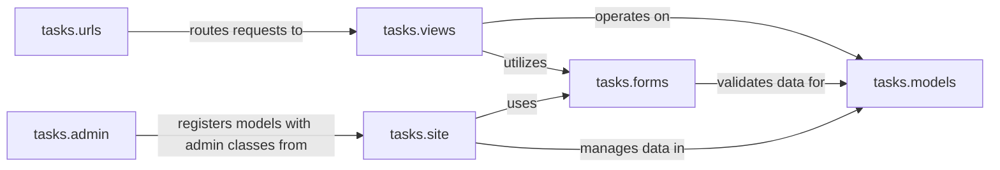

## Details

The `Task & Project Management` subsystem within the CRM is designed to facilitate the organization and tracking of work. It enables users to create, assign, prioritize, and monitor tasks and projects, including setting due dates, managing participants, and updating statuses. This subsystem adheres to the project's Model-View-Template (MVT) and Admin Interface-Driven Development patterns, ensuring a clear separation of concerns and robust administrative capabilities.

### tasks.models
This component defines the entire database schema for task and project management. It includes models for `Task`, `Project`, `Memo`, `Tag`, `Resolution`, and their associated `Stage` models (`TaskStage`, `ProjectStage`). It establishes the relationships and fields for all data entities, serving as the foundational data layer.

**Related Classes/Methods**:

- <a href="https://github.com/DjangoCRM/django-crm/tasks/models/task.py#L0-L0" target="_blank" rel="noopener noreferrer">`tasks.models.task` (0:0)</a>
- <a href="https://github.com/DjangoCRM/django-crm/tasks/models/project.py#L0-L0" target="_blank" rel="noopener noreferrer">`tasks.models.project` (0:0)</a>
- <a href="https://github.com/DjangoCRM/django-crm/tasks/models/memo.py#L0-L0" target="_blank" rel="noopener noreferrer">`tasks.models.memo` (0:0)</a>
- <a href="https://github.com/DjangoCRM/django-crm/tasks/models/tag.py#L0-L0" target="_blank" rel="noopener noreferrer">`tasks.models.tag` (0:0)</a>
- <a href="https://github.com/DjangoCRM/django-crm/tasks/models/resolution.py#L0-L0" target="_blank" rel="noopener noreferrer">`tasks.models.resolution` (0:0)</a>
- <a href="https://github.com/DjangoCRM/django-crm/tasks/models/taskstage.py#L0-L0" target="_blank" rel="noopener noreferrer">`tasks.models.taskstage` (0:0)</a>
- <a href="https://github.com/DjangoCRM/django-crm/tasks/models/projectstage.py#L0-L0" target="_blank" rel="noopener noreferrer">`tasks.models.projectstage` (0:0)</a>

### tasks.forms
This component is responsible for handling data input, validation, and cleaning for the `Task`, `Project`, and `Memo` models. It ensures data integrity by defining rules for user-submitted data before it interacts with the database.

**Related Classes/Methods**:

- <a href="https://github.com/DjangoCRM/django-crm/tasks/forms.py#L0-L0" target="_blank" rel="noopener noreferrer">`tasks.forms.task` (0:0)</a>
- <a href="https://github.com/DjangoCRM/django-crm/tasks/forms.py#L0-L0" target="_blank" rel="noopener noreferrer">`tasks.forms.project` (0:0)</a>
- <a href="https://github.com/DjangoCRM/django-crm/tasks/forms.py#L0-L0" target="_blank" rel="noopener noreferrer">`tasks.forms.memo` (0:0)</a>

### tasks.views
This component contains the core business logic for user-facing interactions related to tasks and projects. It processes web requests, interacts with `tasks.models` to retrieve or modify data, and prepares context for rendering HTML templates. Examples include creating completed subtasks or marking tasks as completed.

**Related Classes/Methods**:

- `tasks.views` (0:0)

### tasks.urls
This component defines the URL routing patterns for the `tasks` application. It maps specific web addresses to the corresponding functions within `tasks.views`, directing incoming HTTP requests to the correct logic handlers.

**Related Classes/Methods**:

- <a href="https://github.com/DjangoCRM/django-crm/tasks/urls.py#L0-L0" target="_blank" rel="noopener noreferrer">`tasks.urls` (0:0)</a>

### tasks.site
This component houses the custom `ModelAdmin` classes (e.g., `TaskAdmin`, `ProjectAdmin`, `MemoAdmin`) that define how the `tasks.models` are displayed, managed, and interacted with within the Django Administration interface. It customizes the admin's behavior, forms, and list displays.

**Related Classes/Methods**:

- <a href="https://github.com/DjangoCRM/django-crm/tasks/site/taskadmin.py#L0-L0" target="_blank" rel="noopener noreferrer">`tasks.site.taskadmin` (0:0)</a>
- <a href="https://github.com/DjangoCRM/django-crm/tasks/site/projectadmin.py#L0-L0" target="_blank" rel="noopener noreferrer">`tasks.site.projectadmin` (0:0)</a>
- <a href="https://github.com/DjangoCRM/django-crm/tasks/site/memoadmin.py#L0-L0" target="_blank" rel="noopener noreferrer">`tasks.site.memoadmin` (0:0)</a>

### tasks.admin
This component is the registration point for the `tasks.models` with their respective `ModelAdmin` classes defined in `tasks.site`. It ensures that tasks, projects, and related entities are accessible and manageable through the Django Administration panel.

**Related Classes/Methods**:

- <a href="https://github.com/DjangoCRM/django-crm/tasks/admin.py#L0-L0" target="_blank" rel="noopener noreferrer">`tasks.admin` (0:0)</a>

### [FAQ](https://github.com/CodeBoarding/GeneratedOnBoardings/tree/main?tab=readme-ov-file#faq)