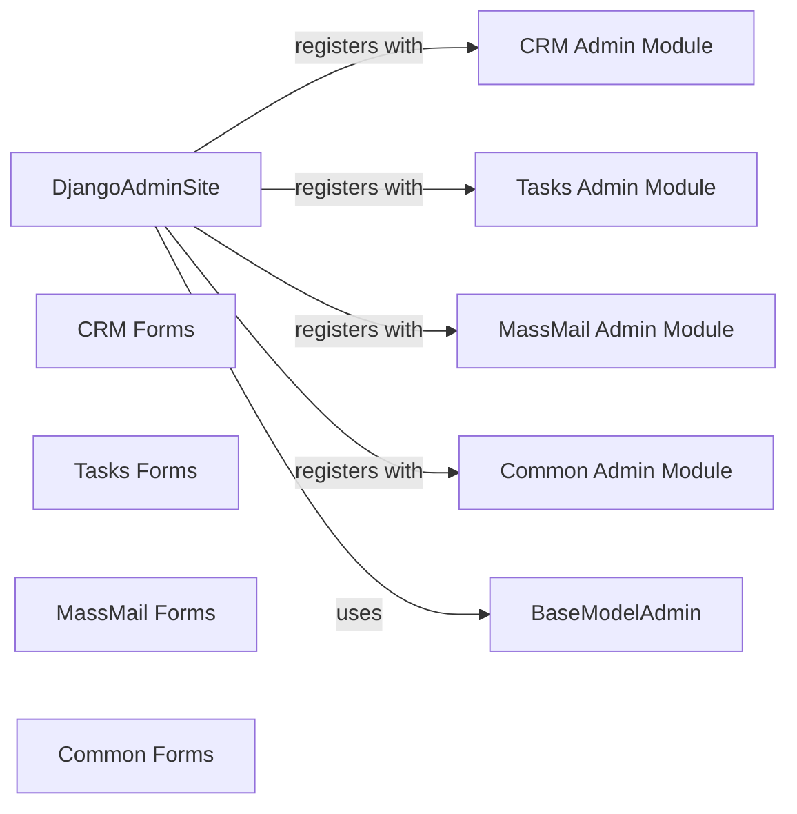

## Details

The `User Interface & Admin Panel` component is a critical part of the CRM system, providing both end-user and administrative functionalities. It heavily relies on Django's MVT pattern and extensive Django Admin customizations. This component serves as the primary web-based interface for both end-users and administrators of the CRM system. It is responsible for rendering dynamic content, processing user input through forms, managing overall navigation, and providing comprehensive administrative capabilities for data management and system configuration. It leverages Django's built-in features for URL routing, view logic, template rendering, and the highly customizable Django Admin interface.

### DjangoAdminSite
This is the custom Django Admin site instance that acts as the central hub for all administrative functionalities across the CRM. It registers `ModelAdmin` classes from various applications (crm, tasks, massmail, common) to provide a unified administrative interface. It's the entry point for administrators to manage all data within the system.

**Related Classes/Methods**:

- <a href="https://github.com/DjangoCRM/django-crm/common/site/crmsite.py#L0-L0" target="_blank" rel="noopener noreferrer">`common.site.crmsite` (0:0)</a>

### BaseModelAdmin
This class serves as a base for custom `ModelAdmin` classes throughout the project. It likely provides common functionalities, customizations, or overrides for the Django Admin's default behavior, ensuring consistency and reducing code duplication across different administrative interfaces.

**Related Classes/Methods**:

- <a href="https://github.com/DjangoCRM/django-crm/common/site/basemodeladmin.py#L0-L0" target="_blank" rel="noopener noreferrer">`common.site.basemodeladmin` (0:0)</a>

### CRM Admin Module
This module contains `ModelAdmin` classes specifically for managing CRM-related models (e.g., Company, Contact, Deal, Lead). These classes define how CRM data is displayed, edited, and managed within the Django Admin interface, including custom actions, filters, and field configurations.

**Related Classes/Methods**:

- <a href="https://github.com/DjangoCRM/django-crm/crm/admin.py#L0-L0" target="_blank" rel="noopener noreferrer">`crm.admin` (0:0)</a>

### Tasks Admin Module
Similar to the CRM Admin Module, this module provides `ModelAdmin` classes for managing task and project-related models (e.g., Task, Project, Memo). It customizes the administrative interface for task management, allowing administrators to oversee and modify tasks, projects, and associated memos.

**Related Classes/Methods**:

- <a href="https://github.com/DjangoCRM/django-crm/tasks/admin.py#L0-L0" target="_blank" rel="noopener noreferrer">`tasks.admin` (0:0)</a>

### MassMail Admin Module
This module defines `ModelAdmin` classes for managing mass mailing functionalities, including email accounts, email messages, and mailing campaigns. It provides administrators with tools to configure and monitor mass email operations within the CRM.

**Related Classes/Methods**:

- <a href="https://github.com/DjangoCRM/django-crm/massmail/admin.py#L0-L0" target="_blank" rel="noopener noreferrer">`massmail.admin` (0:0)</a>

### Common Admin Module
This module contains `ModelAdmin` classes for cross-cutting concerns and common models like User Profiles and Reminders. It ensures that core system-wide configurations and user-related data can be managed through the admin interface.

**Related Classes/Methods**:

- <a href="https://github.com/DjangoCRM/django-crm/common/admin.py#L0-L0" target="_blank" rel="noopener noreferrer">`common.admin` (0:0)</a>

### CRM Forms
This module defines Django `Form` classes used for user input in the CRM module. These forms handle data validation, rendering of input fields, and processing of user submissions for creating or updating CRM entities (e.g., contacts, companies, deals).

**Related Classes/Methods**:

- `crm.forms` (0:0)

### Tasks Forms
This module contains Django `Form` classes specifically for task and project management. These forms facilitate user interaction for creating, editing, and managing tasks, projects, and memos.

**Related Classes/Methods**:

- <a href="https://github.com/DjangoCRM/django-crm/tasks/forms.py#L0-L0" target="_blank" rel="noopener noreferrer">`tasks.forms` (0:0)</a>

### MassMail Forms
This module defines Django `Form` classes for mass mailing functionalities, such as composing email messages or configuring mailing campaigns. These forms enable users to prepare and send mass emails.

**Related Classes/Methods**:

- `massmail.forms` (0:0)

### Common Forms
This module contains Django `Form` classes for common functionalities, such as reminders. These forms provide input mechanisms for system-wide features that are not specific to a single business domain.

**Related Classes/Methods**:

- `common.forms` (0:0)

### [FAQ](https://github.com/CodeBoarding/GeneratedOnBoardings/tree/main?tab=readme-ov-file#faq)