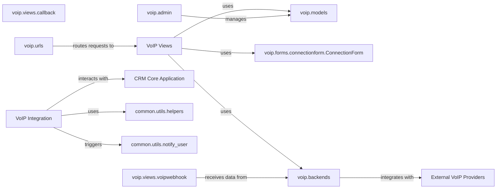

## Details

The VoIP Integration component is a critical part of the CRM system, designed to seamlessly connect the CRM with various Voice over IP services. It enables functionalities such as call tracking, real-time processing of call events via webhooks, and potentially direct call initiation from within the CRM interface. This component adheres to the Monolithic Web Application and Enterprise CRM patterns by encapsulating VoIP-specific logic within its own Django application while integrating with the broader CRM core.

### voip.models
Defines the database schema for all VoIP-related data, including call records, connection configurations, and potentially user-specific VoIP settings. It serves as the persistent storage layer for the VoIP integration.

**Related Classes/Methods**:

- <a href="https://github.com/DjangoCRM/django-crm/voip/models.py#L1-L1" target="_blank" rel="noopener noreferrer">`voip.models` (1:1)</a>

### voip.views.callback
Handles incoming requests related to VoIP connections, often from the CRM's user interface or internal processes. This view might process form submissions for connection setup or trigger actions based on user interaction.

**Related Classes/Methods**:

- <a href="https://github.com/DjangoCRM/django-crm/voip/views/callback.py#L1-L1" target="_blank" rel="noopener noreferrer">`voip.views.callback` (1:1)</a>

### voip.views.voipwebhook
Dedicated to receiving and processing webhooks from external VoIP providers. These webhooks deliver real-time events such as incoming call notifications, call status updates (answered, missed, hung up), and call recordings.

**Related Classes/Methods**:

- <a href="https://github.com/DjangoCRM/django-crm/voip/views/voipwebhook.py#L1-L1" target="_blank" rel="noopener noreferrer">`voip.views.voipwebhook` (1:1)</a>

### voip.forms.connectionform.ConnectionForm
A Django form responsible for validating and processing user input when configuring new VoIP connections or modifying existing ones within the CRM interface.

**Related Classes/Methods**:

- <a href="https://github.com/DjangoCRM/django-crm/voip/forms/connectionform.py#L3-L5" target="_blank" rel="noopener noreferrer">`voip.forms.connectionform.ConnectionForm` (3:5)</a>

### voip.backends
An abstraction layer that defines interfaces for interacting with different VoIP service providers (e.g., Twilio, Vonage). This module contains the concrete implementations for making API calls to these providers, sending commands, and handling their specific responses.

**Related Classes/Methods**:

- `voip.backends` (1:1)

### voip.admin
Customizations for the Django Admin interface, allowing administrators to manage VoIP-related models (e.g., view call logs, manage connection settings) directly through the CRM's administrative panel.

**Related Classes/Methods**:

- <a href="https://github.com/DjangoCRM/django-crm/voip/admin.py#L1-L1" target="_blank" rel="noopener noreferrer">`voip.admin` (1:1)</a>

### voip.urls
Defines the URL routing for the VoIP component, mapping specific URLs to the corresponding views (e.g., webhook endpoints, configuration pages).

**Related Classes/Methods**:

- <a href="https://github.com/DjangoCRM/django-crm/voip/urls.py#L1-L1" target="_blank" rel="noopener noreferrer">`voip.urls` (1:1)</a>

### CRM Core Application
Represents the central business logic and data of the CRM system, including contacts, leads, activities, and user management. The VoIP component integrates deeply with this core.

**Related Classes/Methods**: _None_

### common.utils.helpers
A collection of general utility functions used across the entire project. The VoIP component likely leverages these helpers for common tasks like data formatting, string manipulation, or generic error handling.

**Related Classes/Methods**:

- <a href="https://github.com/DjangoCRM/django-crm/common/utils/helpers.py#L1-L1" target="_blank" rel="noopener noreferrer">`common.utils.helpers` (1:1)</a>

### common.utils.notify_user
A utility component responsible for sending various types of notifications to users (e.g., email, in-app alerts). The VoIP component might use this to notify users of missed calls or new voicemails.

**Related Classes/Methods**:

- <a href="https://github.com/DjangoCRM/django-crm/common/utils/notify_user.py#L17-L33" target="_blank" rel="noopener noreferrer">`common.utils.notify_user` (17:33)</a>

### VoIP Integration [[Expand]](./VoIP_Integration.md)
The VoIP Integration component is a critical part of the CRM system, designed to seamlessly connect the CRM with various Voice over IP services. It enables functionalities such as call tracking, real-time processing of call events via webhooks, and potentially direct call initiation from within the CRM interface. This component adheres to the Monolithic Web Application and Enterprise CRM patterns by encapsulating VoIP-specific logic within its own Django application while integrating with the broader CRM core.

**Related Classes/Methods**: _None_

### VoIP Views
A collective term for views within the VoIP integration component, handling various incoming requests and interactions.

**Related Classes/Methods**: _None_

### External VoIP Providers
External third-party Voice over IP service providers (e.g., Twilio, Vonage) that integrate with the CRM system.

**Related Classes/Methods**: _None_

### [FAQ](https://github.com/CodeBoarding/GeneratedOnBoardings/tree/main?tab=readme-ov-file#faq)