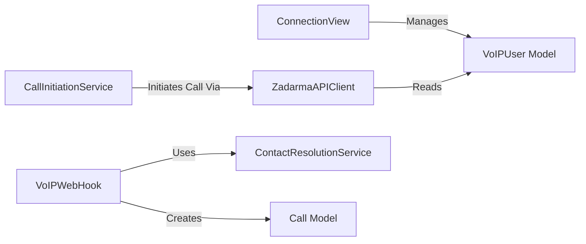

## Details

One paragraph explaining the functionality which is represented by this graph. What the main flow is and what is its purpose.

### VoIPWebHook
This component is the primary listener for incoming webhook events (e.g., call start/end) from the VoIP provider. It is the most critical component for real-time data capture and initiates all subsequent processing.

**Related Classes/Methods**:

- `voip.views.VoIPWebHook`

### ZadarmaAPIClient
This component encapsulates all outbound communication with the Zadarma API. By isolating external API calls, it decouples the subsystem from the provider's specific implementation, simplifying maintenance and future provider changes.

**Related Classes/Methods**:

- `voip.api.ZadarmaAPIClient`

### ConnectionView
Represents the user-facing feature for setting up the VoIP integration. It handles rendering the configuration form (`ConnectionForm`) and processing user input to store API credentials and settings.

**Related Classes/Methods**:

- <a href="https://github.com/DjangoCRM/django-crm/blob/main/voip/views/callback.py#L11-L70" target="_blank" rel="noopener noreferrer">`voip.views.callback.ConnectionView` (11:70)</a>
- <a href="https://github.com/DjangoCRM/django-crm/blob/main/voip/forms/connectionform.py#L3-L5" target="_blank" rel="noopener noreferrer">`voip.forms.connectionform.ConnectionForm` (3:5)</a>

### ContactResolutionService
This service contains the crucial logic (`find_objects_by_phone`) for querying the main CRM database to find contacts or leads associated with an incoming phone number. It represents a clear separation of business rules from I/O operations.

**Related Classes/Methods**:

- `voip.services.ContactResolutionService`
- `voip.services.find_objects_by_phone`

### CallInitiationService
This component represents the "click-to-call" or "callback" functionality within the CRM. It is responsible for initiating outbound calls by invoking the `ZadarmaAPIClient`. This separates the operational action of making a call from the configuration process.

**Related Classes/Methods**: _None_

### Call Model
As a Django model, it defines the database schema for storing call records. It is the foundational component for data persistence, capturing the history of all VoIP interactions.

**Related Classes/Methods**:

- `voip.models.Call`

### VoIPUser Model
This model stores user-specific VoIP credentials and settings. It is fundamental for managing multi-user configurations and providing the necessary authentication details for API clients.

**Related Classes/Methods**:

- `voip.models.VoIPUser`

### [FAQ](https://github.com/CodeBoarding/GeneratedOnBoardings/tree/main?tab=readme-ov-file#faq)