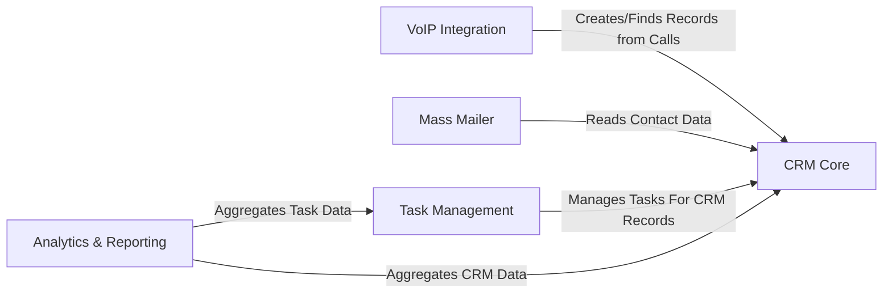

## Details

This project is a modular monolithic application built with Django, organized into distinct apps for each core business function. The main data flow centers on the `CRM Core` component, which acts as the central repository for all customer-related data, including leads, contacts, and deals. Data enters the system through user actions, automated email imports, or real-time VoIP call events. This central data is then accessed by specialized components: `Mass Mailer` reads contact lists for campaigns, `Task Management` links activities to CRM records, and `Analytics & Reporting` aggregates data from both the CRM and task systems to generate business insights. A foundational `Common Services` app provides shared utilities like notifications and base model structures to all other components, ensuring code reuse and consistency.

### CRM Core [[Expand]](./CRM_Core.md)
Serves as the application's foundation, managing the primary entities of a CRM system: leads, contacts, companies, and deals. It is the central source of truth for all customer data and includes functionality for handling individual, non-bulk emails by parsing incoming messages and associating them with the appropriate CRM records.

**Related Classes/Methods**:

- `crm/`

### Task Management [[Expand]](./Task_Management.md)
A dedicated component for creating, tracking, and managing work items. It allows users to create projects and tasks that are directly linked to records within the `CRM Core`, facilitating organized workflows and internal collaboration.

**Related Classes/Methods**:

- `tasks/`

### Mass Mailer [[Expand]](./Mass_Mailer.md)
Manages bulk email marketing campaigns. Distinct from the individual email handling in the CRM Core, this component is specialized for sending communications to large, segmented lists of contacts, leads, or companies.

**Related Classes/Methods**:

- `massmail/`

### Analytics & Reporting [[Expand]](./Analytics_Reporting.md)
Provides business intelligence and data visualization. It aggregates and processes data from the `CRM Core` and `Task Management` components to generate insightful reports, statistics, and dashboards on metrics like lead conversion, deal flow, and team productivity.

**Related Classes/Methods**:

- `analytics/`

### VoIP Integration [[Expand]](./VoIP_Integration.md)
Manages real-time integration with external Voice over IP (VoIP) services. It processes incoming call events, automatically searching for existing contacts or creating new leads in the `CRM Core`, thereby capturing call interactions seamlessly.

**Related Classes/Methods**:

- `voip/`

### [FAQ](https://github.com/CodeBoarding/GeneratedOnBoardings/tree/main?tab=readme-ov-file#faq)