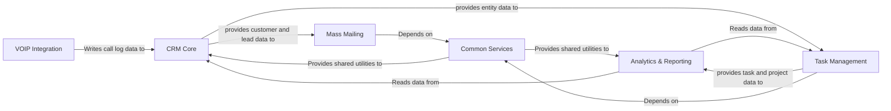

## Details

One paragraph explaining the functionality which is represented by this graph. What the main flow is and what is its purpose.

### CRM Core
The heart of the application, managing fundamental entities like contacts, companies, leads, and deals. It serves as the primary data source for all other components and includes functionality for ingesting data from external sources like emails.

**Related Classes/Methods**:

- `apps/crm/`
- `apps/contacts/`
- `apps/companies/`
- `apps/leads/`
- `apps/deals/`

### Task Management
Manages projects, tasks, and memos. It allows users to create and track work items that can be associated with entities in the CRM Core.

**Related Classes/Methods**:

- `apps/projects/`
- `apps/tasks/`
- `apps/memos/`

### Analytics & Reporting
Aggregates data from other components to provide business intelligence, generate reports, and display performance dashboards, primarily within the Django Admin interface.

**Related Classes/Methods**:

- `apps/analytics/`
- `apps/reports/`

### Mass Mailing
A specialized module for creating, managing, and sending bulk email campaigns to contacts and leads.

**Related Classes/Methods**:

- `apps/mass_mailing/`

### VOIP Integration
Integrates with a third-party VOIP provider to handle call-related events, such as logging incoming calls against CRM records.

**Related Classes/Methods**:

- `apps/calls/`

### Common Services
A foundational, cross-cutting component providing shared utilities, base classes, and core services to all other application modules to enforce consistency.

**Related Classes/Methods**:

- `apps/common/`
- `apps/core/`

### [FAQ](https://github.com/CodeBoarding/GeneratedOnBoardings/tree/main?tab=readme-ov-file#faq)