```mermaid
graph LR
    Core_CRM_Data_Management["Core CRM Data Management"]
    User_Interface_Admin_Panel["User Interface & Admin Panel"]
    Email_Communication_Management["Email & Communication Management"]
    Mass_Mailing_System["Mass Mailing System"]
    Task_Project_Management["Task & Project Management"]
    Analytics_Reporting["Analytics & Reporting"]
    Common_Utilities_Base_Services["Common Utilities & Base Services"]
    VoIP_Integration["VoIP Integration"]
    System_Configuration_Settings["System Configuration & Settings"]
    Chat_Module["Chat Module"]
    Core_CRM_Data_Management -- "Provides structured data for display and receives validated data for persistence." --> User_Interface_Admin_Panel
    Core_CRM_Data_Management -- "Serves as the primary data source for all analytical queries and reports." --> Analytics_Reporting
    Core_CRM_Data_Management -- "Utilizes base models, utility functions, and file attachments." --> Common_Utilities_Base_Services
    User_Interface_Admin_Panel -- "Displays, creates, updates, and deletes CRM entity data." --> Core_CRM_Data_Management
    User_Interface_Admin_Panel -- "Leverages base admin classes, user profile management, authentication, and general UI helpers." --> Common_Utilities_Base_Services
    User_Interface_Admin_Panel -- "Integrates the internal chat interface." --> Chat_Module
    Email_Communication_Management -- "Creates and updates `CrmEmail` records, linking them to relevant CRM entities." --> Core_CRM_Data_Management
    Email_Communication_Management -- "Provides the underlying email sending infrastructure and account management for bulk operations." --> Mass_Mailing_System
    Email_Communication_Management -- "Reads configurations related to email servers, IMAP settings, and OAuth2 credentials." --> System_Configuration_Settings
    Mass_Mailing_System -- "Queries CRM entities to build recipient lists and logs campaign activities." --> Core_CRM_Data_Management
    Mass_Mailing_System -- "Relies on its capabilities for sending individual emails and managing email accounts." --> Email_Communication_Management
    Mass_Mailing_System -- "Retrieves specific configurations for mass mail limits, sending intervals, and default settings." --> System_Configuration_Settings
    Task_Project_Management -- "Links tasks and projects to relevant CRM entities." --> Core_CRM_Data_Management
    Task_Project_Management -- "Provides dedicated UI elements and admin interfaces for managing tasks, projects, and memos." --> User_Interface_Admin_Panel
    Task_Project_Management -- "Utilizes common base models, user profiles, and notification utilities." --> Common_Utilities_Base_Services
    Analytics_Reporting -- "Queries and processes raw data from CRM entities to generate reports." --> Core_CRM_Data_Management
    Analytics_Reporting -- "Displays the generated reports and dashboards." --> User_Interface_Admin_Panel
    Common_Utilities_Base_Services -- "Provides base models for inheritance and general utility functions." --> Core_CRM_Data_Management
    Common_Utilities_Base_Services -- "Supports core UI elements, user authentication, and base admin functionalities." --> User_Interface_Admin_Panel
    Common_Utilities_Base_Services -- "Reads general application settings that influence its behavior." --> System_Configuration_Settings
    VoIP_Integration -- "Logs call records, linking them to relevant contacts, companies, or deals." --> Core_CRM_Data_Management
    VoIP_Integration -- "May use common utilities for user identification, logging, or time zone handling." --> Common_Utilities_Base_Services
    System_Configuration_Settings -- "Provides specific configurations for mass email campaigns." --> Mass_Mailing_System
    System_Configuration_Settings -- "Supplies settings for email accounts, IMAP, and OAuth2." --> Email_Communication_Management
    System_Configuration_Settings -- "Configures general application behavior." --> Common_Utilities_Base_Services
    Chat_Module -- "Integrates the chat interface into the overall CRM UI." --> User_Interface_Admin_Panel
    Chat_Module -- "Utilizes common components for user authentication, user profiles, and potentially notification mechanisms." --> Common_Utilities_Base_Services
    click Core_CRM_Data_Management href "https://github.com/CodeBoarding/GeneratedOnBoardings/blob/main/django-crm/Core_CRM_Data_Management.md" "Details"
    click User_Interface_Admin_Panel href "https://github.com/CodeBoarding/GeneratedOnBoardings/blob/main/django-crm/User_Interface_Admin_Panel.md" "Details"
    click Email_Communication_Management href "https://github.com/CodeBoarding/GeneratedOnBoardings/blob/main/django-crm/Email_Communication_Management.md" "Details"
    click Mass_Mailing_System href "https://github.com/CodeBoarding/GeneratedOnBoardings/blob/main/django-crm/Mass_Mailing_System.md" "Details"
    click Task_Project_Management href "https://github.com/CodeBoarding/GeneratedOnBoardings/blob/main/django-crm/Task_Project_Management.md" "Details"
    click Analytics_Reporting href "https://github.com/CodeBoarding/GeneratedOnBoardings/blob/main/django-crm/Analytics_Reporting.md" "Details"
    click Common_Utilities_Base_Services href "https://github.com/CodeBoarding/GeneratedOnBoardings/blob/main/django-crm/Common_Utilities_Base_Services.md" "Details"
    click VoIP_Integration href "https://github.com/CodeBoarding/GeneratedOnBoardings/blob/main/django-crm/VoIP_Integration.md" "Details"
    click System_Configuration_Settings href "https://github.com/CodeBoarding/GeneratedOnBoardings/blob/main/django-crm/System_Configuration_Settings.md" "Details"
    click Chat_Module href "https://github.com/CodeBoarding/GeneratedOnBoardings/blob/main/django-crm/Chat_Module.md" "Details"
```

## Details

Here's the final architecture analysis for `django-crm`, presenting a high-level data flow overview based on the provided CFG and source analysis. The architecture adheres to a Monolithic Web Application pattern with a strong MVT (Model-View-Template) and Database-Centric approach, typical for an Enterprise CRM system.

### Core CRM Data Management [[Expand]](./Core_CRM_Data_Management.md)
This is the foundational data layer, defining and managing all core CRM entities such as Companies, Contacts, Leads, Deals, Requests, Payments, and Shipments. It encapsulates the business logic for CRUD operations, ensuring data integrity and acting as the single source of truth for all customer and sales-related information.

**Related Classes/Methods**:

- <a href="https://github.com/DjangoCRM/django-crm/crm/models/company.py#L10-L92" target="_blank" rel="noopener noreferrer">`crm.models.Company` (10:92)</a>
- <a href="https://github.com/DjangoCRM/django-crm/crm/models/contact.py#L9-L29" target="_blank" rel="noopener noreferrer">`crm.models.Contact` (9:29)</a>
- <a href="https://github.com/DjangoCRM/django-crm/crm/models/deal.py#L10-L202" target="_blank" rel="noopener noreferrer">`crm.models.Deal` (10:202)</a>
- `crm.forms.CompanyForm` (1:1)
- <a href="https://github.com/DjangoCRM/django-crm/crm/forms/contact_form.py#L9-L72" target="_blank" rel="noopener noreferrer">`crm.forms.ContactForm` (9:72)</a>
- <a href="https://github.com/DjangoCRM/django-crm/crm/admin.py#L76-L128" target="_blank" rel="noopener noreferrer">`crm.admin.CompanyAdmin` (76:128)</a>
- <a href="https://github.com/DjangoCRM/django-crm/crm/admin.py#L131-L199" target="_blank" rel="noopener noreferrer">`crm.admin.DealAdmin` (131:199)</a>
- `crm.site.CrmModelAdmin` (1:1)

### User Interface & Admin Panel [[Expand]](./User_Interface_Admin_Panel.md)
This component provides the primary web-based interface for both end-users and administrators. It heavily leverages Django's Model-View-Template (MVT) pattern and extensive Django Admin customizations to handle form rendering, data display, user input processing, and overall navigation.

**Related Classes/Methods**:

- <a href="https://github.com/DjangoCRM/django-crm/common/site/crmsite.py#L1-L1" target="_blank" rel="noopener noreferrer">`common.site.crmsite` (1:1)</a>
- <a href="https://github.com/DjangoCRM/django-crm/common/site/basemodeladmin.py#L1-L1" target="_blank" rel="noopener noreferrer">`common.site.basemodeladmin` (1:1)</a>
- `crm.site` (1:1)
- `tasks.site` (1:1)
- `massmail.site` (1:1)
- <a href="https://github.com/DjangoCRM/django-crm/crm/admin.py#L1-L1" target="_blank" rel="noopener noreferrer">`crm.admin` (1:1)</a>
- <a href="https://github.com/DjangoCRM/django-crm/common/admin.py#L1-L1" target="_blank" rel="noopener noreferrer">`common.admin` (1:1)</a>
- `crm.forms` (1:1)
- <a href="https://github.com/DjangoCRM/django-crm/tasks/forms.py#L1-L1" target="_blank" rel="noopener noreferrer">`tasks.forms` (1:1)</a>
- `massmail.forms` (1:1)

### Email & Communication Management [[Expand]](./Email_Communication_Management.md)
Manages individual email interactions within the CRM. This includes sending emails directly from CRM records, importing emails from external IMAP accounts, managing email accounts, and handling OAuth2 for secure email service integration.

**Related Classes/Methods**:

- <a href="https://github.com/DjangoCRM/django-crm/crm/models/crmemail.py#L1-L1" target="_blank" rel="noopener noreferrer">`crm.models.crmemail` (1:1)</a>
- <a href="https://github.com/DjangoCRM/django-crm/crm/utils/crm_imap.py#L1-L1" target="_blank" rel="noopener noreferrer">`crm.utils.crm_imap` (1:1)</a>
- <a href="https://github.com/DjangoCRM/django-crm/crm/utils/import_emails.py#L1-L1" target="_blank" rel="noopener noreferrer">`crm.utils.import_emails` (1:1)</a>
- <a href="https://github.com/DjangoCRM/django-crm/crm/utils/send_email.py#L24-L77" target="_blank" rel="noopener noreferrer">`crm.utils.send_email` (24:77)</a>
- <a href="https://github.com/DjangoCRM/django-crm/crm/utils/create_email_request.py#L39-L94" target="_blank" rel="noopener noreferrer">`crm.utils.create_email_request` (39:94)</a>
- <a href="https://github.com/DjangoCRM/django-crm/crm/utils/oauth2.py#L1-L1" target="_blank" rel="noopener noreferrer">`crm.utils.oauth2` (1:1)</a>

### Mass Mailing System [[Expand]](./Mass_Mailing_System.md)
Enables the creation, management, and execution of mass email campaigns. It handles recipient selection from CRM data, email content templating, scheduling, and tracking of campaign performance.

**Related Classes/Methods**:

- <a href="https://github.com/DjangoCRM/django-crm/massmail/models/email_account.py#L12-L130" target="_blank" rel="noopener noreferrer">`massmail.models.EmailAccount` (12:130)</a>
- <a href="https://github.com/DjangoCRM/django-crm/massmail/models/mailing_out.py#L8-L110" target="_blank" rel="noopener noreferrer">`massmail.models.MailingOut` (8:110)</a>
- <a href="https://github.com/DjangoCRM/django-crm/massmail/admin.py#L17-L41" target="_blank" rel="noopener noreferrer">`massmail.admin.EmailAccountAdmin` (17:41)</a>
- <a href="https://github.com/DjangoCRM/django-crm/massmail/utils/sendmassmail.py#L1-L1" target="_blank" rel="noopener noreferrer">`massmail.utils.sendmassmail` (1:1)</a>
- <a href="https://github.com/DjangoCRM/django-crm/massmail/utils/email_creators.py#L1-L1" target="_blank" rel="noopener noreferrer">`massmail.utils.email_creators` (1:1)</a>
- `massmail.views` (1:1)

### Task & Project Management [[Expand]](./Task_Project_Management.md)
Facilitates the organization and tracking of work within the CRM. Users can create, assign, prioritize, and monitor tasks and projects, including setting due dates, managing participants, and updating statuses.

**Related Classes/Methods**:

- <a href="https://github.com/DjangoCRM/django-crm/tasks/models/task.py#L12-L106" target="_blank" rel="noopener noreferrer">`tasks.models.Task` (12:106)</a>
- <a href="https://github.com/DjangoCRM/django-crm/tasks/models/project.py#L6-L25" target="_blank" rel="noopener noreferrer">`tasks.models.Project` (6:25)</a>
- `tasks.site.TaskAdmin` (1:1)
- <a href="https://github.com/DjangoCRM/django-crm/tasks/forms.py#L79-L84" target="_blank" rel="noopener noreferrer">`tasks.forms.TaskForm` (79:84)</a>
- <a href="https://github.com/DjangoCRM/django-crm/tasks/admin.py#L1-L1" target="_blank" rel="noopener noreferrer">`tasks.admin` (1:1)</a>

### Analytics & Reporting [[Expand]](./Analytics_Reporting.md)
Provides business intelligence by aggregating, analyzing, and visualizing CRM data. It generates various statistical reports and dashboards, offering insights into sales performance, lead conversion, income, and other key CRM metrics.

**Related Classes/Methods**:

- <a href="https://github.com/DjangoCRM/django-crm/analytics/models.py#L47-L52" target="_blank" rel="noopener noreferrer">`analytics.models.ClosingReasonStat` (47:52)</a>
- <a href="https://github.com/DjangoCRM/django-crm/analytics/models.py#L55-L60" target="_blank" rel="noopener noreferrer">`analytics.models.DealStat` (55:60)</a>
- `analytics.site.DealStatAdmin` (1:1)
- <a href="https://github.com/DjangoCRM/django-crm/analytics/utils/helpers.py#L1-L1" target="_blank" rel="noopener noreferrer">`analytics.utils.helpers` (1:1)</a>
- <a href="https://github.com/DjangoCRM/django-crm/analytics/utils/monthly_snapshot_saving.py#L1-L1" target="_blank" rel="noopener noreferrer">`analytics.utils.monthly_snapshot_saving` (1:1)</a>
- <a href="https://github.com/DjangoCRM/django-crm/analytics/admin.py#L1-L1" target="_blank" rel="noopener noreferrer">`analytics.admin` (1:1)</a>

### Common Utilities & Base Services [[Expand]](./Common_Utilities_Base_Services.md)
This foundational component provides a set of reusable utilities, helper functions, and base classes that are utilized across various modules of the CRM system. It includes functionalities like user authentication, user profile management, notifications, file handling, reminders, and base administrative functionalities.

**Related Classes/Methods**:

- <a href="https://github.com/DjangoCRM/django-crm/common/utils/notif_email_sender.py#L1-L1" target="_blank" rel="noopener noreferrer">`common.utils.notif_email_sender` (1:1)</a>
- <a href="https://github.com/DjangoCRM/django-crm/common/utils/reminders_sender.py#L1-L1" target="_blank" rel="noopener noreferrer">`common.utils.reminders_sender` (1:1)</a>
- <a href="https://github.com/DjangoCRM/django-crm/common/site/userprofileadmin.py#L1-L1" target="_blank" rel="noopener noreferrer">`common.site.userprofileadmin` (1:1)</a>
- <a href="https://github.com/DjangoCRM/django-crm/common/models.py#L17-L62" target="_blank" rel="noopener noreferrer">`common.models.Base` (17:62)</a>
- <a href="https://github.com/DjangoCRM/django-crm/common/models.py#L247-L331" target="_blank" rel="noopener noreferrer">`common.models.UserProfile` (247:331)</a>
- <a href="https://github.com/DjangoCRM/django-crm/common/models.py#L141-L189" target="_blank" rel="noopener noreferrer">`common.models.Reminder` (141:189)</a>
- `common.views` (1:1)
- <a href="https://github.com/DjangoCRM/django-crm/common/admin.py#L1-L1" target="_blank" rel="noopener noreferrer">`common.admin` (1:1)</a>

### VoIP Integration [[Expand]](./VoIP_Integration.md)
Integrates the CRM with Voice over IP (VoIP) services. This component handles call tracking, processes webhooks from VoIP providers (e.g., for incoming/outgoing calls), and potentially allows initiating calls directly from within the CRM interface.

**Related Classes/Methods**:

- `voip.backends` (1:1)
- <a href="https://github.com/DjangoCRM/django-crm/voip/views/callback.py#L1-L1" target="_blank" rel="noopener noreferrer">`voip.views.callback` (1:1)</a>
- <a href="https://github.com/DjangoCRM/django-crm/voip/models.py#L1-L1" target="_blank" rel="noopener noreferrer">`voip.models` (1:1)</a>
- `voip.forms.ConnectionForm` (1:1)

### System Configuration & Settings [[Expand]](./System_Configuration_Settings.md)
Manages application-wide settings and configurations. This includes global parameters that influence the system's behavior, such as mass mail limits, reminder frequencies, and integration credentials.

**Related Classes/Methods**:

- <a href="https://github.com/DjangoCRM/django-crm/settings/models.py#L33-L64" target="_blank" rel="noopener noreferrer">`settings.models.MassmailSettings` (33:64)</a>
- <a href="https://github.com/DjangoCRM/django-crm/settings/models.py#L1-L1" target="_blank" rel="noopener noreferrer">`settings.models.ReminderSettings` (1:1)</a>
- <a href="https://github.com/DjangoCRM/django-crm/settings/admin.py#L1-L1" target="_blank" rel="noopener noreferrer">`settings.admin` (1:1)</a>

### Chat Module [[Expand]](./Chat_Module.md)
Provides internal chat functionalities, allowing users to communicate in real-time within the CRM system. It handles message storage, retrieval, and display.

**Related Classes/Methods**:

- <a href="https://github.com/DjangoCRM/django-crm/chat/models.py#L11-L59" target="_blank" rel="noopener noreferrer">`chat.models.ChatMessage` (11:59)</a>
- <a href="https://github.com/DjangoCRM/django-crm/chat/site/chatmessageadmin.py#L1-L1" target="_blank" rel="noopener noreferrer">`chat.site.chatmessageadmin` (1:1)</a>
- `chat.forms.ChatMessageForm` (1:1)

### [FAQ](https://github.com/CodeBoarding/GeneratedOnBoardings/tree/main?tab=readme-ov-file#faq)