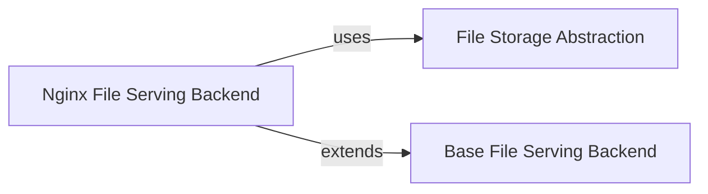

## Details

The File Serving & Storage subsystem in django-filer is crucial for managing and delivering digital assets efficiently. It provides a flexible architecture that abstracts file storage and integrates with various web server configurations for optimized file serving.

### File Storage Abstraction
This component provides a unified interface for file persistence operations (saving, retrieving, deleting) across various storage backends (e.g., local filesystem, cloud storage). It ensures that the rest of the application interacts with files in a consistent manner, abstracting away the complexities of the underlying storage mechanism. This aligns with Django's file storage API and the project's architectural bias towards file system abstraction.

**Related Classes/Methods**:

- <a href="https://github.com/django-cms/django-filer/blob/master/filer/storage.py" target="_blank" rel="noopener noreferrer">`filer.storage`</a>

### Base File Serving Backend
This component defines the foundational contract and common utilities for all file serving strategies. It ensures consistent handling of HTTP headers (like Content-Disposition and Content-Length) and provides a base for concrete implementations to extend, adhering to a "Plugin/Module Pattern" for different web server integrations.

**Related Classes/Methods**:

- <a href="https://github.com/django-cms/django-filer/blob/master/filer/server/backends/base.py" target="_blank" rel="noopener noreferrer">`filer.server.backends.base`</a>

### Nginx File Serving Backend
A specialized implementation of the file serving backend designed to leverage Nginx's X-Accel-Redirect feature. This component offloads the actual file delivery to Nginx, significantly enhancing performance and reducing the load on the Django application for serving large files.

**Related Classes/Methods**:

- <a href="https://github.com/django-cms/django-filer/blob/master/filer/server/backends/nginx.py" target="_blank" rel="noopener noreferrer">`filer.server.backends.nginx`</a>

### [FAQ](https://github.com/CodeBoarding/GeneratedOnBoardings/tree/main?tab=readme-ov-file#faq)