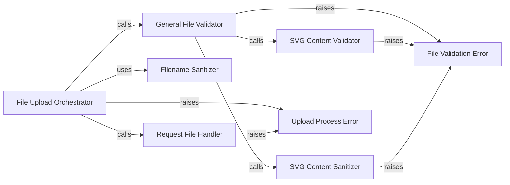

## Details

The File Upload & Validation subsystem is crucial for securely handling incoming files within django-filer. It ensures data integrity and mitigates security risks by processing and validating uploaded content before storage.

### File Upload Orchestrator
The primary entry point for file uploads, coordinating the overall process from reception to initial processing and validation. It acts as the central controller for the upload flow.

**Related Classes/Methods**:

- <a href="https://github.com/django-cms/django-filer/blob/master/filer/utils/files.py" target="_blank" rel="noopener noreferrer">`filer/utils/files.py:handle_upload`</a>

### Request File Handler
Extracts and prepares file data specifically from HTTP requests, making it ready for further handling by the orchestrator.

**Related Classes/Methods**:

- <a href="https://github.com/django-cms/django-filer/blob/master/filer/utils/files.py" target="_blank" rel="noopener noreferrer">`filer/utils/files.py:handle_request_files_upload`</a>

### Filename Sanitizer
Ensures filenames are secure and compliant by sanitizing them, preventing issues like path traversal or invalid characters before storage.

**Related Classes/Methods**:

- <a href="https://github.com/django-cms/django-filer/blob/master/filer/utils/files.py" target="_blank" rel="noopener noreferrer">`filer/utils/files.py:get_valid_filename`</a>

### General File Validator
Performs high-level, general validation checks on the uploaded file's content or metadata, acting as a gatekeeper for file integrity. It delegates to specific content validators.

**Related Classes/Methods**:

- <a href="https://github.com/django-cms/django-filer/blob/master/filer/validation.py" target="_blank" rel="noopener noreferrer">`filer/validation.py:validate_upload`</a>

### SVG Content Validator
Focuses on validating the structural and content integrity of SVG files, ensuring they are well-formed and free from malicious elements.

**Related Classes/Methods**:

- <a href="https://github.com/django-cms/django-filer/blob/master/filer/validation.py" target="_blank" rel="noopener noreferrer">`filer/validation.py:validate_svg`</a>

### SVG Content Sanitizer
Cleans and sanitizes SVG file content by removing potentially harmful scripts or tags, enhancing the security of SVG uploads.

**Related Classes/Methods**:

- <a href="https://github.com/django-cms/django-filer/blob/master/filer/validation.py" target="_blank" rel="noopener noreferrer">`filer/validation.py:sanitize_svg`</a>

### File Validation Error
A custom exception class used to signal specific errors encountered during the file validation process, providing detailed feedback on validation failures.

**Related Classes/Methods**:

- <a href="https://github.com/django-cms/django-filer/blob/master/filer/validation.py" target="_blank" rel="noopener noreferrer">`filer/validation.py:FileValidationError`</a>

### Upload Process Error
A custom exception class used to signal errors that occur during the initial file upload handling and processing, indicating issues at the reception or initial processing stage.

**Related Classes/Methods**:

- <a href="https://github.com/django-cms/django-filer/blob/master/filer/utils/files.py" target="_blank" rel="noopener noreferrer">`filer/utils/files.py:UploadException`</a>

### [FAQ](https://github.com/CodeBoarding/GeneratedOnBoardings/tree/main?tab=readme-ov-file#faq)