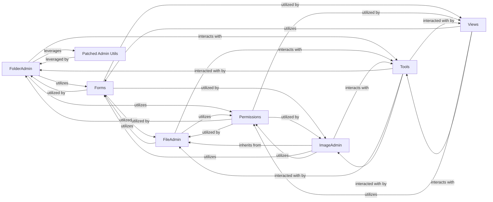

## Details

The `django-filer` admin subsystem is structured around Django's ModelAdmin pattern, providing a robust interface for managing digital assets. Central to this are `FolderAdmin`, `FileAdmin`, and `ImageAdmin`, which extend Django's base admin functionalities to handle specific asset types. These ModelAdmins are supported by `Forms` for data validation and input, `Views` for custom administrative workflows, and `Permissions` for enforcing access control. The `Tools` component provides common utilities, while `Patched Admin Utils` extends core Django admin behaviors to fit `django-filer`'s unique requirements, particularly for polymorphic models. This modular design ensures clear separation of concerns and extensibility for asset management within the Django admin.

### FolderAdmin
This is a specialized Django ModelAdmin responsible for managing `Folder` objects. It handles standard CRUD operations and extends functionality to include bulk actions (move, copy, delete), renaming, and potentially image resizing operations specific to folders. It is fundamental for organizing assets hierarchically.

**Related Classes/Methods**:

- <a href="https://github.com/django-cms/django-filer/blob/master/filer/admin/folderadmin.py#L63-L1334" target="_blank" rel="noopener noreferrer">`FolderAdmin`:63-1334</a>

### FileAdmin
Serves as the base Django ModelAdmin for generic `File` objects. It provides fundamental administrative capabilities applicable to all file types, such as generating icon URLs for display in the admin. It's the foundation for managing individual digital assets.

**Related Classes/Methods**:

- <a href="https://github.com/django-cms/django-filer/blob/master/filer/admin/fileadmin.py#L59-L225" target="_blank" rel="noopener noreferrer">`FileAdmin`:59-225</a>

### ImageAdmin
A specialized ModelAdmin that extends `FileAdmin` to manage `Image` objects. It adds image-specific features like subject location (for intelligent cropping) and expanded views within the admin interface, catering to the unique needs of image assets.

**Related Classes/Methods**:

- <a href="https://github.com/django-cms/django-filer/blob/master/filer/admin/imageadmin.py#L86-L105" target="_blank" rel="noopener noreferrer">`ImageAdmin`:86-105</a>

### Views
Contains custom Django views that handle administrative actions not directly covered by the ModelAdmin classes. This includes specific workflows like creating new folders via AJAX or other custom interactions, providing dynamic and specialized functionalities.

**Related Classes/Methods**:

- <a href="https://github.com/django-cms/django-filer/blob/master/filer/admin/views.py" target="_blank" rel="noopener noreferrer">`Views`</a>

### Forms
Defines Django Form classes used for data input, validation, and manipulation within the admin interface for Filer's models (Files and Folders). This component is crucial for ensuring data integrity and user input handling.

**Related Classes/Methods**:

- <a href="https://github.com/django-cms/django-filer/blob/master/filer/admin/forms.py" target="_blank" rel="noopener noreferrer">`Forms`</a>

### Permissions
Manages and enforces user permissions for various operations within the Filer Admin Interface. This includes checks for creating, viewing, modifying, and deleting files and folders, ensuring secure access control over digital assets.

**Related Classes/Methods**:

- <a href="https://github.com/django-cms/django-filer/blob/master/filer/settings.py" target="_blank" rel="noopener noreferrer">`Permissions`</a>

### Tools
A collection of utility functions that support the various components of the admin interface. This includes helper functions for permission checks, URL generation, and providing UI feedback mechanisms, centralizing common administrative utilities.

**Related Classes/Methods**:

- <a href="https://github.com/django-cms/django-filer/blob/master/filer/admin/tools.py" target="_blank" rel="noopener noreferrer">`Tools`</a>

### Patched Admin Utils
Provides overridden or extended Django admin utilities, specifically for handling complex scenarios like polymorphic object deletion. This component adapts Django's core admin functionalities to `django-filer`'s specific needs, ensuring seamless integration and specialized behavior.

**Related Classes/Methods**:

- <a href="https://github.com/django-cms/django-filer/blob/master/filer/admin/patched/admin_utils.py" target="_blank" rel="noopener noreferrer">`Patched Admin Utils`</a>

### [FAQ](https://github.com/CodeBoarding/GeneratedOnBoardings/tree/main?tab=readme-ov-file#faq)