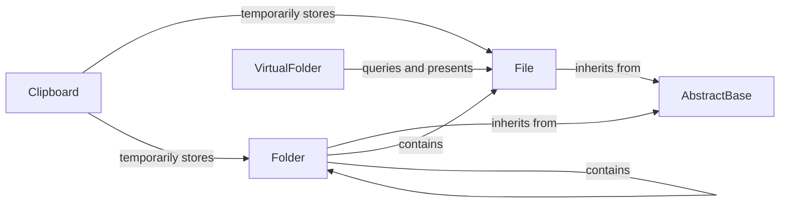

## Details

The `Filer Models` subsystem forms the core data layer for `django-filer`, defining the structure and relationships of digital assets within the application. It adheres to Django's Model-View-Template (MVT) pattern by providing the 'Model' aspect, handling data persistence, integrity, and basic access control for files and folders.

### AbstractBase
Serves as the base class for all file and folder models, providing common attributes and methods. It handles shared concerns like dimensions, permissions, and thumbnail generation logic. It also orchestrates save operations and provides permission checking for its inheriting models.

**Related Classes/Methods**:

- <a href="https://github.com/django-cms/django-filer/blob/master/filer/models/abstract.py" target="_blank" rel="noopener noreferrer">`filer.models.abstract.AbstractBase`</a>

### File
Represents an individual digital file. Manages file-specific metadata (e.g., SHA1 hash, file size, original filename), interacts with the configured file storage backend, and provides methods for generating various admin URLs and logical paths.

**Related Classes/Methods**:

- <a href="https://github.com/django-cms/django-filer/blob/master/filer/models/filemodels.py" target="_blank" rel="noopener noreferrer">`filer.models.filemodels.File`</a>

### Folder
Represents an organizational unit for files and other folders, establishing a hierarchical structure. Manages folder-specific metadata and provides methods for counting contained files and child folders, as well as generating logical paths.

**Related Classes/Methods**:

- <a href="https://github.com/django-cms/django-filer/blob/master/filer/models/foldermodels.py" target="_blank" rel="noopener noreferrer">`filer.models.foldermodels.Folder`</a>

### Clipboard
Provides temporary storage for `File` and `Folder` instances during copy/move operations within the Django admin interface, facilitating batch processing.

**Related Classes/Methods**:

- <a href="https://github.com/django-cms/django-filer/blob/master/filer/models/clipboardmodels.py" target="_blank" rel="noopener noreferrer">`filer.models.clipboardmodels.Clipboard`</a>

### VirtualFolder
Offers dynamic, virtual representations of file collections that may not correspond to physical folders (e.g., "Unsorted Images"). This allows for flexible organization and presentation of assets based on specific criteria.

**Related Classes/Methods**:

- <a href="https://github.com/django-cms/django-filer/blob/master/filer/models/virtualitems.py" target="_blank" rel="noopener noreferrer">`filer.models.virtualitems.VirtualFolder`</a>

### [FAQ](https://github.com/CodeBoarding/GeneratedOnBoardings/tree/main?tab=readme-ov-file#faq)