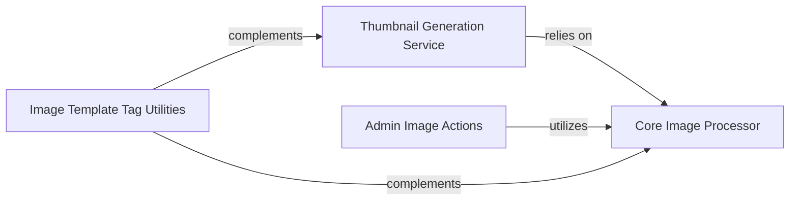

## Details

The `Image Manipulation & Thumbnails` subsystem primarily encompasses functionalities defined within `filer/templatetags/filer_image_tags.py` and `filer/thumbnail_processors.py`, along with related models and admin integrations that trigger or utilize these processes.

### Core Image Processor
This component is the fundamental engine for all image transformations. It handles the actual pixel-level manipulation, including scaling, cropping, and applying subject-location-aware adjustments to images. It leverages the Pillow library for these operations.

**Related Classes/Methods**:

- <a href="https://github.com/django-cms/django-filer/blob/master/filer/thumbnail_processors.py#L34-L133" target="_blank" rel="noopener noreferrer">`filer.thumbnail_processors.scale_and_crop_with_subject_location`:34-133</a>
- <a href="https://github.com/django-cms/django-filer/blob/master/filer/thumbnail_processors.py#L20-L31" target="_blank" rel="noopener noreferrer">`filer.thumbnail_processors.normalize_subject_location`:20-31</a>

### Thumbnail Generation Service
This component is responsible for initiating and managing the creation of various image renditions (thumbnails, icons) for File and Image objects within the `django-filer` system. It acts as the model-level interface for requesting and generating these processed images.

**Related Classes/Methods**:

- <a href="https://github.com/django-cms/django-filer/blob/master/filer/models/abstract.py" target="_blank" rel="noopener noreferrer">`filer.models.abstract.File:icons`</a>
- <a href="https://github.com/django-cms/django-filer/blob/master/filer/models/abstract.py" target="_blank" rel="noopener noreferrer">`filer.models.abstract.File:thumbnails`</a>
- <a href="https://github.com/django-cms/django-filer/blob/master/filer/models/abstract.py" target="_blank" rel="noopener noreferrer">`filer.models.abstract.File:_generate_thumbnails`</a>
- <a href="https://github.com/django-cms/django-filer/blob/master/filer/models/abstract.py" target="_blank" rel="noopener noreferrer">`filer.models.abstract.Image:icons`</a>
- <a href="https://github.com/django-cms/django-filer/blob/master/filer/models/abstract.py" target="_blank" rel="noopener noreferrer">`filer.models.abstract.Image:thumbnails`</a>
- <a href="https://github.com/django-cms/django-filer/blob/master/filer/models/abstract.py" target="_blank" rel="noopener noreferrer">`filer.models.abstract.Image:_generate_thumbnails`</a>

### Image Template Tag Utilities
This component provides a set of Django template tags and utility functions designed to assist in the dynamic display and styling of images within templates. It focuses on calculating dimensions, padding, and CSS positioning rather than direct image manipulation.

**Related Classes/Methods**:

- <a href="https://github.com/django-cms/django-filer/blob/master/filer/templatetags/filer_image_tags.py#L34-L56" target="_blank" rel="noopener noreferrer">`filer.templatetags.filer_image_tags._resize`:34-56</a>
- <a href="https://github.com/django-cms/django-filer/blob/master/filer/templatetags/filer_image_tags.py#L15-L31" target="_blank" rel="noopener noreferrer">`filer.templatetags.filer_image_tags._recalculate_size`:15-31</a>
- <a href="https://github.com/django-cms/django-filer/blob/master/filer/templatetags/filer_image_tags.py#L124-L136" target="_blank" rel="noopener noreferrer">`filer.templatetags.filer_image_tags.get_css_position`:124-136</a>

### Admin Image Actions
This component integrates image management functionalities into the Django administration interface. It provides actions for administrators to perform bulk operations on images, suchs as resizing and updating subject location data.

**Related Classes/Methods**:

- <a href="https://github.com/django-cms/django-filer/blob/master/filer/admin/folderadmin.py#L1289-L1332" target="_blank" rel="noopener noreferrer">`filer.admin.folderadmin.resize_images`:1289-1332</a>
- <a href="https://github.com/django-cms/django-filer/blob/master/filer/admin/folderadmin.py#L1242-L1268" target="_blank" rel="noopener noreferrer">`filer.admin.folderadmin._resize_image`:1242-1268</a>
- <a href="https://github.com/django-cms/django-filer/blob/master/filer/admin/folderadmin.py#L1229-L1240" target="_blank" rel="noopener noreferrer">`filer.admin.folderadmin._new_subject_location`:1229-1240</a>

### [FAQ](https://github.com/CodeBoarding/GeneratedOnBoardings/tree/main?tab=readme-ov-file#faq)