```mermaid
graph LR
    Filer_Models["Filer Models"]
    Filer_Admin_Interface["Filer Admin Interface"]
    File_Upload_Validation["File Upload & Validation"]
    Image_Manipulation_Thumbnails["Image Manipulation & Thumbnails"]
    File_Serving_Storage["File Serving & Storage"]
    Management_Commands["Management Commands"]
    Django_CMS_Integration["Django CMS Integration"]
    Filer_Admin_Interface -- "manages/persists data" --> Filer_Models
    Filer_Admin_Interface -- "enforces permissions" --> Filer_Models
    Filer_Admin_Interface -- "submits uploads" --> File_Upload_Validation
    File_Upload_Validation -- "stores validated data" --> Filer_Models
    Filer_Models -- "provides image data" --> Image_Manipulation_Thumbnails
    Image_Manipulation_Thumbnails -- "stores processed images" --> Filer_Models
    Filer_Models -- "provides file data" --> File_Serving_Storage
    Management_Commands -- "interacts with data" --> Filer_Models
    Django_CMS_Integration -- "extends functionality" --> Filer_Admin_Interface
    click Filer_Models href "https://github.com/CodeBoarding/GeneratedOnBoardings/blob/main/django-filer/Filer_Models.md" "Details"
    click Filer_Admin_Interface href "https://github.com/CodeBoarding/GeneratedOnBoardings/blob/main/django-filer/Filer_Admin_Interface.md" "Details"
    click File_Upload_Validation href "https://github.com/CodeBoarding/GeneratedOnBoardings/blob/main/django-filer/File_Upload_Validation.md" "Details"
    click Image_Manipulation_Thumbnails href "https://github.com/CodeBoarding/GeneratedOnBoardings/blob/main/django-filer/Image_Manipulation_Thumbnails.md" "Details"
    click File_Serving_Storage href "https://github.com/CodeBoarding/GeneratedOnBoardings/blob/main/django-filer/File_Serving_Storage.md" "Details"
```

## Details

The `django-filer` project is structured around a core set of components designed for efficient digital asset management within Django applications. At its heart, the **Filer Models** component serves as the foundational data layer, responsible for defining and managing files, folders, and their associated metadata, ensuring data persistence and integrity.

Interacting directly with the Filer Models is the **Filer Admin Interface**, which provides a comprehensive administrative environment for users to perform CRUD operations, organize assets, and manage permissions. File uploads are handled by the **File Upload & Validation** component, which ensures the integrity and security of incoming data before it is stored by the Filer Models.

For image-specific functionalities, the **Image Manipulation & Thumbnails** component processes image data provided by the Filer Models, generating thumbnails and enabling dynamic resizing. The **File Serving & Storage** component abstracts the underlying storage mechanisms, allowing `django-filer` to serve files efficiently from various backends.

Administrative tasks and bulk operations are facilitated by **Management Commands**, which interact directly with the Filer Models. Finally, the **Django CMS Integration** component extends the functionality of the Filer Admin Interface, providing seamless integration within the Django CMS environment. This modular design ensures clear separation of concerns and facilitates maintainability and extensibility.

### Filer Models [[Expand]](./Filer_Models.md)
The foundational data layer defining files, folders, and related metadata. Manages persistence, integrity, and basic access control.

**Related Classes/Methods**:

- <a href="https://github.com/django-cms/django-filer/blob/master/filer/models/filemodels.py" target="_blank" rel="noopener noreferrer">`filer/models/filemodels.py`</a>
- <a href="https://github.com/django-cms/django-filer/blob/master/filer/models/foldermodels.py" target="_blank" rel="noopener noreferrer">`filer/models/foldermodels.py`</a>
- <a href="https://github.com/django-cms/django-filer/blob/master/filer/models/abstract.py" target="_blank" rel="noopener noreferrer">`filer/models/abstract.py`</a>
- <a href="https://github.com/django-cms/django-filer/blob/master/filer/models/clipboardmodels.py" target="_blank" rel="noopener noreferrer">`filer/models/clipboardmodels.py`</a>
- <a href="https://github.com/django-cms/django-filer/blob/master/filer/models/virtualitems.py" target="_blank" rel="noopener noreferrer">`filer/models/virtualitems.py`</a>

### Filer Admin Interface [[Expand]](./Filer_Admin_Interface.md)
The primary administrative interface for managing digital assets, including CRUD operations, organization, and permissions.

**Related Classes/Methods**:

- <a href="https://github.com/django-cms/django-filer/blob/master/filer/admin/folderadmin.py" target="_blank" rel="noopener noreferrer">`filer/admin/folderadmin.py`</a>
- <a href="https://github.com/django-cms/django-filer/blob/master/filer/admin/fileadmin.py" target="_blank" rel="noopener noreferrer">`filer/admin/fileadmin.py`</a>
- <a href="https://github.com/django-cms/django-filer/blob/master/filer/admin/views.py" target="_blank" rel="noopener noreferrer">`filer/admin/views.py`</a>
- <a href="https://github.com/django-cms/django-filer/blob/master/filer/admin/forms.py" target="_blank" rel="noopener noreferrer">`filer/admin/forms.py`</a>
- <a href="https://github.com/django-cms/django-filer/blob/master/filer/admin/permissions.py" target="_blank" rel="noopener noreferrer">`filer/admin/permissions.py`</a>

### File Upload & Validation [[Expand]](./File_Upload_Validation.md)
Handles the initial intake, validation, and sanitization of uploaded files, ensuring data integrity and security.

**Related Classes/Methods**:

- <a href="https://github.com/django-cms/django-filer/blob/master/filer/validation.py" target="_blank" rel="noopener noreferrer">`filer/validation.py`</a>
- <a href="https://github.com/django-cms/django-filer/blob/master/filer/utils/files.py" target="_blank" rel="noopener noreferrer">`filer/utils/files.py`</a>

### Image Manipulation & Thumbnails [[Expand]](./Image_Manipulation_Thumbnails.md)
Manages the generation of image thumbnails and provides utilities for dynamic image resizing and styling.

**Related Classes/Methods**:

- <a href="https://github.com/django-cms/django-filer/blob/master/filer/templatetags/filer_image_tags.py" target="_blank" rel="noopener noreferrer">`filer/templatetags/filer_image_tags.py`</a>
- <a href="https://github.com/django-cms/django-filer/blob/master/filer/thumbnail_processors.py" target="_blank" rel="noopener noreferrer">`filer/thumbnail_processors.py`</a>

### File Serving & Storage [[Expand]](./File_Serving_Storage.md)
Provides an abstraction layer for storing and serving files, integrating with various storage backends and web server configurations.

**Related Classes/Methods**:

- <a href="https://github.com/django-cms/django-filer/blob/master/filer/server/backends/base.py" target="_blank" rel="noopener noreferrer">`filer/server/backends/base.py`</a>
- <a href="https://github.com/django-cms/django-filer/blob/master/filer/server/backends/nginx.py" target="_blank" rel="noopener noreferrer">`filer/server/backends/nginx.py`</a>
- <a href="https://github.com/django-cms/django-filer/blob/master/filer/storage.py" target="_blank" rel="noopener noreferrer">`filer/storage.py`</a>

### Management Commands
Command-line utilities for administrative tasks, such as bulk imports or storage integrity checks.

**Related Classes/Methods**:

- <a href="https://github.com/django-cms/django-filer/blob/master/filer/management/commands/filer_check.py" target="_blank" rel="noopener noreferrer">`filer/management/commands/filer_check.py`</a>
- <a href="https://github.com/django-cms/django-filer/blob/master/filer/management/commands/import_files.py" target="_blank" rel="noopener noreferrer">`filer/management/commands/import_files.py`</a>

### Django CMS Integration
Provides specific integration points and extensions for `django-filer` within the Django CMS environment.

**Related Classes/Methods**:

- <a href="https://github.com/django-cms/django-filer/blob/master/filer/contrib/django_cms/cms_toolbars.py" target="_blank" rel="noopener noreferrer">`filer/contrib/django_cms/cms_toolbars.py`</a>

### [FAQ](https://github.com/CodeBoarding/GeneratedOnBoardings/tree/main?tab=readme-ov-file#faq)