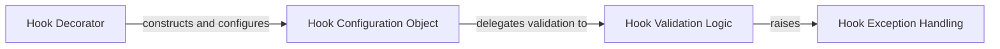

## Details

The `django-lifecycle` subsystem for defining model lifecycle hooks is orchestrated around a declarative API. The `Hook Decorator` serves as the primary entry point, allowing developers to mark methods as lifecycle hooks. Upon decoration, it constructs and configures a `Hook Configuration Object`, which encapsulates all the necessary metadata for the hook. This `Hook Configuration Object` then delegates its parameters for validation to the `Hook Validation Logic` component. The `Hook Validation Logic` ensures the correctness and consistency of the hook's definition. Should any validation rules be violated, the `Hook Validation Logic` signals these errors by raising specific exceptions provided by the `Hook Exception Handling` component, ensuring clear feedback to the developer. This structured interaction ensures that only valid and well-defined lifecycle hooks are processed by the system.

### Hook Decorator
This is the primary public API for users to declaratively mark model methods as lifecycle hooks. It acts as the entry point for defining custom logic to be executed at specific points in a model's lifecycle. It embodies the "Decorator Pattern" and is central to the "Extension/Plugin Pattern" by transforming a standard method into a specialized hook.

**Related Classes/Methods**:

- <a href="https://github.com/rsinger86/django-lifecycle/blob/master/django_lifecycle/decorators.py" target="_blank" rel="noopener noreferrer">`django_lifecycle.decorators.hook`</a>

### Hook Configuration Object
A data structure that encapsulates all metadata for a defined hook, including the event, conditions (`when`), priority, and `on_commit` flag. It serves as the blueprint for how a hook should behave and when it should execute. Its instantiation also triggers initial validation.

**Related Classes/Methods**:

- <a href="https://github.com/rsinger86/django-lifecycle/blob/master/django_lifecycle/decorators.py#L25-L195" target="_blank" rel="noopener noreferrer">`django_lifecycle.decorators.HookConfig`:25-195</a>

### Hook Validation Logic
This component is responsible for ensuring the correctness and validity of the `HookConfig` parameters. It performs checks on the provided event names, condition syntax, and other attributes to prevent runtime errors and guide developers in correct usage.

**Related Classes/Methods**:

- <a href="https://github.com/rsinger86/django-lifecycle/blob/master/django_lifecycle/decorators.py#L168-L171" target="_blank" rel="noopener noreferrer">`django_lifecycle.decorators.validate`:168-171</a>
- <a href="https://github.com/rsinger86/django-lifecycle/blob/master/django_lifecycle/decorators.py#L101-L107" target="_blank" rel="noopener noreferrer">`django_lifecycle.decorators.validate_when`:101-107</a>

### Hook Exception Handling
Provides specific exception types for errors encountered during hook definition and configuration. This component ensures clear and actionable feedback to developers when invalid hook configurations are detected by the `Hook Validation Logic`.

**Related Classes/Methods**:

- <a href="https://github.com/rsinger86/django-lifecycle/blob/master/django_lifecycle/decorators.py#L21-L22" target="_blank" rel="noopener noreferrer">`django_lifecycle.decorators.DjangoLifeCycleException`:21-22</a>

### [FAQ](https://github.com/CodeBoarding/GeneratedOnBoardings/tree/main?tab=readme-ov-file#faq)