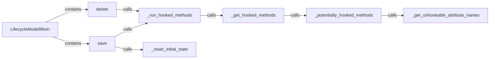

## Details

The `django-lifecycle` subsystem, centered around the `LifecycleModelMixin`, extends Django's ORM capabilities by introducing lifecycle hooks. This is achieved by overriding the standard `save` and `delete` methods, which then orchestrate the execution of user-defined hooks. The `_run_hooked_methods` component is central to this orchestration, dynamically discovering and executing hooks based on their defined conditions. This discovery process involves `_get_hooked_methods`, which identifies potential hooks by filtering out unhookable Django attributes via `_potentially_hooked_methods` and `_get_unhookable_attribute_names`. Additionally, `_reset_initial_state` plays a crucial role in capturing the model's state, enabling conditional hook execution.

### LifecycleModelMixin
The foundational class that integrates lifecycle hook capabilities into Django models. It acts as the primary entry point for the library's functionality, enabling the interception of ORM operations.

**Related Classes/Methods**: _None_

### save
Overrides the default `save` method of Django models. It orchestrates the execution of `before_save` and `after_save` hooks, manages the initial state snapshot, and ensures cache consistency before and after the model is saved.

**Related Classes/Methods**: _None_

### delete
Overrides the default `delete` method. It is responsible for triggering `before_delete` and `after_delete` hooks before the model instance is removed from the database.

**Related Classes/Methods**: _None_

### _run_hooked_methods
A central orchestrator that iterates through identified lifecycle hooks and executes them based on their defined conditions.

**Related Classes/Methods**: _None_

### _get_hooked_methods
Discovers and retrieves methods within a model instance that have been decorated as lifecycle hooks.

**Related Classes/Methods**: _None_

### _reset_initial_state
Captures and updates the initial state of the model instance, crucial for evaluating `when` conditions against previous model states.

**Related Classes/Methods**: _None_

### _potentially_hooked_methods
Identifies methods on the model that could potentially be lifecycle hooks, excluding Django's built-in attributes to prevent unintended hook registration.

**Related Classes/Methods**: _None_

### _get_unhookable_attribute_names
Provides a list of attribute names that should be ignored when searching for lifecycle hooks, ensuring that only user-defined hooks are considered.

**Related Classes/Methods**: _None_

### [FAQ](https://github.com/CodeBoarding/GeneratedOnBoardings/tree/main?tab=readme-ov-file#faq)