```mermaid
graph LR
    Lifecycle_Model_Integration["Lifecycle Model Integration"]
    Hook_Execution_Orchestration["Hook Execution Orchestration"]
    Hook_Definition_Configuration["Hook Definition & Configuration"]
    Condition_Evaluation_Engine["Condition Evaluation Engine"]
    Model_State_Management["Model State Management"]
    Lifecycle_Model_Integration -- "initializes and queries" --> Model_State_Management
    Lifecycle_Model_Integration -- "triggers" --> Hook_Execution_Orchestration
    Hook_Execution_Orchestration -- "retrieves metadata from" --> Hook_Definition_Configuration
    Hook_Execution_Orchestration -- "requests evaluation from" --> Condition_Evaluation_Engine
    Hook_Definition_Configuration -- "configures" --> Condition_Evaluation_Engine
    Condition_Evaluation_Engine -- "queries" --> Model_State_Management
    click Lifecycle_Model_Integration href "https://github.com/CodeBoarding/GeneratedOnBoardings/blob/main/django-lifecycle/Lifecycle_Model_Integration.md" "Details"
    click Hook_Definition_Configuration href "https://github.com/CodeBoarding/GeneratedOnBoardings/blob/main/django-lifecycle/Hook_Definition_Configuration.md" "Details"
```

## Details

The `django-lifecycle` library provides a robust mechanism for integrating lifecycle hooks into Django models. At its core, the **Lifecycle Model Integration** component, primarily embodied by `LifecycleModelMixin`, extends Django's ORM operations to intercept `save`, `delete`, and `refresh_from_db` calls. This component is responsible for initiating the hook execution process and maintaining a snapshot of the model's initial state. The **Model State Management** component, represented by `ModelState`, works in conjunction with the `LifecycleModelIntegration` to capture and compare model states, which is crucial for evaluating conditional hooks. The **Hook Definition & Configuration** component, through the `@hook` decorator and `HookConfig`, allows developers to declaratively define lifecycle hooks on model methods, specifying their events, conditions, and execution priority. Finally, the **Hook Execution Orchestration** component dynamically discovers, filters, and executes these defined hooks based on the current ORM event and the evaluation results from the **Condition Evaluation Engine**. This engine, comprising various condition classes like `When` and `ChainedCondition`, determines whether a hook should fire by assessing the model's state changes. This structured interaction ensures that custom logic can be precisely triggered at different points in a model's lifecycle, enhancing maintainability and modularity.

### Lifecycle Model Integration [[Expand]](./Lifecycle_Model_Integration.md)
The entry point for `django-lifecycle` functionality, extending Django models to intercept ORM operations (`save`, `delete`, `refresh_from_db`) and initiate the hook execution process. It also manages the initial state snapshot.

**Related Classes/Methods**:

- <a href="https://github.com/rsinger86/django-lifecycle/blob/master/django_lifecycle/mixins.py#L80-L300" target="_blank" rel="noopener noreferrer">`django_lifecycle.mixins.LifecycleModelMixin`:80-300</a>

### Hook Execution Orchestration
Manages the discovery, filtering, and execution of methods decorated as lifecycle hooks. It iterates through registered hooks, evaluates their conditions, and invokes the appropriate methods.

**Related Classes/Methods**:

- <a href="https://github.com/rsinger86/django-lifecycle/blob/master/django_lifecycle/mixins.py" target="_blank" rel="noopener noreferrer">`django_lifecycle.mixins.LifecycleModelMixin._run_hooked_methods`</a>
- <a href="https://github.com/rsinger86/django-lifecycle/blob/master/django_lifecycle/mixins.py" target="_blank" rel="noopener noreferrer">`django_lifecycle.mixins.LifecycleModelMixin._get_hooked_methods`</a>

### Hook Definition & Configuration [[Expand]](./Hook_Definition_Configuration.md)
Provides the `@hook` decorator and `HookConfig` for declaratively marking model methods as lifecycle hooks. It handles configuration (event, conditions, priority, `on_commit`) and validates parameters.

**Related Classes/Methods**:

- <a href="https://github.com/rsinger86/django-lifecycle/blob/master/django_lifecycle/decorators.py#L25-L195" target="_blank" rel="noopener noreferrer">`django_lifecycle.decorators.HookConfig`:25-195</a>
- <a href="https://github.com/rsinger86/django-lifecycle/blob/master/django_lifecycle/decorators.py" target="_blank" rel="noopener noreferrer">`django_lifecycle.decorators.hook`</a>

### Condition Evaluation Engine
Defines and evaluates various conditions (`When`, `ChainedCondition`, `Always`, field-based conditions) that determine whether a lifecycle hook should execute, leveraging model state for comparisons.

**Related Classes/Methods**:

- <a href="https://github.com/rsinger86/django-lifecycle/blob/master/django_lifecycle/conditions/base.py#L13-L34" target="_blank" rel="noopener noreferrer">`django_lifecycle.conditions.base.ChainedCondition`:13-34</a>
- <a href="https://github.com/rsinger86/django-lifecycle/blob/master/django_lifecycle/conditions/base.py#L37-L47" target="_blank" rel="noopener noreferrer">`django_lifecycle.conditions.base.ChainableCondition`:37-47</a>
- <a href="https://github.com/rsinger86/django-lifecycle/blob/master/django_lifecycle/conditions/legacy.py" target="_blank" rel="noopener noreferrer">`django_lifecycle.conditions.legacy.When`</a>
- <a href="https://github.com/rsinger86/django-lifecycle/blob/master/django_lifecycle/conditions/__init__.py" target="_blank" rel="noopener noreferrer">`django_lifecycle.conditions.Always`</a>

### Model State Management
Captures and manages the state of a model instance at different points in its lifecycle. It provides utilities to compare current and initial states, crucial for evaluating field-change conditions.

**Related Classes/Methods**:

- <a href="https://github.com/rsinger86/django-lifecycle/blob/master/django_lifecycle/model_state.py#L13-L62" target="_blank" rel="noopener noreferrer">`django_lifecycle.model_state.ModelState`:13-62</a>

### [FAQ](https://github.com/CodeBoarding/GeneratedOnBoardings/tree/main?tab=readme-ov-file#faq)