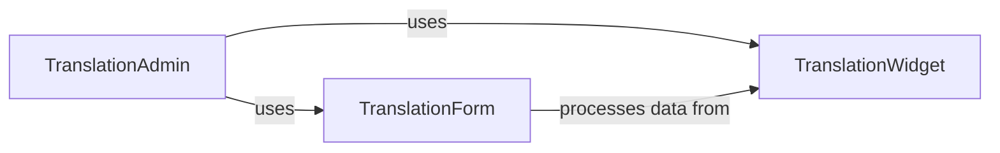

## Details

The Admin & Form Interface subsystem encompasses the modules modeltranslation.admin, modeltranslation.forms, and modeltranslation.widgets. These modules collectively extend Django's administrative interface and form handling mechanisms to provide a seamless and user-friendly way to manage translated content within a Django application.

### TranslationAdmin
This component (modeltranslation.admin.TranslationAdmin) is the core extension point for Django's administrative interface. It customizes the display and behavior of model change forms to accommodate translated fields. Its primary responsibility is to orchestrate how translated fields are presented, allowing administrators to manage content in multiple languages. It dynamically modifies fieldsets, form fields, and integrates specialized widgets to achieve this.

**Related Classes/Methods**:

- <a href="https://github.com/deschler/django-modeltranslation/blob/master/modeltranslation/admin.py#L276-L371" target="_blank" rel="noopener noreferrer">`modeltranslation.admin.TranslationAdmin`:276-371</a>

### TranslationForm
The TranslationForm component (modeltranslation.forms.TranslationForm) serves as the foundational form class for handling translation-aware field processing. It extends Django's ModelForm to incorporate logic specific to translated fields, such as determining if a translated field's value has changed across different languages. It ensures that form submissions correctly process and save multilingual content.

**Related Classes/Methods**:

- <a href="https://github.com/deschler/django-modeltranslation/blob/master/modeltranslation/forms.py" target="_blank" rel="noopener noreferrer">`modeltranslation.forms.TranslationForm`</a>

### TranslationWidget
This component (modeltranslation.widgets.TranslationWidget) provides the user interface elements for inputting and displaying translated content within forms. It is responsible for rendering the appropriate HTML for translated fields, often including multiple input fields for different languages, and for processing their values from submitted form data. It can also manage any necessary media assets (like JavaScript or CSS) required for its functionality.

**Related Classes/Methods**:

- <a href="https://github.com/deschler/django-modeltranslation/blob/master/modeltranslation/widgets.py" target="_blank" rel="noopener noreferrer">`modeltranslation.widgets.TranslationWidget`</a>

### [FAQ](https://github.com/CodeBoarding/GeneratedOnBoardings/tree/main?tab=readme-ov-file#faq)