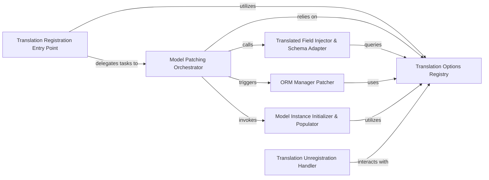

## Details

The `Core Translation Engine` subsystem is primarily defined by the `modeltranslation.translator`, `modeltranslation.decorators`, and `modeltranslation.models` modules. Its boundaries encompass the mechanisms responsible for registering models for translation, dynamically modifying their structure and behavior at runtime, and managing the associated translation configurations.

### Translation Registration Entry Point
This component serves as the primary interface for initiating the translation process. It handles the auto-discovery of translatable models during Django application startup (`handle_translation_registrations`) and provides the public API (`register`) for users to explicitly mark models for translation. The `decorators` module simplifies this interaction.

**Related Classes/Methods**:

- <a href="https://github.com/deschler/django-modeltranslation/blob/master/modeltranslation/models.py" target="_blank" rel="noopener noreferrer">`modeltranslation.models`</a>
- <a href="https://github.com/deschler/django-modeltranslation/blob/master/modeltranslation/translator.py" target="_blank" rel="noopener noreferrer">`modeltranslation.translator:handle_translation_registrations`</a>
- <a href="https://github.com/deschler/django-modeltranslation/blob/master/modeltranslation/translator.py" target="_blank" rel="noopener noreferrer">`modeltranslation.translator:register`</a>
- <a href="https://github.com/deschler/django-modeltranslation/blob/master/modeltranslation/decorators.py" target="_blank" rel="noopener noreferrer">`modeltranslation.decorators`</a>

### Model Patching Orchestrator
The core internal component responsible for coordinating the dynamic modification of Django models. It orchestrates various patching functions (`_register_single_model`) to inject translation-aware behaviors and fields into the model's structure and runtime, embodying the "Extension/Plugin Pattern".

**Related Classes/Methods**:

- <a href="https://github.com/deschler/django-modeltranslation/blob/master/modeltranslation/translator.py" target="_blank" rel="noopener noreferrer">`modeltranslation.translator:_register_single_model`</a>

### Translated Field Injector & Schema Adapter
This component is responsible for dynamically adding language-specific fields (e.g., `my_field_en`) to the registered model's definition, effectively altering the in-memory database schema (`add_translation_fields`). It also handles patching model constraints (`patch_constraints`) to account for these new fields, ensuring data integrity.

**Related Classes/Methods**:

- <a href="https://github.com/deschler/django-modeltranslation/blob/master/modeltranslation/translator.py" target="_blank" rel="noopener noreferrer">`modeltranslation.translator:add_translation_fields`</a>
- <a href="https://github.com/deschler/django-modeltranslation/blob/master/modeltranslation/translator.py" target="_blank" rel="noopener noreferrer">`modeltranslation.translator:patch_constraints`</a>

### ORM Manager Patcher
Modifies Django's `Manager` and custom managers (`patch_manager_class`) to ensure that ORM queries and updates correctly handle translated fields. This makes the ORM translation-aware, providing a seamless interaction layer with translated data in the database.

**Related Classes/Methods**:

- <a href="https://github.com/deschler/django-modeltranslation/blob/master/modeltranslation/translator.py" target="_blank" rel="noopener noreferrer">`modeltranslation.translator:patch_manager_class`</a>

### Model Instance Initializer & Populator
Patches the model's `__init__` method (`patch_constructor`) and related logic (`populate_translation_fields`) to ensure that translation fields are correctly populated when model instances are created or retrieved, including handling fallback values based on configured language settings.

**Related Classes/Methods**:

- <a href="https://github.com/deschler/django-modeltranslation/blob/master/modeltranslation/translator.py" target="_blank" rel="noopener noreferrer">`modeltranslation.translator:patch_constructor`</a>
- <a href="https://github.com/deschler/django-modeltranslation/blob/master/modeltranslation/translator.py" target="_blank" rel="noopener noreferrer">`modeltranslation.translator:populate_translation_fields`</a>

### Translation Options Registry
Acts as the central registry and lookup for all translation-related configurations and options for any given model (`get_options_for_model`, `_get_options_for_model`). It stores information such as translatable fields, fallback languages, and other settings.

**Related Classes/Methods**:

- <a href="https://github.com/deschler/django-modeltranslation/blob/master/modeltranslation/translator.py" target="_blank" rel="noopener noreferrer">`modeltranslation.translator:get_options_for_model`</a>
- <a href="https://github.com/deschler/django-modeltranslation/blob/master/modeltranslation/translator.py" target="_blank" rel="noopener noreferrer">`modeltranslation.translator:_get_options_for_model`</a>

### Translation Unregistration Handler
Provides the functionality to reverse the translation setup for a model (`unregister`). It removes dynamically added fields and reverts patched behaviors, which is important for testing and dynamic application scenarios.

**Related Classes/Methods**:

- <a href="https://github.com/deschler/django-modeltranslation/blob/master/modeltranslation/translator.py" target="_blank" rel="noopener noreferrer">`modeltranslation.translator:unregister`</a>

### [FAQ](https://github.com/CodeBoarding/GeneratedOnBoardings/tree/main?tab=readme-ov-file#faq)