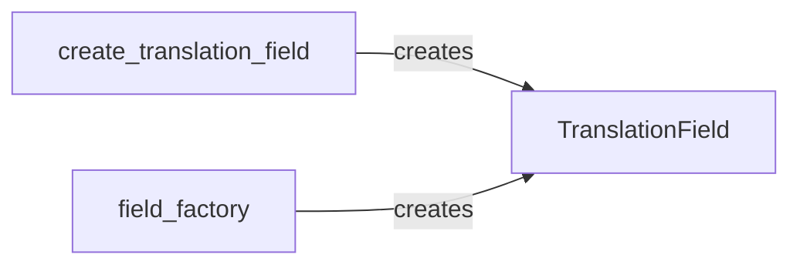

## Details

The Model Schema & Field Definition subsystem is primarily encapsulated within the modeltranslation.fields module, specifically the modeltranslation/fields.py file. This module defines the custom Django field types and descriptor logic essential for handling translated attributes on Django models.

### TranslationField
This is the foundational custom Django field class. It extends Django's built-in field types to incorporate translation capabilities, defining the core structure and behavior for translatable model attributes. It dictates how translated values are stored, accessed, and managed within the Django ORM, serving as the central abstraction for all translation-aware field operations.

**Related Classes/Methods**:

- <a href="https://github.com/deschler/django-modeltranslation/blob/master/modeltranslation/fields.py#L97-L352" target="_blank" rel="noopener noreferrer">`modeltranslation.fields.TranslationField`:97-352</a>

### create_translation_field
A factory function responsible for the dynamic creation and configuration of TranslationField instances. It plays a crucial role in generating the specific translated field variants (e.g., name_en, name_fr) based on the registered translatable fields and active languages.

**Related Classes/Methods**:

- <a href="https://github.com/deschler/django-modeltranslation/blob/master/modeltranslation/fields.py#L64-L84" target="_blank" rel="noopener noreferrer">`modeltranslation.fields.create_translation_field`:64-84</a>

### field_factory
Another factory function, similar in purpose to create_translation_field, that manages the dynamic creation and configuration of TranslationField instances. It likely serves as an internal helper or a more generalized mechanism for field generation within the modeltranslation framework.

**Related Classes/Methods**:

- <a href="https://github.com/deschler/django-modeltranslation/blob/master/modeltranslation/fields.py#L87-L94" target="_blank" rel="noopener noreferrer">`modeltranslation.fields.field_factory`:87-94</a>

### [FAQ](https://github.com/CodeBoarding/GeneratedOnBoardings/tree/main?tab=readme-ov-file#faq)