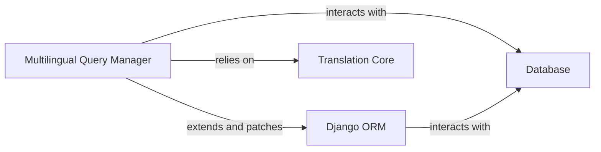

## Details

The `django-modeltranslation` subsystem provides a robust solution for managing multilingual content within Django applications. At its heart, the `Multilingual Query Manager` transparently adapts standard Django ORM operations to handle translated fields. It achieves this by extending and patching the core `Django ORM` components, such as `Manager` and `QuerySet`, to dynamically rewrite database queries and data manipulations. This manager critically depends on the `Translation Core` to retrieve translation configurations for models. Ultimately, the `Multilingual Query Manager` facilitates seamless interaction with the `Database`, ensuring that multilingual data is stored and retrieved correctly without requiring developers to manage language-specific fields explicitly. This architecture ensures a clean separation of concerns and a developer-friendly approach to internationalization.

### Multilingual Query Manager
This component is responsible for transparently adapting Django ORM queries and operations to handle translated fields. It intercepts standard `QuerySet` methods (e.g., `filter`, `order_by`, `create`, `update`) and dynamically rewrites field lookups and data manipulations to target the correct language-specific columns in the database. This ensures that developers can interact with models as if fields were singular, while the system manages the underlying multilingual storage.

**Related Classes/Methods**:

- <a href="https://github.com/deschler/django-modeltranslation/blob/master/modeltranslation/manager.py#L1-L9999" target="_blank" rel="noopener noreferrer">`modeltranslation.manager`:1-9999</a>

### Django ORM
The core Object-Relational Mapper provided by Django. The `Multilingual Query Manager` extends and patches its functionalities, specifically `django.db.models.Manager` and `django.db.models.query.QuerySet`, to introduce multilingual capabilities. These are external components to the `django-modeltranslation` project.

**Related Classes/Methods**: _None_

### Translation Core
This component (`modeltranslation.translator`) provides the registration and lookup of translation options for models, which the `Multilingual Query Manager` relies on to determine how fields should be translated.

**Related Classes/Methods**:

- <a href="https://github.com/deschler/django-modeltranslation/blob/master/modeltranslation/translator.py#L1-L9999" target="_blank" rel="noopener noreferrer">`modeltranslation.translator`:1-9999</a>

### Database
The underlying data storage system that the `Multilingual Query Manager` interacts with, via the `Django ORM`, to store and retrieve multilingual data. This is an abstract representation of the persistence layer and does not have a direct source code reference within the `django-modeltranslation` project.

**Related Classes/Methods**: _None_

### [FAQ](https://github.com/CodeBoarding/GeneratedOnBoardings/tree/main?tab=readme-ov-file#faq)