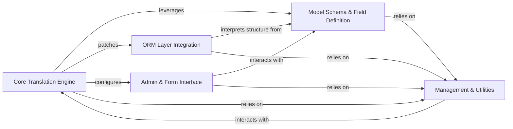

## Details

The `django-modeltranslation` architecture is designed as a highly integrated extension to the Django framework, enabling seamless internationalization of model content. At its core, the **Core Translation Engine** acts as the central orchestrator, dynamically modifying Django models by adding translation fields and patching the ORM to support multilingual data. This dynamic modification is underpinned by the **Model Schema & Field Definition** component, which defines the structure and behavior of translated fields. The **ORM Layer Integration** then ensures that all database queries and operations transparently interact with these translated fields, abstracting the complexity from the developer. For content management, the **Admin & Form Interface** provides a user-friendly experience within the Django administration, allowing for easy input and display of translated content. Finally, the **Management & Utilities** component offers essential command-line tools for schema synchronization and data loading, alongside a suite of helper functions and configuration settings that support the entire translation ecosystem. This modular yet interconnected design allows `django-modeltranslation` to deeply embed translation capabilities without requiring significant changes to existing Django application code.

### Core Translation Engine [[Expand]](./Core_Translation_Engine.md)
The central control point for enabling translation, responsible for registering models, dynamically adding translation fields, and patching Django's core model and manager functionalities at runtime.

**Related Classes/Methods**:

- <a href="https://github.com/deschler/django-modeltranslation/blob/master/modeltranslation/translator.py" target="_blank" rel="noopener noreferrer">`modeltranslation.translator`</a>
- <a href="https://github.com/deschler/django-modeltranslation/blob/master/modeltranslation/decorators.py" target="_blank" rel="noopener noreferrer">`modeltranslation.decorators`</a>
- <a href="https://github.com/deschler/django-modeltranslation/blob/master/modeltranslation/models.py" target="_blank" rel="noopener noreferrer">`modeltranslation.models`</a>

### ORM Layer Integration [[Expand]](./ORM_Layer_Integration.md)
Intercepts and modifies Django ORM queries to correctly handle translated fields, ensuring seamless database operations with the translation layer.

**Related Classes/Methods**:

- <a href="https://github.com/deschler/django-modeltranslation/blob/master/modeltranslation/manager.py" target="_blank" rel="noopener noreferrer">`modeltranslation.manager`</a>

### Admin & Form Interface [[Expand]](./Admin_Form_Interface.md)
Extends Django's administrative interface and form handling to provide a user-friendly way to manage translated content, including customizing fieldsets, form fields, and providing specialized widgets.

**Related Classes/Methods**:

- <a href="https://github.com/deschler/django-modeltranslation/blob/master/modeltranslation/admin.py" target="_blank" rel="noopener noreferrer">`modeltranslation.admin`</a>
- <a href="https://github.com/deschler/django-modeltranslation/blob/master/modeltranslation/forms.py" target="_blank" rel="noopener noreferrer">`modeltranslation.forms`</a>
- <a href="https://github.com/deschler/django-modeltranslation/blob/master/modeltranslation/widgets.py" target="_blank" rel="noopener noreferrer">`modeltranslation.widgets`</a>

### Model Schema & Field Definition [[Expand]](./Model_Schema_Field_Definition.md)
Defines the custom field types and descriptor logic that enable translated attributes on Django models, dictating how translated values are stored and accessed.

**Related Classes/Methods**:

- <a href="https://github.com/deschler/django-modeltranslation/blob/master/modeltranslation/fields.py" target="_blank" rel="noopener noreferrer">`modeltranslation.fields`</a>

### Management & Utilities
Provides command-line utilities for database schema synchronization and data loading, along with a collection of helper functions and application-wide configuration settings used across various components.

**Related Classes/Methods**:

- <a href="https://github.com/deschler/django-modeltranslation/blob/master/modeltranslation/management/commands/sync_translation_fields.py" target="_blank" rel="noopener noreferrer">`modeltranslation.management.commands.sync_translation_fields`</a>
- <a href="https://github.com/deschler/django-modeltranslation/blob/master/modeltranslation/management/commands/loaddata.py" target="_blank" rel="noopener noreferrer">`modeltranslation.management.commands.loaddata`</a>
- <a href="https://github.com/deschler/django-modeltranslation/blob/master/modeltranslation/utils.py" target="_blank" rel="noopener noreferrer">`modeltranslation.utils`</a>
- <a href="https://github.com/deschler/django-modeltranslation/blob/master/modeltranslation/settings.py" target="_blank" rel="noopener noreferrer">`modeltranslation.settings`</a>
- <a href="https://github.com/deschler/django-modeltranslation/blob/master/modeltranslation/apps.py" target="_blank" rel="noopener noreferrer">`modeltranslation.apps`</a>

### [FAQ](https://github.com/CodeBoarding/GeneratedOnBoardings/tree/main?tab=readme-ov-file#faq)