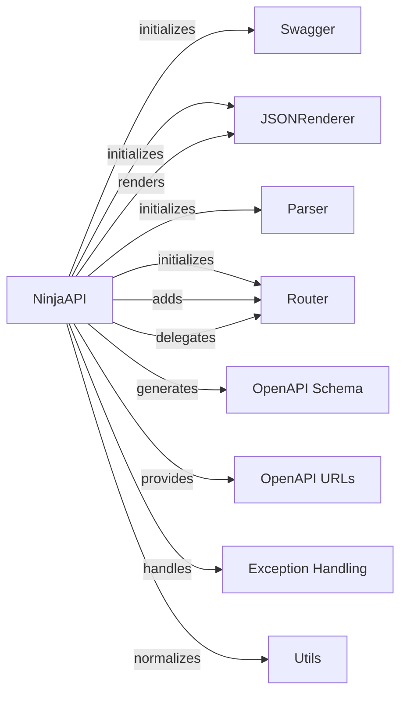

## Component Details

The API Core component in django-ninja provides the foundation for building APIs. It defines the central `NinjaAPI` class, which manages API configuration, routing, request parsing, response rendering, exception handling, and OpenAPI schema generation. The core interacts with Routers to define API endpoints, JSONRenderer to serialize responses, and exception handlers to manage errors. It also leverages OpenAPI components to generate API documentation and Swagger UI for interactive exploration.

### NinjaAPI
The central class representing the API. It handles routing, rendering, parsing, exception handling, and OpenAPI schema generation. It initializes and integrates various sub-components like Routers, JSONRenderer, and exception handlers.
- **Related Classes/Methods**: `django-ninja.ninja.main.NinjaAPI` (49:567), `django-ninja.ninja.main.NinjaAPI.__init__` (56:125), `django-ninja.ninja.main.NinjaAPI.get` (127:168), `django-ninja.ninja.main.NinjaAPI.post` (170:211), `django-ninja.ninja.main.NinjaAPI.delete` (213:254), `django-ninja.ninja.main.NinjaAPI.patch` (256:297), `django-ninja.ninja.main.NinjaAPI.put` (299:340), `django-ninja.ninja.main.NinjaAPI.api_operation` (342:381), `django-ninja.ninja.main.NinjaAPI.add_router` (383:414), `django-ninja.ninja.main.NinjaAPI.urls` (417:431), `django-ninja.ninja.main.NinjaAPI._get_urls` (433:440), `django-ninja.ninja.main.NinjaAPI.create_response` (446:468), `django-ninja.ninja.main.NinjaAPI.create_temporal_response` (470:471), `django-ninja.ninja.main.NinjaAPI.get_openapi_schema` (476:484), `django-ninja.ninja.main.NinjaAPI.exception_handler` (504:511), `django-ninja.ninja.main.NinjaAPI.set_default_exception_handlers` (513:514), `django-ninja.ninja.main.NinjaAPI.on_exception` (516:520), `django-ninja.ninja.main.NinjaAPI.validation_error_from_error_contexts` (522:542), `django-ninja.ninja.main.NinjaAPI._validate` (551:567)

### Router
Handles the registration of API operations (paths and methods) and their associated functions. It provides methods for defining API endpoints for different HTTP methods (GET, POST, etc.).
- **Related Classes/Methods**: `ninja.router.Router` (32:441), `ninja.router.Router.get` (56:94), `ninja.router.Router.post` (96:134), `ninja.router.Router.delete` (136:174), `ninja.router.Router.patch` (176:214), `ninja.router.Router.put` (216:254), `ninja.router.Router.api_operation` (256:300)

### JSONRenderer
Responsible for rendering API responses into JSON format. It takes data and converts it into a JSON string.
- **Related Classes/Methods**: `ninja.renderers.JSONRenderer` (19:25), `ninja.renderers.JSONRenderer.render` (24:25)

### Parser
Responsible for parsing incoming request data. It handles the conversion of request data into a usable format.
- **Related Classes/Methods**: `ninja.parser.Parser` (12:27)

### Swagger
Generates the OpenAPI schema and serves the Swagger UI for API documentation. It allows users to interact with the API documentation.
- **Related Classes/Methods**: `ninja.openapi.docs.Swagger` (32:55)

### OpenAPI Schema
Generates the OpenAPI schema for the API. This schema describes the API endpoints, request/response formats, and other details.
- **Related Classes/Methods**: `ninja.openapi.schema.get_schema` (27:29)

### OpenAPI URLs
Provides the URLs for accessing the OpenAPI schema and Swagger UI. These URLs allow users to view and interact with the API documentation.
- **Related Classes/Methods**: `ninja.openapi.urls.get_openapi_urls` (14:37), `ninja.openapi.urls.get_root_url` (40:41)

### Exception Handling
Handles exceptions raised during API processing, including default exception handlers and custom exception handlers. It ensures that errors are handled gracefully and informative error responses are returned.
- **Related Classes/Methods**: `ninja.errors.set_default_exc_handlers` (87:103), `django-ninja.ninja.main.NinjaAPI.add_exception_handler` (498:502), `django-ninja.ninja.main.NinjaAPI._lookup_exception_handler` (544:549), `ninja.errors.ValidationError` (49:58)

### Utils
Provides utility functions such as path normalization. These utilities are used internally by other components.
- **Related Classes/Methods**: `ninja.utils.normalize_path` (20:23)