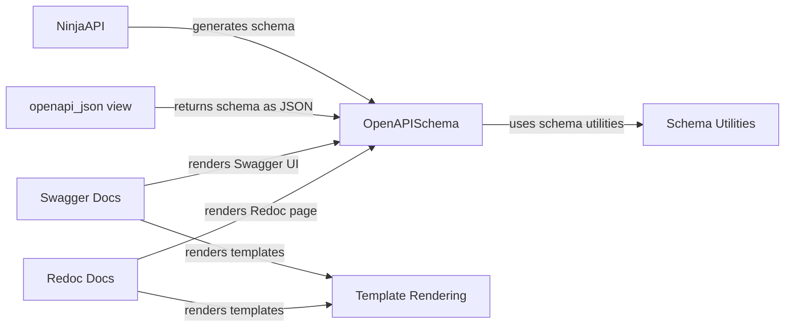

## Component Details

The API Documentation component in django-ninja is responsible for generating and serving OpenAPI specifications, along with providing user interfaces (Swagger UI and Redoc) for exploring the API. It starts with the NinjaAPI instance, which holds the API's structure, and uses the OpenAPISchema class to create the OpenAPI schema. This schema is then served as a JSON endpoint and rendered into interactive documentation using either Swagger UI or Redoc.

### NinjaAPI
The main entry point for defining API endpoints. It's responsible for registering routes, middleware, and exception handlers. Crucially, it provides the `get_openapi_schema` method, which triggers the OpenAPI schema generation process.
- **Related Classes/Methods**: `django-ninja.ninja.main.NinjaAPI:get_openapi_schema` (476:484), `django-ninja.ninja.main.NinjaAPI.get_root_path` (442:444)

### OpenAPISchema
This class is responsible for generating the OpenAPI schema. It takes a NinjaAPI instance and traverses its registered routes, extracting information about parameters, request bodies, and responses to build a complete OpenAPI schema representation. It uses schema utilities to manipulate and refine the schema.
- **Related Classes/Methods**: `django-ninja.ninja.openapi.schema.OpenAPISchema` (35:321), `django-ninja.ninja.openapi.schema.OpenAPISchema.__init__` (36:60), `django-ninja.ninja.openapi.schema.OpenAPISchema.get_paths` (62:79), `django-ninja.ninja.openapi.schema.OpenAPISchema.get_components` (309:313), `django-ninja.ninja.openapi.schema.OpenAPISchema.methods` (81:88), `django-ninja.ninja.openapi.schema.OpenAPISchema.operation_details` (105:141), `django-ninja.ninja.openapi.schema.OpenAPISchema.deep_dict_update` (90:103), `django-ninja.ninja.openapi.schema.OpenAPISchema.operation_parameters` (143:148), `django-ninja.ninja.openapi.schema.OpenAPISchema._extract_parameters` (150:194), `django-ninja.ninja.openapi.schema.OpenAPISchema._flatten_schema` (196:206), `django-ninja.ninja.openapi.schema.OpenAPISchema._create_schema_from_model` (208:234), `django-ninja.ninja.openapi.schema.OpenAPISchema._create_multipart_schema_from_models` (236:249), `django-ninja.ninja.openapi.schema.OpenAPISchema.request_body` (251:273), `django-ninja.ninja.openapi.schema.OpenAPISchema.responses` (275:295), `django-ninja.ninja.openapi.schema.OpenAPISchema.add_schema_definitions` (315:321)

### openapi_json view
A Django view that serves the generated OpenAPI schema as a JSON response. It retrieves the schema from the NinjaAPI instance and returns it in a format suitable for consumption by OpenAPI-compatible tools.
- **Related Classes/Methods**: `django-ninja.ninja.openapi.views:openapi_json` (19:21)

### Schema Utilities
A collection of utility functions for manipulating and processing OpenAPI schemas. These utilities handle tasks such as flattening complex schemas, resolving `allOf` references, and merging multiple schemas into a single unified schema.
- **Related Classes/Methods**: `django-ninja.ninja.openapi.schema.flatten_properties` (324:361), `django-ninja.ninja.openapi.schema.resolve_allOf` (364:372), `django-ninja.ninja.openapi.schema.merge_schemas` (375:388)

### Swagger Docs
Responsible for rendering the Swagger UI, providing an interactive interface for exploring and testing the API. It retrieves the OpenAPI schema and uses it to generate the Swagger UI page, allowing users to visualize the API's endpoints, parameters, and responses.
- **Related Classes/Methods**: `django-ninja.ninja.openapi.docs.Swagger:render_page` (46:55), `django-ninja.ninja.openapi.docs.DocsBase.get_openapi_url` (28:29), `django-ninja.ninja.openapi.docs._csrf_needed` (105:111), `django-ninja.ninja.openapi.docs.render_template` (80:91)

### Redoc Docs
Similar to Swagger Docs, this component renders the Redoc page, offering an alternative visualization of the API documentation. It also retrieves the OpenAPI schema and uses it to generate the Redoc page, presenting the API in a different style.
- **Related Classes/Methods**: `django-ninja.ninja.openapi.docs.Redoc:render_page` (69:77), `django-ninja.ninja.openapi.docs.DocsBase.get_openapi_url` (28:29), `django-ninja.ninja.openapi.docs.render_template` (80:91)

### Template Rendering
Handles the rendering of HTML templates for both Swagger UI and Redoc documentation pages. It takes a template name and a context (containing data to be displayed) and generates the final HTML output.
- **Related Classes/Methods**: `django-ninja.ninja.openapi.docs:render_template` (80:91), `django-ninja.ninja.openapi.docs._render_cdn_template` (94:102)