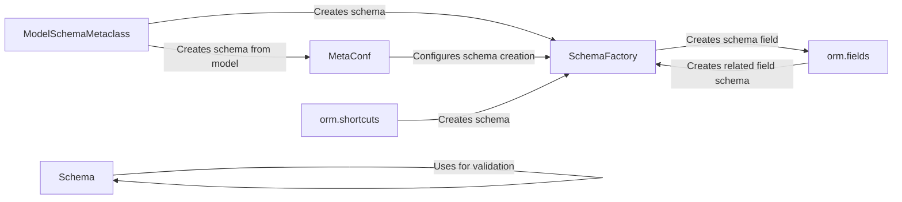

## Component Details

The Data Definition and Validation component in django-ninja is responsible for defining the structure and validation rules for data exchanged through the API. It leverages Pydantic models to define schemas, enabling data type validation, serialization, and deserialization. This component also provides seamless integration with Django models, allowing for automatic schema generation based on model definitions and facilitating interaction with the Django ORM.

### Schema
The Schema class in `django-ninja.ninja.schema` is responsible for defining the structure and validation rules for data being passed into and out of the API. It uses pydantic to define the schema and handles data validation.
- **Related Classes/Methods**: `django-ninja.ninja.schema.Schema` (209:249), `django-ninja.ninja.schema.Schema:_run_root_validator` (215:228), `django-ninja.ninja.schema.Schema:schema` (243:249)

### ModelSchemaMetaclass
The `ModelSchemaMetaclass` in `django-ninja.ninja.orm.metaclass` is a metaclass used for creating ModelSchema classes. It intercepts the class creation process to configure the schema based on the associated Django model.
- **Related Classes/Methods**: `django-ninja.ninja.orm.metaclass.ModelSchemaMetaclass` (68:118), `django-ninja.ninja.orm.metaclass.ModelSchemaMetaclass.__new__` (70:118)

### MetaConf
The `MetaConf` class in `django-ninja.ninja.orm.metaclass` is responsible for holding configuration information extracted from the `Meta` class defined within a ModelSchema. It helps in configuring the schema generation process.
- **Related Classes/Methods**: `django-ninja.ninja.orm.metaclass.MetaConf` (15:65), `django-ninja.ninja.orm.metaclass.MetaConf.from_schema_class` (22:65)

### SchemaFactory
The `SchemaFactory` class in `django-ninja.ninja.orm.factory` is responsible for dynamically creating schemas based on Django models. It handles field selection, schema field generation, and unique name generation.
- **Related Classes/Methods**: `django-ninja.ninja.orm.factory.SchemaFactory` (30:164), `django-ninja.ninja.orm.factory.SchemaFactory.create_schema` (35:99), `django-ninja.ninja.orm.factory.SchemaFactory._selected_model_fields` (131:156), `django-ninja.ninja.orm.factory.SchemaFactory._model_fields` (158:164), `django-ninja.ninja.orm.factory.SchemaFactory.get_key` (101:121), `django-ninja.ninja.orm.factory.SchemaFactory._get_unique_name` (123:129)

### orm.shortcuts
The `orm.shortcuts` module provides shortcut functions `S` and `L` for creating schemas. `S` is likely for single schema creation and `L` for list schema creation.
- **Related Classes/Methods**: `django-ninja.ninja.orm.shortcuts:S` (17:18), `django-ninja.ninja.orm.shortcuts:L` (21:23)

### orm.fields
The `orm.fields` module contains functions for determining the appropriate schema field for a given Django model field. It handles regular fields, related fields, and many-to-many fields.
- **Related Classes/Methods**: `django-ninja.ninja.orm.fields:get_schema_field` (117:197), `django-ninja.ninja.orm.fields:get_related_field_schema` (201:219), `django-ninja.ninja.orm.fields.title_if_lower` (22:25), `django-ninja.ninja.orm.fields.create_m2m_link_type` (90:113)