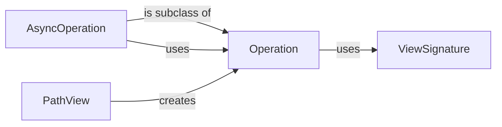

## Component Details

The Operation Processing component in django-ninja is responsible for handling individual API endpoint logic. It encompasses request processing, validation, and response generation. The central class, `Operation`, orchestrates the execution of the view function, manages authentication, throttling, and pagination, and transforms the result into an appropriate HTTP response. `PathView` registers the operations with Django's URL dispatcher, while `ViewSignature` inspects the view function's signature for validation and schema generation. `AsyncOperation` extends `Operation` to handle asynchronous API endpoints.

### Operation
The `Operation` class encapsulates the logic of a single API operation (endpoint). It handles input validation, authentication, authorization, throttling, and response generation. It orchestrates the execution of the user-defined view function and transforms the result into an appropriate HTTP response.
- **Related Classes/Methods**: `django-ninja.ninja.operation.Operation` (43:338), `django-ninja.ninja.operation.Operation.__init__` (44:124), `django-ninja.ninja.operation.Operation:run` (126:140), `django-ninja.ninja.operation.Operation:set_api_instance` (142:172), `django-ninja.ninja.operation.Operation:_run_checks` (180:202), `django-ninja.ninja.operation.Operation:_run_authentication` (204:219), `django-ninja.ninja.operation.Operation:_check_throttles` (221:235), `django-ninja.ninja.operation.Operation:_result_to_response` (237:300), `django-ninja.ninja.operation.Operation:_get_values` (302:322), `django-ninja.ninja.operation.Operation:_create_response_model_multiple` (324:332), `django-ninja.ninja.operation.Operation:_create_response_model` (334:338)

### AsyncOperation
The `AsyncOperation` class is a subclass of `Operation` designed to handle asynchronous API operations. It inherits most of its functionality from `Operation` but overrides certain methods to work with asynchronous view functions and authentication mechanisms.
- **Related Classes/Methods**: `django-ninja.ninja.operation.AsyncOperation` (341:399), `django-ninja.ninja.operation.AsyncOperation.__init__` (342:344), `django-ninja.ninja.operation.AsyncOperation:run` (346:356), `django-ninja.ninja.operation.AsyncOperation:_run_checks` (358:380), `django-ninja.ninja.operation.AsyncOperation:_run_authentication` (382:399)

### PathView
The `PathView` class is responsible for registering API operations (defined by the user) with the Django URL dispatcher. It receives a view function and associates it with a specific path, HTTP method, and API instance. It also handles the conversion of Django's request/response objects to Ninja's request/response objects.
- **Related Classes/Methods**: `django-ninja.ninja.operation.PathView` (402:506), `django-ninja.ninja.operation.PathView:add_operation` (408:461), `django-ninja.ninja.operation.PathView:_sync_view` (478:482), `django-ninja.ninja.operation.PathView:_async_view` (484:494)

### ViewSignature
The `ViewSignature` class (from `ninja.signature.details`) is responsible for inspecting the signature of the view function and extracting information about its parameters, return type, and other relevant details. This information is used to perform input validation, generate OpenAPI schema, and convert request data into the appropriate format for the view function.
- **Related Classes/Methods**: `ninja.signature.details.ViewSignature` (40:284)