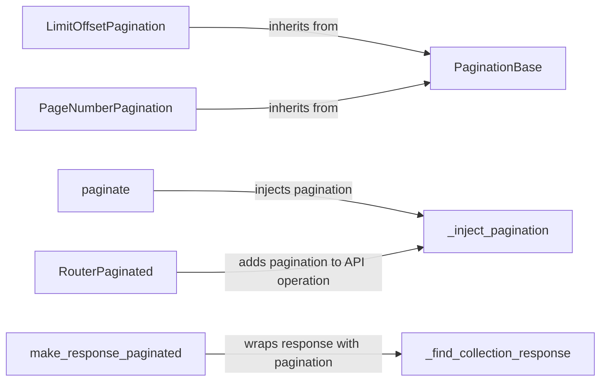

## Component Details

The Pagination component in django-ninja provides a structured way to divide large result sets into smaller, manageable pages for APIs. It offers different pagination styles, including limit/offset and page number-based pagination. The component automatically injects pagination parameters into API operations, handles the pagination of querysets, and formats the API response with pagination metadata, enhancing both performance and usability.

### LimitOffsetPagination
Handles pagination using limit and offset parameters. It inherits from PaginationBase and provides methods to paginate a queryset and retrieve the total item count. It's suitable for scenarios where clients can specify the starting point and number of items to retrieve.
- **Related Classes/Methods**: `django-ninja.ninja.pagination.LimitOffsetPagination` (78:119), `django-ninja.ninja.pagination.LimitOffsetPagination:paginate_queryset` (91:102), `django-ninja.ninja.pagination.LimitOffsetPagination:apaginate_queryset` (104:119)

### PageNumberPagination
Handles pagination using page numbers. It inherits from PaginationBase and provides methods to paginate a queryset and retrieve the page size. This style is useful when clients prefer to navigate through pages using sequential numbers.
- **Related Classes/Methods**: `django-ninja.ninja.pagination.PageNumberPagination` (122:173), `django-ninja.ninja.pagination.PageNumberPagination:__init__` (127:135), `django-ninja.ninja.pagination.PageNumberPagination:paginate_queryset` (143:154), `django-ninja.ninja.pagination.PageNumberPagination:apaginate_queryset` (156:173)

### paginate
A function that injects pagination into an API operation. It determines how the data should be paginated and modifies the API operation accordingly. It uses _inject_pagination internally to handle the actual injection process.
- **Related Classes/Methods**: `django-ninja.ninja.pagination:paginate` (176:206)

### _inject_pagination
Internally injects pagination parameters and logic into the API operation. It checks if the operation is async, contributes arguments, and adds a callback to handle the pagination logic. This function is the core of the pagination injection process.
- **Related Classes/Methods**: `django-ninja.ninja.pagination:_inject_pagination` (209:275)

### RouterPaginated
A router that automatically adds pagination to API operations that return collections. It extends the standard Router and overrides the add_api_operation method. It uses _inject_pagination to inject pagination, simplifying the process of adding pagination to multiple API endpoints.
- **Related Classes/Methods**: `django-ninja.ninja.pagination.RouterPaginated` (278:289), `django-ninja.ninja.pagination.RouterPaginated:__init__` (279:281), `django-ninja.ninja.pagination.RouterPaginated:add_api_operation` (283:289)

### make_response_paginated
Wraps the API response with pagination metadata. It finds the collection response and adds pagination information to it, such as total count, next page, and previous page links. It uses _find_collection_response to locate the collection response within the API schema.
- **Related Classes/Methods**: `django-ninja.ninja.pagination:make_response_paginated` (292:323)

### _find_collection_response
Finds the collection response type within the API operation's response schema. It identifies the type that represents a collection of items, allowing make_response_paginated to correctly wrap the response with pagination metadata.
- **Related Classes/Methods**: `django-ninja.ninja.pagination:_find_collection_response` (326:342)

### PaginationBase
Base class for pagination classes. Defines the interface for pagination, providing a common structure for different pagination implementations like LimitOffsetPagination and PageNumberPagination.
- **Related Classes/Methods**: `django-ninja.ninja.pagination.PaginationBase` (25:58)