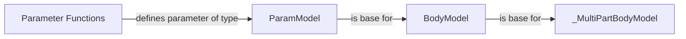

## Component Details

The Parameter Management component in django-ninja is responsible for defining, extracting, validating, and converting API endpoint parameters from HTTP requests. It supports various parameter types, including path, query, header, cookie, body, form, and file parameters. The component uses parameter definition functions and model classes to handle the parameter processing, ensuring that the data passed to the API endpoint is in the correct format and meets the specified requirements.

### ParamModel
The ParamModel class serves as the base class for handling different types of parameters. It defines the core logic for resolving and mapping request data to parameters, including extraction, validation, and transformation. It uses `get_request_data` to extract data from the request and `_map_data_paths` and `_map_data_path` to map the extracted data to the parameter.
- **Related Classes/Methods**: `django-ninja.ninja.params.models.ParamModel` (46:91), `django-ninja.ninja.params.models.ParamModel:resolve` (57:68), `django-ninja.ninja.params.models.ParamModel.get_request_data` (51:54), `django-ninja.ninja.params.models.ParamModel._map_data_paths` (71:83), `django-ninja.ninja.params.models.ParamModel:_map_data_path` (86:91)

### BodyModel
The BodyModel class extends ParamModel to handle request body data. It defines how the request body should be parsed and validated, including handling potential HTTP errors during data processing. It uses `get_request_data` to extract and process the body data.
- **Related Classes/Methods**: `django-ninja.ninja.params.models.BodyModel:get_request_data` (138:155)

### _MultiPartBodyModel
The _MultiPartBodyModel class, inheriting from BodyModel, specializes in handling multipart request body data, commonly used for file uploads. It extends the functionality of BodyModel to manage file data within the request.
- **Related Classes/Methods**: `django-ninja.ninja.params.models._MultiPartBodyModel:get_request_data` (184:197)

### Parameter Functions
These functions (Path, Query, Header, Cookie, Body, Form, File) serve as convenient shortcuts for defining parameter types in API definitions. They return instances of corresponding parameter classes, simplifying the process of specifying parameter requirements for API endpoints.
- **Related Classes/Methods**: `django-ninja.ninja.params.functions:Path` (11:47), `django-ninja.ninja.params.functions:Query` (50:86), `django-ninja.ninja.params.functions:Header` (89:125), `django-ninja.ninja.params.functions:Cookie` (128:164), `django-ninja.ninja.params.functions:Body` (167:203), `django-ninja.ninja.params.functions:Form` (206:242), `django-ninja.ninja.params.functions:File` (245:281)