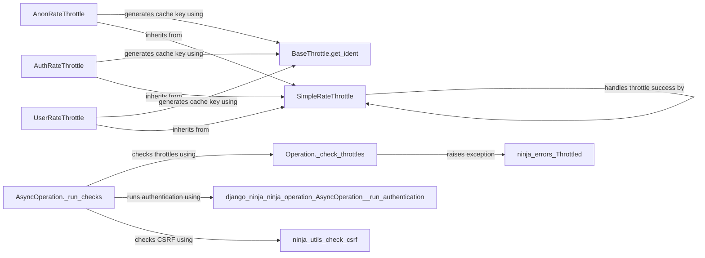

## Component Details

The Rate Limiting and Throttling component in django-ninja is responsible for controlling the rate at which users can make requests to the API. It prevents abuse, ensures fair usage, and maintains API availability. The core functionality revolves around defining throttling rates, generating unique cache keys for requests, checking if a request is allowed based on the defined rates, and handling successful or failed throttle attempts. Different throttling strategies are supported, including anonymous, authenticated, and user-based rate limiting.

### SimpleRateThrottle
The SimpleRateThrottle class provides a basic implementation for throttling requests based on a defined rate. It includes methods for initializing the throttle, determining if a request is allowed, and handling successful or failed throttle attempts. It relies on caching to store the request history.
- **Related Classes/Methods**: `django-ninja.ninja.throttling.SimpleRateThrottle` (50:189), `django-ninja.ninja.throttling.SimpleRateThrottle:__init__` (81:87), `django-ninja.ninja.throttling.SimpleRateThrottle.get_rate` (98:110), `django-ninja.ninja.throttling.SimpleRateThrottle.parse_rate` (112:134), `django-ninja.ninja.throttling.SimpleRateThrottle:allow_request` (136:159), `django-ninja.ninja.throttling.SimpleRateThrottle.get_cache_key` (89:96), `django-ninja.ninja.throttling.SimpleRateThrottle.throttle_failure` (170:174), `django-ninja.ninja.throttling.SimpleRateThrottle.throttle_success` (161:168)

### AnonRateThrottle
The AnonRateThrottle class is a subclass of SimpleRateThrottle that applies rate limiting to anonymous users. It overrides the get_cache_key method to generate a cache key based on the user's IP address.
- **Related Classes/Methods**: `django-ninja.ninja.throttling.AnonRateThrottle` (192:208), `django-ninja.ninja.throttling.AnonRateThrottle:get_cache_key` (201:208), `django-ninja.ninja.throttling.BaseThrottle.get_ident` (21:40)

### AuthRateThrottle
The AuthRateThrottle class is a subclass of SimpleRateThrottle that applies rate limiting to authenticated users. It overrides the get_cache_key method to generate a cache key based on the user's ID.
- **Related Classes/Methods**: `django-ninja.ninja.throttling.AuthRateThrottle` (211:229), `django-ninja.ninja.throttling.AuthRateThrottle:get_cache_key` (222:229), `django-ninja.ninja.throttling.BaseThrottle.get_ident` (21:40)

### UserRateThrottle
The UserRateThrottle class is a subclass of SimpleRateThrottle that applies rate limiting to authenticated users. It overrides the get_cache_key method to generate a cache key based on the user's ID.
- **Related Classes/Methods**: `django-ninja.ninja.throttling.UserRateThrottle` (232:249), `django-ninja.ninja.throttling.UserRateThrottle:get_cache_key` (243:249), `django-ninja.ninja.throttling.BaseThrottle.get_ident` (21:40)

### Operation._check_throttles
The _check_throttles method is responsible for checking if the request is allowed based on the defined throttling rules. It iterates through the defined throttles and raises a Throttled exception if any of the throttles reject the request.
- **Related Classes/Methods**: `django-ninja.ninja.operation.Operation:_check_throttles` (221:235), `ninja.errors.Throttled` (81:84)

### AsyncOperation._run_checks
The _run_checks method is responsible for running all the checks before executing the operation, including authentication, CSRF, and throttling. It calls _run_authentication, checks CSRF, and then calls _check_throttles.
- **Related Classes/Methods**: `django-ninja.ninja.operation.AsyncOperation:_run_checks` (358:380), `django-ninja.ninja.operation.AsyncOperation._run_authentication` (382:399), `ninja.utils.check_csrf` (30:36), `django-ninja.ninja.operation.Operation:_check_throttles` (221:235)

### BaseThrottle.get_ident
The get_ident method, part of the BaseThrottle class, is responsible for obtaining a unique identifier for the request, typically the user's IP address. This identifier is used as part of the cache key for throttling.
- **Related Classes/Methods**: `django-ninja.ninja.throttling.BaseThrottle.get_ident` (21:40)