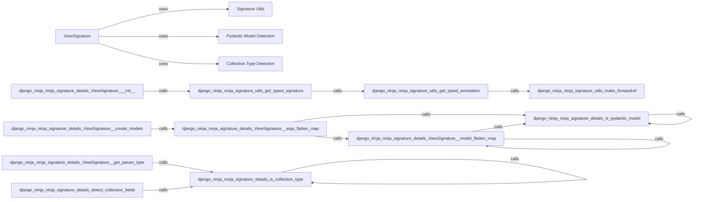

## Component Details

The Request/Response Handling component in django-ninja is responsible for inspecting view function signatures to extract information about parameters and return types. This information is then used for request validation, response serialization, and OpenAPI schema generation. The component leverages utilities for type annotation extraction, Pydantic model detection, and collection type detection to accurately determine parameter types and create models for request and response data.

### ViewSignature
The ViewSignature class is responsible for inspecting a view function, extracting its parameter types and names, and creating models for request validation and data extraction. It handles various parameter types, including path, query, and body parameters, and supports Pydantic models for request body validation. It also flattens nested models to simplify data extraction.
- **Related Classes/Methods**: `django-ninja.ninja.signature.details.ViewSignature` (40:284), `django-ninja.ninja.signature.details.ViewSignature:_create_models` (124:183), `django-ninja.ninja.signature.details.ViewSignature:_args_flatten_map` (185:206), `django-ninja.ninja.signature.details.ViewSignature:_model_flatten_map` (208:216), `django-ninja.ninja.signature.details.ViewSignature:_get_param_type` (218:284), `django-ninja.ninja.signature.details.ViewSignature._validate_view_path_params` (100:122), `django-ninja.ninja.signature.details.ViewSignature:__init__` (46:98)

### Signature Utils
This component provides utility functions for extracting type annotations from function signatures. It handles forward references and resolves them to actual types.
- **Related Classes/Methods**: `django-ninja.ninja.signature.utils:get_typed_signature` (21:35), `django-ninja.ninja.signature.utils:get_typed_annotation` (38:42), `django-ninja.ninja.signature.utils:make_forwardref` (45:51)

### Pydantic Model Detection
This component provides a utility function to determine if a given type is a Pydantic model.
- **Related Classes/Methods**: `django-ninja.ninja.signature.details:is_pydantic_model` (287:301)

### Collection Type Detection
This component provides utility functions to determine if a given type is a collection type (e.g., list, set) and to detect the fields within a collection.
- **Related Classes/Methods**: `django-ninja.ninja.signature.details:is_collection_type` (304:321), `django-ninja.ninja.signature.details:detect_collection_fields` (324:359)