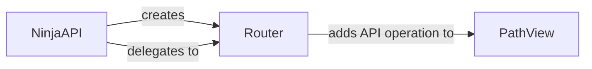

## Component Details

The Routing and Endpoint Management subsystem in django-ninja is responsible for defining and organizing API endpoints. It uses a central NinjaAPI instance to manage routers, which group related endpoints. Each router associates URL paths with specific view functions, supporting various HTTP methods. The PathView component represents individual API operations, handling request execution and response generation. This system allows for a structured and maintainable API design, enabling complex API structures through nested routers and clear separation of concerns.

### NinjaAPI
The NinjaAPI class serves as the central hub for the entire API. It's responsible for initializing routers, managing URL patterns, and setting up default exception handlers. It provides methods for registering routers and defining API operations directly.
- **Related Classes/Methods**: `django-ninja.ninja.main.NinjaAPI.__init__` (56:125), `django-ninja.ninja.main.NinjaAPI.get` (127:168), `django-ninja.ninja.main.NinjaAPI.post` (170:211), `django-ninja.ninja.main.NinjaAPI.delete` (213:254), `django-ninja.ninja.main.NinjaAPI.patch` (256:297), `django-ninja.ninja.main.NinjaAPI.put` (299:340), `django-ninja.ninja.main.NinjaAPI.api_operation` (342:381), `django-ninja.ninja.main.NinjaAPI.add_router` (383:414), `django-ninja.ninja.main.NinjaAPI.urls` (417:431)

### Router
The Router class is responsible for grouping related API endpoints. It allows developers to define routes for different HTTP methods (GET, POST, etc.) and associate them with corresponding view functions. Routers can be nested to create complex API structures.
- **Related Classes/Methods**: `django-ninja.ninja.router.Router.get` (56:94), `django-ninja.ninja.router.Router.post` (96:134), `django-ninja.ninja.router.Router.delete` (136:174), `django-ninja.ninja.router.Router.patch` (176:214), `django-ninja.ninja.router.Router.put` (216:254), `django-ninja.ninja.router.Router.api_operation` (256:300), `django-ninja.ninja.router.Router.add_api_operation` (302:366), `django-ninja.ninja.router.Router.urls_paths` (379:393), `django-ninja.ninja.router.Router.build_routers` (427:441)

### PathView
The PathView class represents a single API operation or endpoint. It encapsulates the view function, path parameters, and other metadata required to handle a specific request. It's responsible for executing the view function and returning the response.
- **Related Classes/Methods**: `ninja.operation.PathView` (402:506), `ninja.operation.PathView.add_operation` (408:461), `ninja.operation.PathView.set_api_instance` (463:466)