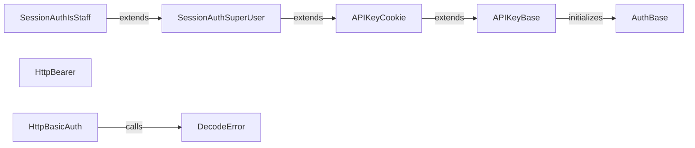

## Component Details

The Security component in django-ninja provides a flexible and extensible framework for handling authentication and authorization. It offers various authentication schemes like API key, HTTP Basic, and HTTP Bearer authentication. The core functionality revolves around validating user credentials and granting access to protected API endpoints. Abstract base classes define the structure for different authentication methods, while concrete implementations handle the specifics of extracting credentials and authenticating users. Django sessions can also be used for authentication, particularly for superusers and staff members.

### AuthBase
An abstract base class for authentication schemes. It initializes the OpenAPI security schema and checks if the authenticate method is asynchronous. It serves as the foundation for all authentication classes in django-ninja.
- **Related Classes/Methods**: `django-ninja.ninja.security.base.AuthBase:__init__` (18:31)

### APIKeyBase
An abstract base class for API key authentication schemes. It defines the basic structure for API key authentication, including retrieving the key and authenticating the request. Subclasses must implement the _get_key method to define how the API key is extracted from the request.
- **Related Classes/Methods**: `django-ninja.ninja.security.apikey.APIKeyBase:__init__` (17:19), `django-ninja.ninja.security.apikey.APIKeyBase:__call__` (21:23), `django-ninja.ninja.security.apikey.APIKeyBase._get_key` (26:27), `django-ninja.ninja.security.apikey.APIKeyBase.authenticate` (30:31)

### APIKeyCookie
Implements API key authentication using a cookie. It retrieves the API key from the request cookies and authenticates the request. It inherits from APIKeyBase and implements the _get_key method to extract the key from the cookie.
- **Related Classes/Methods**: `django-ninja.ninja.security.apikey.APIKeyCookie:__init__` (44:46), `django-ninja.ninja.security.apikey.APIKeyCookie:_get_key` (48:53)

### HttpBasicAuth
Implements HTTP Basic authentication by extracting the username and password from the Authorization header, decoding it, and calling the authenticate method to validate the credentials. It raises a DecodeError if decoding fails.
- **Related Classes/Methods**: `django-ninja.ninja.security.http.HttpBasicAuth:__call__` (53:65), `django-ninja.ninja.security.http.HttpBasicAuth.decode_authorization` (73:86), `django-ninja.ninja.security.http.HttpBasicAuth.authenticate` (68:71)

### HttpBearer
Implements HTTP Bearer authentication by extracting the token from the Authorization header and calling the authenticate method to validate the token. It is commonly used for API authentication with JWT tokens.
- **Related Classes/Methods**: `django-ninja.ninja.security.http.HttpBearer:__call__` (26:38), `django-ninja.ninja.security.http.HttpBearer.authenticate` (41:42)

### SessionAuthSuperUser
Extends APIKeyCookie and provides authentication for superusers using Django sessions. It verifies that the user is both authenticated and a superuser. It's suitable for securing admin-like functionalities.
- **Related Classes/Methods**: `django-ninja.ninja.security.session.SessionAuthSuperUser.authenticate` (28:33)

### SessionAuthIsStaff
Extends SessionAuthSuperUser and provides authentication for staff users. It checks if the user is a superuser or a staff member, providing a broader access control than just superusers.
- **Related Classes/Methods**: `django-ninja.ninja.security.session.SessionAuthIsStaff.authenticate` (37:44)

### DecodeError
Exception raised when decoding the authorization header fails in HttpBasicAuth. It signals that the provided credentials could not be properly decoded.
- **Related Classes/Methods**: `django-ninja.ninja.security.http.DecodeError` (45:46)