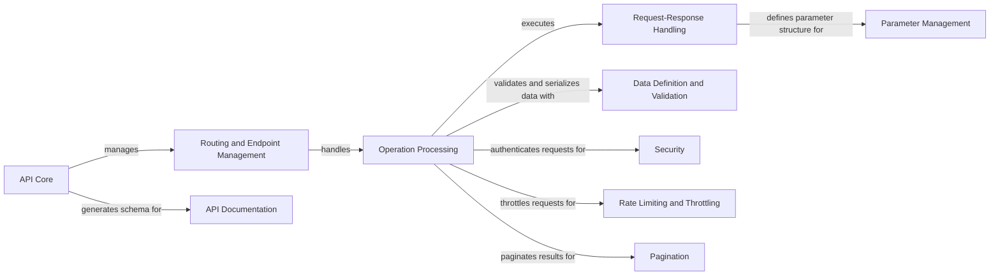

## Component Details

Django Ninja provides a framework for building APIs with Django, focusing on type hints and fast development. The core flow involves defining API operations using routers and view functions, which are then processed by the framework to handle requests, validate data, and generate responses. The framework also supports OpenAPI schema generation, authentication, throttling, and pagination, providing a comprehensive set of tools for building robust and scalable APIs.

### API Core
The API Core component is the central entry point for defining and configuring the API. It manages routers, exception handling, middleware, and the overall API structure. It also provides the entry point for generating the OpenAPI schema and serving API documentation.
- **Related Classes/Methods**: `django-ninja.ninja.main.NinjaAPI` (49:567), `django-ninja.ninja.main.NinjaAPI:__init__` (56:125), `django-ninja.ninja.main.NinjaAPI:add_router` (383:414), `django-ninja.ninja.main.NinjaAPI:urls` (417:431), `django-ninja.ninja.main.NinjaAPI:get_openapi_schema` (476:484), `django-ninja.ninja.main.NinjaAPI:exception_handler` (504:511)

### Routing and Endpoint Management
This component is responsible for organizing API endpoints into logical groups using routers. It defines URL paths and associates them with specific view functions, supporting nested routers for complex API structures and handling different HTTP methods for each endpoint.
- **Related Classes/Methods**: `django-ninja.ninja.router.Router` (32:441), `django-ninja.ninja.router.Router:add_api_operation` (302:366), `django-ninja.ninja.router.Router:urls_paths` (379:393)

### Operation Processing
The Operation Processing component represents a single API endpoint and encapsulates the logic for request processing, validation, and response generation. It manages authentication, throttling, and pagination, and transforms the result of the view function into an appropriate HTTP response.
- **Related Classes/Methods**: `django-ninja.ninja.operation.Operation` (43:338), `django-ninja.ninja.operation.Operation:run` (126:140), `django-ninja.ninja.operation.Operation:_run_checks` (180:202), `django-ninja.ninja.operation.Operation:_result_to_response` (237:300)

### Request-Response Handling
This component analyzes the view function's signature to extract information about its parameters and return type. This information is used for request validation, response serialization, and OpenAPI schema generation. It determines the types of parameters and creates models for request and response data.
- **Related Classes/Methods**: `django-ninja.ninja.signature.details.ViewSignature` (40:284), `django-ninja.ninja.signature.details.ViewSignature:_create_models` (124:183), `django-ninja.ninja.signature.details.ViewSignature:_get_param_type` (218:284)

### Data Definition and Validation
The Data Definition and Validation component provides a way to define the structure of request and response data using Pydantic models. It supports data type validation, serialization, and deserialization, and integrates with Django models for seamless interaction with the Django ORM.
- **Related Classes/Methods**: `django-ninja.ninja.schema.Schema` (209:249), `django-ninja.ninja.schema.Schema:_run_root_validator` (215:228), `django-ninja.ninja.schema.Schema:schema` (243:249)

### Parameter Management
This component defines and manages API endpoint parameters, including path, query, header, cookie, and body parameters. It handles the extraction, validation, and conversion of parameter values from the HTTP request.
- **Related Classes/Methods**: `django-ninja.ninja.params.models.ParamModel` (46:91), `django-ninja.ninja.params.models.ParamModel:resolve` (57:68), `django-ninja.ninja.params.functions:Path` (11:47), `django-ninja.ninja.params.functions:Query` (50:86), `django-ninja.ninja.params.functions:Body` (167:203)

### API Documentation
The API Documentation component is responsible for generating the OpenAPI schema for the API and providing a user interface for exploring the API's documentation. It uses the information extracted from the API endpoints to create a comprehensive description of the API's structure and renders it in a human-readable format using Swagger or Redoc.
- **Related Classes/Methods**: `django-ninja.ninja.openapi.schema:get_schema` (27:29), `django-ninja.ninja.openapi.schema.OpenAPISchema` (35:321), `django-ninja.ninja.openapi.docs.Swagger:render_page` (46:55), `django-ninja.ninja.openapi.docs.Redoc:render_page` (69:77)

### Security
The Security component handles user authentication and authorization. It provides different authentication schemes, such as API key authentication, HTTP Basic authentication, and HTTP Bearer authentication. It verifies user credentials and grants access to protected API endpoints.
- **Related Classes/Methods**: `django-ninja.ninja.security.http.HttpBearer` (22:42), `django-ninja.ninja.security.http.HttpBasicAuth` (49:86), `django-ninja.ninja.security.apikey.APIKeyBase` (13:31)

### Rate Limiting and Throttling
The Rate Limiting and Throttling component limits the rate at which users can access the API. It prevents abuse and ensures that the API remains available to all users. It supports different throttling strategies, such as anonymous rate limiting, authenticated rate limiting, and user-based rate limiting.
- **Related Classes/Methods**: `django-ninja.ninja.throttling.SimpleRateThrottle` (50:189), `django-ninja.ninja.throttling.SimpleRateThrottle:allow_request` (136:159), `django-ninja.ninja.throttling.AnonRateThrottle:get_cache_key` (201:208)

### Pagination
The Pagination component provides a way to divide large result sets into smaller pages. It improves the performance and usability of APIs that return large amounts of data. It supports different pagination styles, such as limit/offset pagination and page number pagination.
- **Related Classes/Methods**: `django-ninja.ninja.pagination.LimitOffsetPagination` (78:119), `django-ninja.ninja.pagination.PageNumberPagination` (122:173), `django-ninja.ninja.pagination:paginate` (176:206)