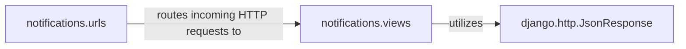

## Details

The `notifications` subsystem in this Django project is designed to manage and serve user notifications. The `notifications.urls` component acts as the routing layer, defining the API endpoints and mapping them to specific handlers within `notifications.views`. The `notifications.views` component encapsulates the core logic for processing notification-related requests, including fetching, marking as read/unread, and deleting notifications. These views interact with the underlying data models to retrieve and manipulate notification data. For API responses, `notifications.views` heavily relies on `django.http.JsonResponse` to serialize Python data into a standardized JSON format, ensuring efficient and structured communication with client-side applications. This architecture provides a clear separation of concerns, with distinct components handling routing, business logic, and response formatting.

### notifications.urls
This component, defined in `notifications/urls.py`, establishes the URL patterns that direct incoming HTTP requests to the appropriate view functions or class-based views within the `notifications.views` component. It acts as the primary entry point for the notification API, routing requests such as fetching unread notification counts or lists to their designated handlers.

**Related Classes/Methods**:

- <a href="https://github.com/django-notifications/django-notifications/blob/master/notifications/urls.py#L1-L99999" target="_blank" rel="noopener noreferrer">`notifications.urls`:1-99999</a>

### notifications.views
Located in `notifications/views.py`, this component contains the business logic for handling various notification-related HTTP GET requests. It includes functions like `live_unread_notification_count`, `live_unread_notification_list`, `live_all_notification_count`, and `live_all_notification_list`. These functions interact with the application's data models (e.g., `Notification` model via `request.user.notifications`) to retrieve and process notification data, preparing it for client consumption. It also leverages `django.http.JsonResponse` to format responses.

**Related Classes/Methods**:

- <a href="https://github.com/django-notifications/django-notifications/blob/master/notifications/views.py#L1-L99999" target="_blank" rel="noopener noreferrer">`notifications.views`:1-99999</a>

### django.http.JsonResponse
This is a core Django utility class responsible for serializing Python data structures (such as dictionaries or lists) into JSON format. It then constructs an HTTP response with the `Content-Type` header set to `application/json`, ensuring that API responses are correctly formatted for client-side applications. It is a critical component for providing structured data in API responses.

**Related Classes/Methods**: _None_

### [FAQ](https://github.com/CodeBoarding/GeneratedOnBoardings/tree/main?tab=readme-ov-file#faq)