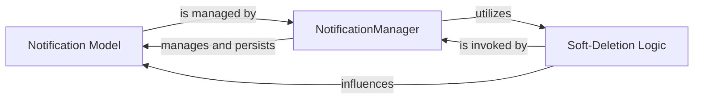

## Details

The core of the notification subsystem revolves around the `Notification Model`, which defines the data structure for notifications. The `NotificationManager` acts as the primary interface for all database operations related to these notifications, handling their lifecycle from creation to soft-deletion. This manager component critically depends on the `Soft-Deletion Logic` to implement the application's policy of marking notifications as deleted rather than permanently removing them, thereby influencing the effective state and accessibility of `Notification Model` instances within the system.

### Notification Model
The foundational component defining the schema, attributes, and behavior of a single notification entity. It includes fields for recipient, sender, message, timestamp, and various state flags (read, sent, deleted). It also provides instance-level utility methods, such as `timesince`, for formatting display information.

**Related Classes/Methods**:

- <a href="https://github.com/django-notifications/django-notifications/blob/master/notifications/base/models.py" target="_blank" rel="noopener noreferrer">`notifications.base.models.Notification`</a>

### NotificationManager
The primary interface for database operations related to `Notification` objects. It extends Django's default manager to provide specialized methods for querying (e.g., `read()`, `unread()`, `sent()`, `unsent()`, `active()`, `deleted()`) and efficient bulk state changes (e.g., `mark_all_as_read()`, `mark_all_as_deleted()`). It orchestrates interactions with the `Soft-Deletion Logic` to ensure proper data visibility and integrity.

**Related Classes/Methods**:

- <a href="https://github.com/django-notifications/django-notifications/blob/master/notifications/base/models.py" target="_blank" rel="noopener noreferrer">`notifications.base.models.NotificationManager`</a>

### Soft-Deletion Logic
A distinct policy component that implements the application's soft-deletion mechanism for notifications. Instead of permanent removal, notifications are marked as deleted, allowing for recovery or historical tracking. This logic is applied by the `NotificationManager` during query filtering and bulk update operations to control which notifications are considered "active" or "deleted."

**Related Classes/Methods**:

- <a href="https://github.com/django-notifications/django-notifications/blob/master/notifications/base/models.py#L46-L52" target="_blank" rel="noopener noreferrer">`notifications.base.models.assert_soft_delete`:46-52</a>
- <a href="https://github.com/django-notifications/django-notifications/blob/master/notifications/base/models.py#L42-L43" target="_blank" rel="noopener noreferrer">`notifications.base.models.is_soft_delete`:42-43</a>

### [FAQ](https://github.com/CodeBoarding/GeneratedOnBoardings/tree/main?tab=readme-ov-file#faq)