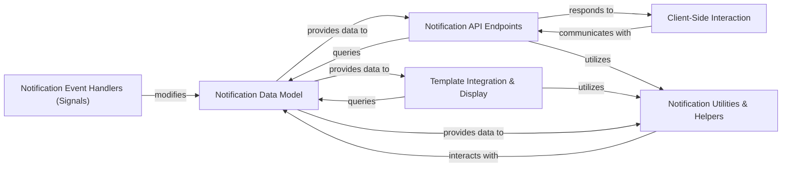

## Details

The django-notifications project implements a modular architecture centered around a Notification Data Model that serves as the authoritative source for all notification data. Notification API Endpoints provide a programmatic interface for Client-Side Interaction to dynamically manage and retrieve notifications, while Template Integration & Display enables server-side rendering of notification elements. Notification Event Handlers (Signals) ensure the Notification Data Model is updated in response to application events, maintaining data consistency. Supporting these core components, Notification Utilities & Helpers offer reusable logic for common data operations and processing tasks, interacting directly with the Notification Data Model to facilitate efficient data access and manipulation across the system. This design promotes clear separation of concerns and a well-defined data flow, ideal for both documentation and visual representation.

### Notification Data Model [[Expand]](./Notification_Data_Model.md)
The central data layer defining the Notification entity, its attributes, and the primary interface for database interactions. Manages persistence, state (read/unread, sent/unsent, soft-deletion), and querying.

**Related Classes/Methods**:

- <a href="https://github.com/django-notifications/django-notifications/blob/master/notifications/base/models.py" target="_blank" rel="noopener noreferrer">`notifications/base/models.py`</a>
- <a href="https://github.com/django-notifications/django-notifications/blob/master/notifications/models.py" target="_blank" rel="noopener noreferrer">`notifications/models.py`</a>

### Notification API Endpoints [[Expand]](./Notification_API_Endpoints.md)
Exposes RESTful HTTP interfaces for client-side applications to retrieve and manage notification data, primarily for dynamic updates (unread counts, lists) via JSON responses.

**Related Classes/Methods**:

- <a href="https://github.com/django-notifications/django-notifications/blob/master/notifications/views.py" target="_blank" rel="noopener noreferrer">`notifications/views.py`</a>
- <a href="https://github.com/django-notifications/django-notifications/blob/master/notifications/urls.py" target="_blank" rel="noopener noreferrer">`notifications/urls.py`</a>

### Template Integration & Display
Provides Django template tags and associated templates to seamlessly embed and render notification-related information directly within the user interface, including counts and interactive badges.

**Related Classes/Methods**:

- <a href="https://github.com/django-notifications/django-notifications/blob/master/notifications/templatetags/notifications_tags.py" target="_blank" rel="noopener noreferrer">`notifications/templatetags/notifications_tags.py`</a>
- <a href="https://github.com/django-notifications/django-notifications/blob/master/notifications/templates/notifications/" target="_blank" rel="noopener noreferrer">`notifications/templates/notifications/`</a>

### Notification Event Handlers (Signals)
Manages the application's response to various system events related to notifications using Django's signal dispatching mechanism, ensuring loose coupling.

**Related Classes/Methods**:

- <a href="https://github.com/django-notifications/django-notifications/blob/master/notifications/signals.py" target="_blank" rel="noopener noreferrer">`notifications/signals.py`</a>

### Notification Utilities & Helpers
A collection of reusable functions and utilities supporting various notification-related operations across different components, such as fetching specific lists or generating object URLs.

**Related Classes/Methods**:

- <a href="https://github.com/django-notifications/django-notifications/blob/master/notifications/helpers.py" target="_blank" rel="noopener noreferrer">`notifications/helpers.py`</a>
- <a href="https://github.com/django-notifications/django-notifications/blob/master/notifications/utils.py" target="_blank" rel="noopener noreferrer">`notifications/utils.py`</a>

### Client-Side Interaction
Handles the dynamic and real-time aspects of notifications on the client-side, involving JavaScript logic for AJAX requests to the API and dynamic UI updates.

**Related Classes/Methods**:

- <a href="https://github.com/django-notifications/django-notifications/blob/master/notifications/static/notifications/notify.js" target="_blank" rel="noopener noreferrer">`notifications/static/notifications/notify.js`</a>

### [FAQ](https://github.com/CodeBoarding/GeneratedOnBoardings/tree/main?tab=readme-ov-file#faq)