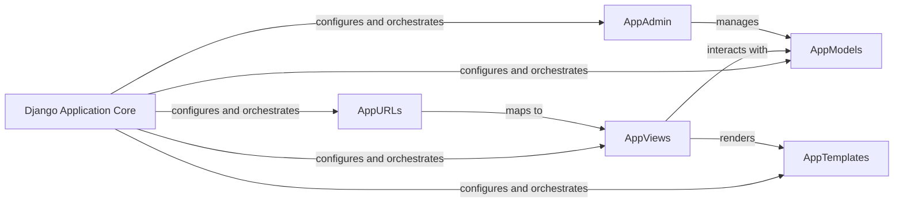

## Details

The Django Application Core subsystem is the foundational layer of the web application, responsible for its overall configuration, routing, and orchestration of individual Django applications. It adheres to the Model-Template-View (MTV) architectural pattern, promoting a clear separation of concerns.

### Django Application Core [[Expand]](./Django_Application_Core.md)
This component serves as the central configuration and entry point for the entire Django web application. It manages global settings, the primary URL routing, and the WSGI/ASGI interfaces, acting as the orchestrator for all integrated Django applications.

**Related Classes/Methods**:

- <a href="https://github.com/anil3a/django-postgres-docker-skeleton/blob/master/app/settings/settings.py#L1-L1" target="_blank" rel="noopener noreferrer">`app/settings/settings.py` (1:1)</a>
- <a href="https://github.com/anil3a/django-postgres-docker-skeleton/blob/master/app/settings/urls.py#L1-L1" target="_blank" rel="noopener noreferrer">`app/settings/urls.py` (1:1)</a>
- <a href="https://github.com/anil3a/django-postgres-docker-skeleton/blob/master/app/settings/wsgi.py#L1-L1" target="_blank" rel="noopener noreferrer">`app/settings/wsgi.py` (1:1)</a>
- <a href="https://github.com/anil3a/django-postgres-docker-skeleton/blob/master/app/settings/asgi.py#L1-L1" target="_blank" rel="noopener noreferrer">`app/settings/asgi.py` (1:1)</a>
- `app/manage.py`

### AppModels
Represents the data models and associated business logic for individual Django applications. These models define the structure of the application's data and interact with the database.

**Related Classes/Methods**:

- `*/models.py` (1:1)

### AppViews
Handles the request-response cycle for individual Django applications. Views process user input, interact with models, and render templates to generate responses.

**Related Classes/Methods**:

- `*/views.py` (1:1)

### AppTemplates
Contains the presentation logic and HTML structures for individual Django applications. Templates are rendered by views to generate the final user interface.

**Related Classes/Methods**:

- `*/templates/` (1:1)

### AppURLs
Defines the URL routing patterns specific to individual Django applications. These patterns map URLs to corresponding views within the application.

**Related Classes/Methods**:

- `*/urls.py` (1:1)

### AppAdmin
Configures the Django administrative interface for individual applications, allowing for easy management of models and data through a web-based GUI.

**Related Classes/Methods**:

- `*/admin.py` (1:1)

### [FAQ](https://github.com/CodeBoarding/GeneratedOnBoardings/tree/main?tab=readme-ov-file#faq)