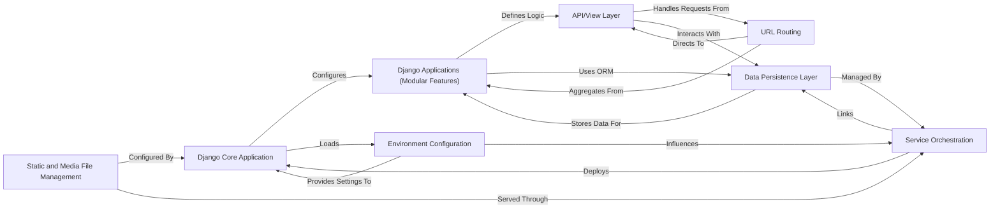

## Details

This section provides a detailed overview of the core components within the project, focusing on their responsibilities, key source files, and interactions, aligned with monolithic web application backend patterns.

### Django Core Application
Manages the overall Django project settings, global URL routing, and server gateway interfaces (WSGI/ASGI). It acts as the central hub for all individual Django applications, defining the project's fundamental behavior and structure.

**Related Classes/Methods**:

- `settings.py`
- <a href="https://github.com/anil3a/django-postgres-docker-skeleton/blob/master/app/settings/urls.py" target="_blank" rel="noopener noreferrer">`urls.py`</a>
- <a href="https://github.com/anil3a/django-postgres-docker-skeleton/blob/master/app/settings/wsgi.py" target="_blank" rel="noopener noreferrer">`wsgi.py`</a>
- <a href="https://github.com/anil3a/django-postgres-docker-skeleton/blob/master/app/settings/asgi.py" target="_blank" rel="noopener noreferrer">`asgi.py`</a>

### Django Applications (Modular Features)
Encapsulates distinct functionalities of the application, adhering to the Model-Template-View (MTV) pattern. Each application contains its own data models, business logic (views), and URL routing, promoting modularity and separation of concerns.

**Related Classes/Methods**:

- `models.py`
- `views.py`
- <a href="https://github.com/anil3a/django-postgres-docker-skeleton/blob/master/app/settings/urls.py" target="_blank" rel="noopener noreferrer">`urls.py`</a>
- `admin.py`
- `apps.py`

### Data Persistence Layer
Manages the application's data storage and retrieval, primarily through the PostgreSQL database. It includes Django's ORM for defining data models and managing database schema changes via migrations.

**Related Classes/Methods**:

- `models.py`
- `migrations`

### API/View Layer
Processes incoming HTTP requests, orchestrates interactions with the data persistence layer and business logic, and generates appropriate HTTP responses. It serves as the interface between clients and the application's core functionalities.

**Related Classes/Methods**:

- `views.py`

### URL Routing
Defines the URL patterns that map incoming web requests to specific view functions or classes within the Django project and its individual applications, directing traffic to the correct handlers.

**Related Classes/Methods**:

- <a href="https://github.com/anil3a/django-postgres-docker-skeleton/blob/master/app/settings/urls.py" target="_blank" rel="noopener noreferrer">`urls.py`</a>
- <a href="https://github.com/anil3a/django-postgres-docker-skeleton/blob/master/app/settings/urls.py" target="_blank" rel="noopener noreferrer">`urls.py`</a>

### Service Orchestration [[Expand]](./Service_Orchestration.md)
This component is responsible for defining, linking, and managing the multi-container Docker application. It coordinates the startup, shutdown, and networking of all services, primarily the Django application and the PostgreSQL database.

**Related Classes/Methods**:

- `docker-compose.yml`
- `Dockerfile`

### Environment Configuration
Handles the loading and management of environment-specific settings and sensitive data (e.g., database credentials, API keys) to ensure secure and flexible deployments across different environments.

**Related Classes/Methods**:

- `.env`
- `settings.py`

### Static and Media File Management
Manages the collection, serving, and storage of static assets (e.g., CSS, JavaScript, images) and user-uploaded media files, ensuring they are accessible to the web application's clients.

**Related Classes/Methods**:

- `static`
- `media`
- `settings.py`

### [FAQ](https://github.com/CodeBoarding/GeneratedOnBoardings/tree/main?tab=readme-ov-file#faq)