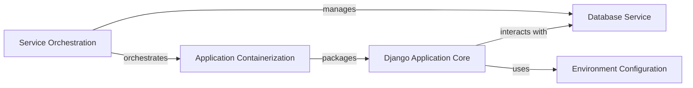

## Details

Abstract Components Overview

### Django Application Core [[Expand]](./Django_Application_Core.md)
This component represents the heart of the web application, encompassing all Django-specific logic, including global settings, URL routing, and the entry points for the application. It processes requests, interacts with the database, and serves responses.

**Related Classes/Methods**:

- <a href="https://github.com/anil3a/django-postgres-docker-skeleton/blob/master/app/settings/settings.py#L1-L1" target="_blank" rel="noopener noreferrer">`app/settings/settings.py` (1:1)</a>

### Database Service
This component provides the persistent data storage for the Django application, specifically a PostgreSQL instance. It is managed as a separate service within the containerized environment, ensuring data integrity and availability. (Definition based on common architectural patterns for Django with PostgreSQL in a containerized environment, as direct source code for the database service itself is external to the Python application.)

**Related Classes/Methods**: _None_

### Environment Configuration
This component handles all environment-specific variables and sensitive information, allowing the application to adapt its behavior across different deployment environments (e.g., development, production) without code changes.

**Related Classes/Methods**:

- <a href="https://github.com/anil3a/django-postgres-docker-skeleton/blob/master/app/settings/settings.py#L1-L1" target="_blank" rel="noopener noreferrer">`app/settings/settings.py` (1:1)</a>

### Application Containerization
This component defines the build process and runtime environment for the Django application within Docker containers. It specifies dependencies, environment setup, and entry points, ensuring consistent deployment across various environments. (Definition based on common architectural patterns for Dockerized applications, as the `Dockerfile` itself is not a Python source file.)

**Related Classes/Methods**: _None_

### Service Orchestration [[Expand]](./Service_Orchestration.md)
This component is responsible for defining, linking, and managing the multi-container Docker application. It coordinates the startup, shutdown, and networking of all services, primarily the Django application and the PostgreSQL database. (Definition based on common architectural patterns for Docker Compose or similar orchestration tools, as the `docker-compose.yml` file is not a Python source file.)

**Related Classes/Methods**: _None_

### [FAQ](https://github.com/CodeBoarding/GeneratedOnBoardings/tree/main?tab=readme-ov-file#faq)