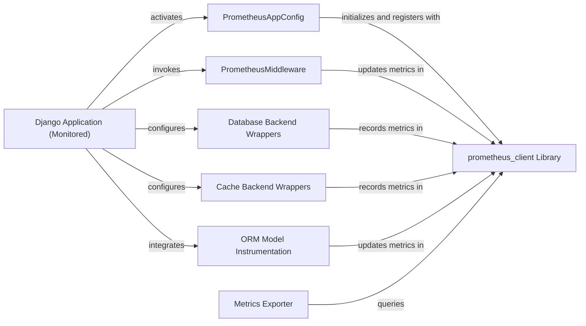

## Details

The `django-prometheus` subsystem integrates Prometheus monitoring capabilities into a Django application. It operates by instrumenting various aspects of the `Django Application (Monitored)`, including HTTP requests, database queries, cache operations, and ORM interactions. The `PrometheusAppConfig` initializes the monitoring setup, while specialized wrappers like `PrometheusMiddleware`, `Database Backend Wrappers`, `Cache Backend Wrappers`, and `ORM Model Instrumentation` collect metrics from their respective domains. All collected metrics are managed and exposed through the `prometheus_client Library`, an external dependency, and made available for scraping by Prometheus servers via the `Metrics Exporter` component.

### Django Application (Monitored) [[Expand]](./Django_Application_Monitored_.md)
The user's core Django application, which is the primary subject of monitoring. It provides the operational context (HTTP requests, database queries, cache operations, ORM interactions) that django-prometheus instruments. As this is the user's application and not part of the django-prometheus codebase, no direct source code reference is provided from within this project.

**Related Classes/Methods**: _None_

### PrometheusAppConfig
Manages the initialization and setup of the django-prometheus subsystem within the Django Application (Monitored). It registers default metrics and ensures monitoring components are properly configured upon application startup.

**Related Classes/Methods**:

- <a href="https://github.com/django-commons/django-prometheus/blob/master/django_prometheus/apps.py#L1-L1000" target="_blank" rel="noopener noreferrer">`django_prometheus.apps`:1-1000</a>

### PrometheusMiddleware
Intercepts HTTP requests and responses within the Django Application (Monitored)'s request-response cycle. It collects web traffic metrics such as request duration, status codes, and request counts.

**Related Classes/Methods**:

- <a href="https://github.com/django-commons/django-prometheus/blob/master/django_prometheus/middleware.py#L1-L1000" target="_blank" rel="noopener noreferrer">`django_prometheus.middleware`:1-1000</a>

### Database Backend Wrappers
Replaces Django's standard database backends within the Django Application (Monitored) to instrument database queries. It collects metrics like query counts and execution durations for various database operations.

**Related Classes/Methods**:

- <a href="https://github.com/django-commons/django-prometheus/blob/master/django_prometheus/db#L1-L1000" target="_blank" rel="noopener noreferrer">`django_prometheus.db`:1-1000</a>

### Cache Backend Wrappers
Wraps Django's cache backends within the Django Application (Monitored) to instrument cache operations. It collects metrics such as cache hits, misses, sets, and gets.

**Related Classes/Methods**:

- <a href="https://github.com/django-commons/django-prometheus/blob/master/django_prometheus/cache#L1-L1000" target="_blank" rel="noopener noreferrer">`django_prometheus.cache`:1-1000</a>

### ORM Model Instrumentation
Provides mechanisms (e.g., mixins) to collect metrics related to Django ORM operations (creation, updates, deletions) on models defined within the Django Application (Monitored).

**Related Classes/Methods**:

- <a href="https://github.com/django-commons/django-prometheus/blob/master/django_prometheus/models.py#L1-L1000" target="_blank" rel="noopener noreferrer">`django_prometheus.models`:1-1000</a>

### Metrics Exporter
Responsible for exposing all collected Prometheus metrics from the Django Application (Monitored) via a dedicated /metrics HTTP endpoint, making them available for Prometheus servers to scrape.

**Related Classes/Methods**:

- <a href="https://github.com/django-commons/django-prometheus/blob/master/django_prometheus/exports.py#L1-L1000" target="_blank" rel="noopener noreferrer">`django_prometheus.exports`:1-1000</a>

### prometheus_client Library
An integral external dependency that provides the fundamental API for defining, registering, collecting, and exposing Prometheus metrics. All django-prometheus instrumentation components within the Django Application (Monitored) interact with this library. As an external library, its source code is not part of the django-prometheus project's codebase.

**Related Classes/Methods**: _None_

### [FAQ](https://github.com/CodeBoarding/GeneratedOnBoardings/tree/main?tab=readme-ov-file#faq)