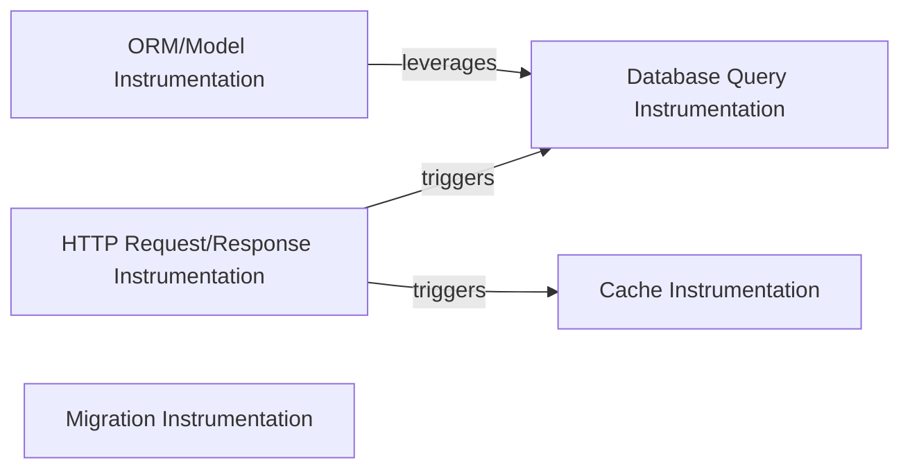

## Details

The `django-prometheus` subsystem provides comprehensive instrumentation for Django applications, primarily focusing on collecting metrics for Prometheus. Its architecture is centered around intercepting key application interactions: `HTTP Request/Response Instrumentation` acts as the primary entry point for web traffic, subsequently triggering `Database Query Instrumentation` and `Cache Instrumentation` as requests are processed. `ORM/Model Instrumentation` specifically extends database monitoring to Django's ORM layer by leveraging the core database instrumentation. `Migration Instrumentation` operates independently to track database schema changes.

The `django-prometheus` subsystem integrates deeply into Django's core functionalities to provide observability. The `HTTP Request/Response Instrumentation` component, implemented as Django middleware, is strategically positioned to capture metrics at the entry and exit points of web requests. This component acts as a central orchestrator, as typical web request processing often involves database queries and cache operations. The `Database Query Instrumentation` and `Cache Instrumentation` components are designed to transparently wrap Django's native database cursors and cache backends, respectively, ensuring that all interactions are automatically monitored. `ORM/Model Instrumentation` builds upon the foundational database instrumentation, providing a higher-level abstraction for ORM-specific metrics. `Migration Instrumentation` operates as a distinct concern, focusing on database schema evolution rather than runtime request processing.

### HTTP Request/Response Instrumentation
This component is responsible for intercepting and instrumenting HTTP requests and responses within the Django middleware stack. It collects metrics related to request methods, transport, view processing, and exceptions, applying appropriate labels.

**Related Classes/Methods**:

- <a href="https://github.com/django-commons/django-prometheus/blob/master/django_prometheus/middleware.py" target="_blank" rel="noopener noreferrer">`django_prometheus.middleware`</a>

### Database Query Instrumentation
This component wraps Django's database cursors to instrument database `execute` and `executemany` operations. It specifically tracks query counts, durations, and exceptions during database interactions.

**Related Classes/Methods**:

- <a href="https://github.com/django-commons/django-prometheus/blob/master/django_prometheus/db/metrics.py" target="_blank" rel="noopener noreferrer">`django_prometheus.db.metrics`</a>
- <a href="https://github.com/django-commons/django-prometheus/blob/master/django_prometheus/db/common.py" target="_blank" rel="noopener noreferrer">`django_prometheus.db.common`</a>

### Cache Instrumentation
This component instruments Django's cache backend operations to collect metrics related to cache hits, misses, sets, and deletes.

**Related Classes/Methods**:

- <a href="https://github.com/django-commons/django-prometheus/blob/master/django_prometheus/cache/metrics.py" target="_blank" rel="noopener noreferrer">`django_prometheus.cache.metrics`</a>

### ORM/Model Instrumentation
This component provides a mixin (`PrometheusModelBase`) for Django models to enable automatic instrumentation of ORM operations (e.g., queries, saves, deletes) for specific models.

**Related Classes/Methods**:

- <a href="https://github.com/django-commons/django-prometheus/blob/master/django_prometheus/models.py" target="_blank" rel="noopener noreferrer">`django_prometheus.models`</a>

### Migration Instrumentation
This component orchestrates the export of metrics related to Django database migrations, potentially tracking migration counts or status.

**Related Classes/Methods**:

- <a href="https://github.com/django-commons/django-prometheus/blob/master/django_prometheus/migrations.py" target="_blank" rel="noopener noreferrer">`django_prometheus.migrations`</a>

### [FAQ](https://github.com/CodeBoarding/GeneratedOnBoardings/tree/main?tab=readme-ov-file#faq)