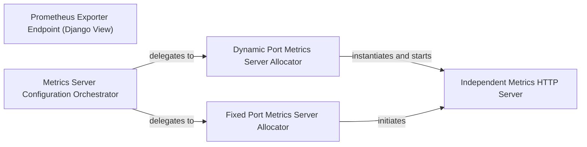

## Details

The `django-prometheus` subsystem provides robust metrics exposition for Django applications, offering two primary mechanisms: a direct Django view endpoint and an independent HTTP server. The `Prometheus Exporter Endpoint (Django View)` integrates metrics exposure directly into the Django application's request-response cycle, serving aggregated metrics via a standard HTTP response. Complementing this, the `Metrics Server Configuration Orchestrator` dynamically manages an out-of-band metrics server. This orchestrator, based on Django settings, delegates to either a `Dynamic Port Metrics Server Allocator` or a `Fixed Port Metrics Server Allocator` to initiate an `Independent Metrics HTTP Server`. This independent server operates in a separate thread, ensuring continuous metrics availability even if the main Django application becomes unresponsive, and serves metrics through a dedicated HTTP server instance.

### Prometheus Exporter Endpoint (Django View)
The central component responsible for aggregating all collected metrics and exposing them via an HTTP endpoint (typically `/metrics`) for external Prometheus servers to scrape. This is implemented as a standard Django view, integrating directly into the Django application's request-response cycle. It leverages external Prometheus client libraries and Django's HTTP response capabilities.

**Related Classes/Methods**:

- <a href="https://github.com/django-commons/django-prometheus/blob/master/django_prometheus/exports.py" target="_blank" rel="noopener noreferrer">`django_prometheus.exports.metrics_view`</a>

### Metrics Server Configuration Orchestrator
This component reads `django-prometheus` specific settings (e.g., `PROMETHEUS_METRICS_EXPORT_PORT`, `PROMETHEUS_METRICS_EXPORT_PORT_RANGE`) to determine if and how an independent Prometheus HTTP exposition server should be started. It orchestrates the initiation of this server based on these configurations, providing a centralized control point for the out-of-band metrics endpoint. It relies on Django's configuration system.

**Related Classes/Methods**: _None_

### Dynamic Port Metrics Server Allocator
Responsible for finding an available port within a specified range and initiating the `Independent Metrics HTTP Server` on that chosen port. This provides flexibility for environments where a fixed port might not always be available, allowing multiple Django processes to expose metrics on different ports. It utilizes standard Python HTTP server components and Prometheus client handlers.

**Related Classes/Methods**: _None_

### Fixed Port Metrics Server Allocator
Handles the setup of the `Independent Metrics HTTP Server` on a single, explicitly defined port. This is used for environments with static port assignments for the metrics server. It directly uses the Prometheus client's HTTP server utility.

**Related Classes/Methods**: _None_

### Independent Metrics HTTP Server
This is a dedicated thread that encapsulates and runs an underlying lightweight HTTP server (`http.server.HTTPServer`). It binds to a specific port and continuously listens for incoming scrape requests from Prometheus, serving the metrics data retrieved from the Prometheus registry. This server operates independently of the Django application's WSGI process, ensuring metrics availability even if the main Django application becomes unresponsive. It relies on standard Python HTTP server components and Prometheus client handlers.

**Related Classes/Methods**: _None_

### [FAQ](https://github.com/CodeBoarding/GeneratedOnBoardings/tree/main?tab=readme-ov-file#faq)