```mermaid
graph LR
    Django_Application_Monitored_["Django Application (Monitored)"]
    Instrumentation_Layers["Instrumentation Layers"]
    Prometheus_Exporter_Endpoint["Prometheus Exporter Endpoint"]
    Prometheus_Server_External_["Prometheus Server (External)"]
    Django_Application_Monitored_ -- "Triggers Operations / Intercepted by" --> Instrumentation_Layers
    Instrumentation_Layers -- "Contributes Metrics To" --> Prometheus_Exporter_Endpoint
    Prometheus_Exporter_Endpoint -- "Serves Metrics To / Scraped by" --> Prometheus_Server_External_
    click Django_Application_Monitored_ href "https://github.com/CodeBoarding/GeneratedOnBoardings/blob/main/django-prometheus/Django_Application_Monitored_.md" "Details"
    click Instrumentation_Layers href "https://github.com/CodeBoarding/GeneratedOnBoardings/blob/main/django-prometheus/Instrumentation_Layers.md" "Details"
    click Prometheus_Exporter_Endpoint href "https://github.com/CodeBoarding/GeneratedOnBoardings/blob/main/django-prometheus/Prometheus_Exporter_Endpoint.md" "Details"
```

## Details

The `django-prometheus` library integrates seamlessly into a standard Django application to provide comprehensive monitoring capabilities. It operates by injecting "Instrumentation Layers" into various parts of the Django application, such as HTTP requests, database queries, caching operations, ORM interactions, and migrations. These layers passively collect performance and operational metrics. All collected metrics are then aggregated and exposed through a dedicated "Prometheus Exporter Endpoint" (typically `/metrics`). An external "Prometheus Server" periodically scrapes this endpoint to pull the time-series data, enabling external monitoring, analysis, and visualization of the Django application's health and performance.

### Django Application (Monitored) [[Expand]](./Django_Application_Monitored_.md)
The core Django application developed by the user, which integrates `django-prometheus` for performance and operational monitoring. This component represents the application being observed.

**Related Classes/Methods**:

- <a href="https://github.com/django-commons/django-prometheus/blob/master/django_prometheus/apps.py" target="_blank" rel="noopener noreferrer">`django_prometheus.apps.PrometheusAppConfig`</a>

### Instrumentation Layers [[Expand]](./Instrumentation_Layers.md)
A consolidated component representing all the various `django-prometheus` modules that intercept and collect metrics from different parts of the Django application. This includes HTTP, Database, Cache, ORM, and Migration instrumentation.

**Related Classes/Methods**:

- <a href="https://github.com/django-commons/django-prometheus/blob/master/django_prometheus/middleware.py#L162-L181" target="_blank" rel="noopener noreferrer">`django_prometheus.middleware.PrometheusBeforeMiddleware`:162-181</a>
- <a href="https://github.com/django-commons/django-prometheus/blob/master/django_prometheus/db/metrics.py" target="_blank" rel="noopener noreferrer">`django_prometheus.db.metrics`</a>
- <a href="https://github.com/django-commons/django-prometheus/blob/master/django_prometheus/cache/metrics.py" target="_blank" rel="noopener noreferrer">`django_prometheus.cache.metrics`</a>
- <a href="https://github.com/django-commons/django-prometheus/blob/master/django_prometheus/models.py" target="_blank" rel="noopener noreferrer">`django_prometheus.models.PrometheusModelBase`</a>
- <a href="https://github.com/django-commons/django-prometheus/blob/master/django_prometheus/migrations.py" target="_blank" rel="noopener noreferrer">`django_prometheus.migrations.PrometheusMigrationRecorder`</a>

### Prometheus Exporter Endpoint [[Expand]](./Prometheus_Exporter_Endpoint.md)
The central component responsible for aggregating all collected metrics and exposing them via an HTTP endpoint (typically `/metrics`) for external Prometheus servers to scrape.

**Related Classes/Methods**:

- <a href="https://github.com/django-commons/django-prometheus/blob/master/django_prometheus/exports.py" target="_blank" rel="noopener noreferrer">`django_prometheus.exports.metrics_view`</a>

### Prometheus Server (External)
An external monitoring system that periodically scrapes metrics from the `django-prometheus` exporter endpoint to store, analyze, and visualize time-series data.

**Related Classes/Methods**: _None_

### [FAQ](https://github.com/CodeBoarding/GeneratedOnBoardings/tree/main?tab=readme-ov-file#faq)