```mermaid
graph LR
    Django_Application_Core_Serving["Django Application Core & Serving"]
    Backend_Data_Business_Logic["Backend Data & Business Logic"]
    Backend_API_Layer["Backend API Layer"]
    Frontend_Core_Services_Configuration["Frontend Core Services & Configuration"]
    Frontend_API_Client["Frontend API Client"]
    Frontend_UI_Components_Pages["Frontend UI Components & Pages"]
    Django_Application_Core_Serving -- "manages the execution of" --> Backend_Data_Business_Logic
    Django_Application_Core_Serving -- "serves the compiled output of" --> Frontend_Core_Services_Configuration
    Backend_API_Layer -- "interacts with" --> Backend_Data_Business_Logic
    Frontend_Core_Services_Configuration -- "serves as the initial render point for" --> Frontend_UI_Components_Pages
    Frontend_API_Client -- "fetches data from and sends data to" --> Backend_API_Layer
    Frontend_UI_Components_Pages -- "utilizes" --> Frontend_API_Client
    Frontend_UI_Components_Pages -- "utilizes" --> Frontend_Core_Services_Configuration
```

## Details

The `django-react-typescript` project is structured as a robust full-stack web application, leveraging Django for its powerful backend capabilities and React/TypeScript for a dynamic, responsive frontend. The architecture is fundamentally client-server, with the `Django Application Core & Serving` acting as the initial entry point, responsible for serving the compiled React application. Once loaded, the `Frontend UI Components & Pages`, orchestrated by `Frontend Core Services & Configuration`, interact with the backend exclusively through the `Frontend API Client`. This client communicates with the `Backend API Layer`, which then processes requests by engaging with the `Backend Data & Business Logic` for all data persistence and business rule enforcement. This clear separation of concerns ensures scalability, maintainability, and an efficient API-driven data flow between the frontend and backend.

### Django Application Core & Serving
Manages the overall Django application lifecycle, including command execution, database migrations, and crucially, serves the compiled React frontend assets as the SPA's entry point.

**Related Classes/Methods**:

- <a href="https://github.com/marcelovicentegc/django-react-typescript/blob/main/manage.py" target="_blank" rel="noopener noreferrer">`manage.py` (1:1)</a>
- <a href="https://github.com/marcelovicentegc/django-react-typescript/blob/main/backend/migrations/" target="_blank" rel="noopener noreferrer">`backend/migrations/` (1:1)</a>
- <a href="https://github.com/marcelovicentegc/django-react-typescript/blob/main/frontend/views.py" target="_blank" rel="noopener noreferrer">`frontend/views.py` (1:1)</a>

### Backend Data & Business Logic
Encapsulates the application's core domain logic, defining data structures, handling persistence through the Django ORM, and implementing business rules and event-driven logic.

**Related Classes/Methods**:

- <a href="https://github.com/marcelovicentegc/django-react-typescript/blob/main/backend/models/" target="_blank" rel="noopener noreferrer">`backend/models/` (1:1)</a>
- <a href="https://github.com/marcelovicentegc/django-react-typescript/blob/main/backend/utils.py" target="_blank" rel="noopener noreferrer">`backend/utils.py` (1:1)</a>
- <a href="https://github.com/marcelovicentegc/django-react-typescript/blob/main/backend/signals.py" target="_blank" rel="noopener noreferrer">`backend/signals.py` (1:1)</a>

### Backend API Layer
Provides the RESTful interface for the backend, exposing data and functionalities to the frontend and other consumers, handling request parsing, data serialization, and response formatting.

**Related Classes/Methods**:

- <a href="https://github.com/marcelovicentegc/django-react-typescript/blob/main/api/views/" target="_blank" rel="noopener noreferrer">`api/views/` (1:1)</a>
- <a href="https://github.com/marcelovicentegc/django-react-typescript/blob/main/api/serializers/" target="_blank" rel="noopener noreferrer">`api/serializers/` (1:1)</a>

### Frontend Core Services & Configuration
Manages foundational aspects of the React frontend, including application-wide configuration, environment variables, client-side routing, and the main application entry point.

**Related Classes/Methods**:

- <a href="https://github.com/marcelovicentegc/django-react-typescript/blob/main/frontend/lib/config.ts" target="_blank" rel="noopener noreferrer">`frontend/lib/config.ts` (1:1)</a>
- <a href="https://github.com/marcelovicentegc/django-react-typescript/blob/main/frontend/lib/routes/use-router.ts" target="_blank" rel="noopener noreferrer">`frontend/lib/routes/use-router.ts` (1:1)</a>
- `frontend/index/index.tsx` (1:1)

### Frontend API Client
Provides a standardized and centralized interface for the frontend to interact with the backend API, abstracting away the complexities of HTTP requests, response handling, and data typing.

**Related Classes/Methods**:

- `frontend/lib/api/use-api/use-api.ts` (1:1)
- <a href="https://github.com/marcelovicentegc/django-react-typescript/blob/main/frontend/lib/api/utils.ts" target="_blank" rel="noopener noreferrer">`frontend/lib/api/utils.ts` (1:1)</a>

### Frontend UI Components & Pages
Encompasses all visual elements of the frontend, from atomic UI components and content-specific display components to sectional layouts and top-level page components that compose the entire user interface.

**Related Classes/Methods**:

- <a href="https://github.com/marcelovicentegc/django-react-typescript/blob/main/frontend/lib/components/" target="_blank" rel="noopener noreferrer">`frontend/lib/components/` (1:1)</a>
- <a href="https://github.com/marcelovicentegc/django-react-typescript/blob/main/frontend/lib/pages/" target="_blank" rel="noopener noreferrer">`frontend/lib/pages/` (1:1)</a>

### [FAQ](https://github.com/CodeBoarding/GeneratedOnBoardings/tree/main?tab=readme-ov-file#faq)