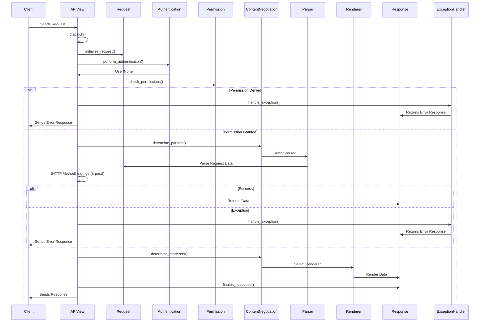

### Component Descriptions:

**1. Client:**
   - *Description*: The user or application that initiates the API request.
   - *Interaction*: Sends requests to the APIView and receives responses.
   - *Source Files*: N/A

**2. APIView:**
   - *Description*: The central component that receives requests, orchestrates processing, and returns responses. It handles dispatching, authentication, permission checks, and rendering.
   - *Interaction*: Receives requests from the Client, interacts with Request, Authentication, Permission, ContentNegotiation, Parser, Renderer, ExceptionHandler, and sends responses to the Client.
   - *Source Files*: `rest_framework.views.APIView`

**3. Request:**
   - *Description*: Represents the incoming HTTP request with parsed data and metadata.
   - *Interaction*: Created by APIView, used by Authentication, Permission, and API methods (get, post, etc.).
   - *Source Files*: `rest_framework.request.Request`

**4. Authentication:**
   - *Description*: Authenticates the user based on the request.
   - *Interaction*: Receives the Request from APIView, returns the authenticated user (or None) to APIView.
   - *Source Files*: `rest_framework.authentication.BaseAuthentication`

**5. Permission:**
   - *Description*: Checks if the authenticated user has permission to access the resource.
   - *Interaction*: Receives the Request and user from APIView, returns a boolean indicating whether access is allowed. If permission is denied, it signals APIView to use the ExceptionHandler.
   - *Source Files*: `rest_framework.permissions.BasePermission`

**6. ContentNegotiation:**
   - *Description*: Determines the appropriate parser and renderer based on the request's content type and Accept header.
   - *Interaction*: Receives the Request from APIView, selects a Parser and Renderer, and provides them to APIView.
   - *Source Files*: `rest_framework.negotiation.BaseContentNegotiation`

**7. Parser:**
   - *Description*: Parses the incoming request data into a usable format (e.g., JSON).
   - *Interaction*: Receives data from ContentNegotiation, parses it, and provides the parsed data to the Request object.
   - *Source Files*: `rest_framework.parsers.BaseParser`

**8. Renderer:**
   - *Description*: Renders the response data into the desired format (e.g., JSON).
   - *Interaction*: Receives data from ContentNegotiation, renders it, and provides the rendered data to the Response object.
   - *Source Files*: `rest_framework.renderers.BaseRenderer`

**9. Response:**
   - *Description*: Represents the outgoing HTTP response.
   - *Interaction*: Created by APIView, receives rendered data from Renderer, and sends the response to the Client.
   - *Source Files*: `rest_framework.response.Response`

**10. ExceptionHandler:**
    - *Description*: Handles exceptions raised during the API processing.
    - *Interaction*: Receives exceptions from APIView, formats them into error responses, and returns the error Response to APIView.
    - *Source Files*: `rest_framework.views.exception_handler`, `rest_framework.exceptions.APIException`
